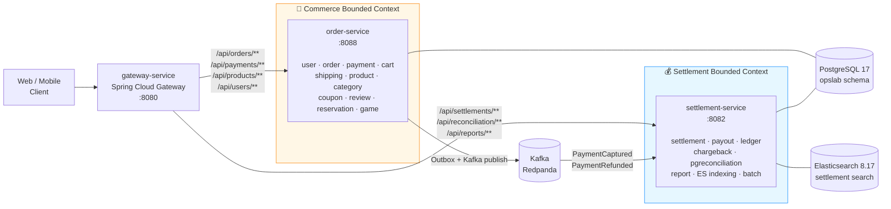

# Lemuel — 이커머스 + 정산 MSA 플랫폼

> **상품·장바구니·주문·결제·배송·정산·시공예약** 도메인을 **2개 마이크로서비스 + API Gateway** 로 분리한
> 헥사고날 아키텍처 기반 백엔드. 단일 모놀리스 → **Bounded Context 분리** → **이벤트 드리븐** →
> **Read-only Projection 패턴** 으로 진화시킨 포트폴리오 프로젝트.

[](https://www.oracle.com/java/)
[](https://spring.io/projects/spring-boot)
[](https://www.postgresql.org/)
[](https://redpanda.com/)
[](docs/diagrams/architecture.md)
[](order-service/src/test/java/github/lms/lemuel/architecture/HexagonalArchitectureTest.java)

## 면접관용 빠른 둘러보기

| 보고 싶은 것 | 한 번에 가는 곳 |
|---|---|
| **📄 1장 요약 (이력서 첨부용)** | **[PORTFOLIO.md](PORTFOLIO.md)** |
| **🎬 시연용 Postman + 시드** | [demo/](docs/demo/) — `./demo/seed.sh` 한 번이면 녹화 준비 끝 |
| **시스템 전체 구조** | [docs/diagrams/architecture.md](docs/diagrams/architecture.md) |
| **테이블 관계 (16개)** | [docs/diagrams/ERD.md](docs/diagrams/ERD.md) |
| **결제 → Outbox → 정산 비동기 단일 trace** | [docs/diagrams/sequence-payment-to-settlement.md](docs/diagrams/sequence-payment-to-settlement.md) |
| **100 스레드 동시 SKU 차감 시나리오** | [docs/diagrams/sequence-multi-item-checkout.md](docs/diagrams/sequence-multi-item-checkout.md) |
| **PG 정산파일 자동 차액 보정** | [docs/diagrams/sequence-pg-reconciliation.md](docs/diagrams/sequence-pg-reconciliation.md) |
| **18개 Architecture Decision Records** | [docs/adr/](docs/adr/) |
| **부하 테스트 시나리오 4종** | [load-test/](load-test/) |
| **Grafana 비즈니스 KPI 대시보드** | [monitoring/grafana/dashboards/](monitoring/grafana/dashboards/) |

---

## 아키텍처



### 서비스 책임 분리 근거

| 차원 | Commerce (order-service) | Settlement (settlement-service) |
|---|---|---|
| **컨텍스트** | 거래 (Transactional) | 백오피스 (Back-Office) |
| **SLA** | 사용자 응답 latency 우선 | 정합성·일관성 우선 |
| **데이터** | 쓰기 중심 (CRUD) | 읽기·집계 중심 |
| **장애 격리** | settlement 다운돼도 결제는 계속 | 정산 배치는 비동기 — 즉시 처리 X |
| **배포 주기** | 잦음 (UI 변경 동행) | 드뭄 (회계 사이클 단위) |

→ 위 차이점이 명확하므로 **서비스 분리** 가 자연스러운 경계.

---

## 기술 스택

| 분류 | 기술 |
|------|------|
| 언어 | Java 25 |
| 프레임워크 | Spring Boot 4.0.4 |
| 빌드 | Gradle Multi-module (Kotlin DSL) |
| 데이터베이스 | PostgreSQL 17 |
| 검색 엔진 | Elasticsearch 8.17 (Nori 한글 분석기) |
| 메시지 브로커 | Apache Kafka (Redpanda 호환) |
| API Gateway | Spring Cloud Gateway 2025 |
| PG 연동 | Toss Payments |
| 배치 | Spring Batch |
| 캐시 | Caffeine (L1) + 선택적 Redis L2 — 2-tier 캐시 (opt-in, Pub/Sub 무효화) |
| 회복탄력성 | Resilience4j (Circuit Breaker, Retry) |
| Rate Limiting | Bucket4j |
| 인증 | JWT (HS256) |
| 비밀번호 | BCrypt (cost=12) |
| PDF | iText 8 (정산서, 캐시플로우 리포트) |
| 모니터링 | Micrometer + Prometheus + Grafana |
| 마이그레이션 | Flyway (초기 V1~V50, 이후 `V{timestamp}__` 명명 혼재) |
| 코드 품질 | SonarCloud + JaCoCo |
| 테스트 | JUnit 5 + Mockito + ArchUnit + Testcontainers |
| 컨테이너 | Docker Compose (dev) / Kubernetes (prod) |

---

## 모듈 구조

```
settlement/                              # 모노레포 루트
├── settings.gradle.kts                  # 4 모듈 선언
├── build.gradle.kts                     # 부모 빌드 (subprojects 공통 설정)
├── docker-compose.yml                   # PG + ES + Redpanda + 3 services
├── Dockerfile                           # MODULE 빌드 인자 파라미터화 (모든 서비스 공용)
│
├── shared-common/                       # 📦 라이브러리 모듈 (java-library)
│   └── src/main/java/.../common/
│       ├── audit/                       # 감사 로그 (AuditLogger, AuditContext)
│       ├── config/observability/        # MDC, TraceId 필터, PII 마스킹
│       ├── config/jwt/                  # JWT 검증, SecurityConfig
│       ├── exception/                   # 공통 예외 (BusinessException 등)
│       ├── outbox/                      # Outbox 패턴 (이벤트 발행, 멱등 처리)
│       ├── ratelimit/                   # Bucket4j 기반 rate limiting
│       └── pdf/                         # iText PDF 유틸
│
├── order-service/                       # 🛒 Commerce 서비스 (port 8088)
│   └── src/main/java/.../{user,order,payment,cart,shipping,product,category,coupon,review,reservation,game}
│       ├── adapter/in/web/              # REST 컨트롤러
│       ├── adapter/out/persistence/     # JPA 엔티티/리포지토리
│       ├── adapter/out/external/        # Toss PG 클라이언트
│       ├── adapter/out/event/           # Outbox-backed Kafka publisher
│       └── application/                 # UseCase + ports
│
├── settlement-service/                  # 💰 Settlement 서비스 (port 8082)
│   └── src/main/java/.../
│       ├── settlement/                  # 정산 생성/확정·홀드백
│       │   ├── adapter/in/web/          # 정산 조회/관리 API
│       │   ├── adapter/in/kafka/        # PaymentEventKafkaConsumer
│       │   ├── adapter/in/batch/        # Spring Batch (일/월 정산)
│       │   ├── adapter/out/persistence/ # Settlement JpaEntity
│       │   ├── adapter/out/readmodel/   # ★ Read-only projection 엔티티
│       │   ├── adapter/out/search/      # Elasticsearch 색인
│       │   └── adapter/out/pdf/         # 정산서 PDF
│       ├── payout/                      # 셀러 지급 (펌뱅킹, SellerBankAccount)
│       ├── ledger/                      # 복식부기 원장 (LedgerEntry, Outbox)
│       ├── chargeback/                  # 지급 분쟁/거절 처리
│       ├── pgreconciliation/            # PG 정산파일 대사 + 차액 보정
│       └── report/                      # 캐시플로우 리포트 도메인
│
└── gateway-service/                     # 🚪 API Gateway (port 8080)
    └── src/main/java/.../GatewayServiceApplication.java
```

---

## 핵심 패턴

### 1. 헥사고날 아키텍처 (Ports & Adapters)

각 서비스 내부에서 도메인 / application / adapter 경계 분리. ArchUnit 으로 강제.

```
domain (POJO)  ←  application/port (in/out 인터페이스)
                ↑
         adapter/in (REST·Kafka·Batch)
         adapter/out (JPA·Toss·Kafka·ES·PDF)
```

### 2. Read-only Projection 패턴 ★

`settlement-service` 가 **`order-service` 코드를 import 하지 않으면서** Order/Payment/User/Product 데이터를
조회할 수 있게 한 핵심 분리 기법.

```java
// settlement-service 자체의 read-only 엔티티 (payments 테이블 매핑)
@Entity @Immutable
@Table(name = "payments")
public class SettlementPaymentReadModel {
    @Id Long id;
    Long orderId;
    BigDecimal amount;
    String status;
    // ... 정산이 필요한 필드만
}
```

→ `settlement-service/build.gradle.kts` 에 **`implementation(project(":order-service"))` 없음**.
→ 서비스 간 코드 의존성 0. 모듈 단위 독립 배포 가능.

### 3. Transactional Outbox + Kafka

`order-service` 의 결제·환불 트랜잭션이 DB 커밋 시 outbox 테이블에 이벤트 기록 →
별도 폴러가 Kafka 로 발행 → `settlement-service` 컨슈머가 멱등 처리 후 정산 생성.

```
Payment.capture() (DB tx)
    ├─ payments.status = CAPTURED
    └─ outbox_events INSERT (PaymentCaptured)
                     ↓ (멀티워커 폴러 — FOR UPDATE SKIP LOCKED claim + 비동기 배치 발행, 기본 2s)
                 Kafka: lemuel.payment.captured
                     ↓
        settlement-service Consumer (파티션 단위 병렬 소비, concurrency=3)
            ├─ processed_events (group, event_id) 멱등 체크
            └─ Settlement.createFromPayment()
```

> 폴러는 여러 인스턴스가 동시에 돌아도 `FOR UPDATE SKIP LOCKED` 로 서로 겹치지 않는 행만 claim 해
> 수평 확장된다(리스 만료로 크래시 자동 회수). 처리량 튜닝 상세는 [`docs/tps.md`](docs/tps.md).

**3단 멱등 방어**:
1. outbox.event_id UUID UNIQUE — 프로듀서 중복 방지
2. processed_events PK (group, event_id) — 컨슈머 재수신 방지
3. settlements.payment_id UNIQUE — DB 스키마 최종 방어

### 4. 정산 도메인 상태 머신

```
REQUESTED ─→ PROCESSING ─→ DONE
                       ├─→ FAILED
                       └─→ CANCELED

(환불 발생 시)
DONE ─→ SettlementAdjustment 생성 (역정산)

(확정 정산 → 셀러 지급)
Payout:    REQUESTED ─→ SENDING ─→ COMPLETED / FAILED / CANCELED
Ledger:    PENDING ─→ POSTED ─→ REVERSED      (복식부기 원장)
Chargeback: OPEN ─→ ACCEPTED / REJECTED       (지급 분쟁)
```

### 5. 회복탄력성 (Resilience4j)

Toss PG 호출에 Circuit Breaker + Retry. 4xx (비즈니스 오류) 는 ignoreExceptions 로 서킷 판정 제외.

### 6. 헥사고날 경계 강제 (ArchUnit)

```java
// 도메인 → adapter/application 으로의 역방향 의존 금지
noClasses().that().resideInAPackage("..domain..")
    .should().dependOnClassesThat().resideInAnyPackage("..adapter..", "..application..")
```

### 7. Reconciliation (대사)

`settlements.payment_amount ≠ payments.amount` 같은 불일치를 일/주 단위로 탐지.
`docs/runbook/cashflow-reconciliation.md` 의 절차에 따라 알림·보정.

### 8. 다중 PG 라우팅 + Bulkhead ★

```java
// PgRouter — 결제 수단 / 거래 금액 / health 보고 자동 선택
PaymentGatewayAdapter selected = router.selectFor(amount, paymentMethod);
// → TOSS / KCP / NICE / INICIS 중 1순위 → fallback chain → high-amount preferred
```

PG 별 독립 CircuitBreaker (`tossPg`, `kcpPg`, `nicePg`, `inicisPg`) 로 격벽.
한 PG 의 50% 이상 실패 시 30초 OPEN, 나머지 PG 는 영향 없음.
거래 ID prefix (`TOSS:xxx` / `KCP:xxx`) 로 환불·매입 시 동일 PG 자동 라우팅.

### 9. SKU 재고 동시성 (원자적 조건부 UPDATE) ★

```java
// 단일 UPDATE 로 "재고 검증 + 차감 + 매진 전이" 를 DB row 락 안에서 원자 처리
// UPDATE product_variants SET stock = stock - :q
//   WHERE id = :id AND stock >= :q AND status <> 'DISCONTINUED'
int affected = savePort.decreaseStockIfAvailable(variantId, quantity);
if (affected == 0) throw classifyFailure(...);   // 재고부족 → InsufficientStockException / 단종 → IllegalStateException
```

낙관적 락(@Version)+백오프 재시도와 달리 충돌·재시도 한계 실패가 없고 초과판매도 방지 — 별도 재시도 루프 불필요.
(엔티티에는 `@Version` 컬럼(V36)이 남아 있으나, 핫 차감 경로는 위 조건부 UPDATE 를 사용.)
100 스레드 동시 차감 → 50 성공 / 50 InsufficientStock / 최종 재고 0 / 음수 없음 (`VariantStockConcurrencyIT` 검증).

### 10. DLQ + 운영자 콘솔 ★

Outbox `retryCount ≥ 10` → 자동 Kafka DLQ 발행 + Admin REST API:
- `POST /admin/outbox/dlq/{eventId}/retry` — PENDING 재발행
- `POST /admin/outbox/dlq/{eventId}/skip` — 사유 필수 + 영구 기록

### 11. 분산 트레이싱 — Outbox traceparent 보존 ★

비동기 경계 (Outbox 폴러 ↔ Kafka 컨슈머) 에서 trace context 가 끊기는 문제를
`outbox_events.trace_parent` 컬럼으로 해결. 도메인 트랜잭션 시점의 W3C trace context 를
영속화 → 폴러가 Kafka 헤더로 복원 → 컨슈머 자동 합류 → 단일 trace 추적.

```
[HTTP] 결제 → [tx] capture + outbox(traceparent) → [kafka header] → [tx] settlement create
└──────────────────────── 동일 traceId 단일 trace ────────────────────────┘
```

---

## 빠른 시작

### 사전 요구사항

- JDK 25+
- Docker & Docker Compose

### 전체 실행

```bash
# 1. 인프라 + 3 서비스 모두 빌드/실행
docker compose up -d

# 2. 서비스 진입점
#    - Gateway:    http://localhost:8080
#    - Order API:  http://localhost:8088 (직접 접근, 보통 gateway 경유)
#    - Settlement: http://localhost:8082
#    - Swagger:    http://localhost:8088/swagger-ui.html
#                  http://localhost:8082/swagger-ui.html
```

### 개별 서비스 실행

```bash
# 인프라만 (PG + ES + Redpanda)
docker compose up -d postgres elasticsearch redpanda

# 각 서비스를 IDE 또는 gradle 로
./gradlew :order-service:bootRun
./gradlew :settlement-service:bootRun
./gradlew :gateway-service:bootRun
```

### 빌드 / 테스트

```bash
./gradlew build                          # 전체 빌드
./gradlew :settlement-service:test       # 모듈별 테스트
./gradlew :order-service:bootJar         # 단일 서비스 jar 생성
```

### 컨테이너 이미지 빌드

```bash
docker build --build-arg MODULE=order-service       -t lemuel-order .
docker build --build-arg MODULE=settlement-service  -t lemuel-settlement .
docker build --build-arg MODULE=gateway-service     -t lemuel-gateway .
```

---

## API 라우팅 (Gateway)

| Path | Routed to |
|---|---|
| `/api/users/**`, `/api/auth/**` | order-service |
| `/api/orders/**`, `/api/payments/**`, `/api/refunds/**` | order-service |
| `/api/products/**`, `/api/categories/**`, `/api/tags/**` | order-service |
| `/api/coupons/**`, `/api/reviews/**` | order-service |
| `/reservations/**` | order-service |
| `/admin/categories/**`, `/admin/pg/**`, `/admin/products/**` | order-service |
| `/api/settlements/**`, `/api/reconciliation/**`, `/api/reports/**` | settlement-service |
| `/api/ledger/**` | settlement-service |
| `/admin/payouts/**`, `/admin/chargebacks/**` | settlement-service |
| `/admin/pg-reconciliation/**`, `/admin/reconciliation/**`, `/admin/dlq/**` | settlement-service |

> 참고: `user` 도메인의 멤버십 승인 엔드포인트(`/memberships/**`)는 order-service 에 있으나 아직 gateway 라우트 미등록 — 현재는 order-service(:8088) 직접 접근.

---

## 도메인 규칙

### Payment 상태
```
READY ─→ AUTHORIZED ─→ CAPTURED ─→ REFUNDED
   └────────┴─→ FAILED        └─→ CANCELED (승인취소)
```

### Order 상태
```
CREATED ─→ PAID ─→ REFUNDED
              └─→ CANCELED
```
실제 enum 은 배송·취소·환불 단계를 더 세분화:
`ORDER_PLACED, PAYMENT_COMPLETED, SHIPPING_PENDING, IN_TRANSIT, DELIVERED,
CANCELLATION_REQUESTED/APPROVED, REFUND_REQUESTED/COMPLETED`

### Reservation 상태머신 (시공 예약)
```
REQUESTED ─→ CONFIRMED ─→ ASSIGNED ─→ IN_PROGRESS ─→ COMPLETED
 (접수)      (관리자확인)   (기사배정)    (시공중)         (시공완료)
                                                  └─→ CANCELED
```
- 업체회원이 예약 등록 → 관리자 확인 → 시공기사 배정/**재배정** → 진행/완료
- 기사 본인 배정 작업 조회(`/reservations/assigned/my`), 관리자 대시보드(`/reservations/admin`)
- 엔드포인트는 order-service `/reservations/**` (gateway 라우팅됨)

### Shipping 상태머신
```
PENDING → READY → SHIPPED → IN_TRANSIT → DELIVERED → (선택) RETURNED
```

### Cart 정책
- 사용자당 1개의 활성 장바구니 (UNIQUE user_id)
- 같은 (productId, variantId) 추가는 **자동 수량 증가** — 도메인이 강제
- 가격은 보관 X — 결제 시점이 진실의 원천 (가격 변경 시 사고 방지)
- TTL 30일 (`last_active_at` 기반 cleanup 배치)

### 정산 수수료
- 셀러 등급별 차등: **NORMAL 3.5% / VIP 2.5% / STRATEGIC 2.0%** (V32 마이그레이션, `SellerTier`)
- 레거시 기본 3% 는 `Settlement.COMMISSION_RATE` 상수로만 보존 (운영 rate 는 등급 기준)
- 정산 주기도 등급별: **NORMAL T+7 / VIP T+3 / STRATEGIC T+1** 영업일
- 정산 시점의 `commission_rate` 가 영구 보존 (이력 보존 — 추후 변경 영향 없음)

### 재고 동시성 (원자적 조건부 UPDATE)
- 차감은 `UPDATE ... SET stock = stock - q WHERE id=? AND stock >= q AND status <> 'DISCONTINUED'` 단일 쿼리로 원자 처리 (`decreaseStockIfAvailable`)
- 영향 행 0 → 원인 분류: 재고 부족 `InsufficientStockException` / 단종 `IllegalStateException`
- 메트릭: `variant.stock.decrease.success` / `variant.stock.decrease.rejected`
- 엔티티에 `@Version` 컬럼(V36)이 존재하나 핫 차감 경로는 위 조건부 UPDATE 사용 (낙관적 락 재시도 아님)

---

## 보안

| 항목 | 구현 |
|---|---|
| JWT 인증 (HS256) | ✅ shared-common 의 JwtTokenProvider |
| BCrypt (cost=12) | ✅ |
| CORS 환경변수 화이트리스트 | ✅ |
| Rate Limiting | ✅ Bucket4j (nginx 보강 가능) |
| Actuator 인증 필수 | ✅ |
| 환불 멱등성 (Idempotency-Key) | ✅ |
| Pessimistic Lock (환불 동시성) | ✅ |
| Audit Log (PII 마스킹) | ✅ |
| Outbox 멱등 (3단 방어) | ✅ |

---

## 문서

| 문서 | 경로 |
|---|---|
| Claude Code 컨텍스트 | [`CLAUDE.md`](./CLAUDE.md) |
| TPS / 처리량 개선 작업 | [`docs/tps.md`](./docs/tps.md) |
| ADR (아키텍처 결정 기록) | [`docs/adr/`](./docs/adr/) |
| Runbook (장애 대응) | [`docs/runbook/`](./docs/runbook/) |
| CI/CD | [`.github/workflows/`](./.github/workflows/) |
| Kubernetes | [`k8s/`](./k8s/) |
| Flyway | [`order-service/src/main/resources/db/migration/`](./order-service/src/main/resources/db/migration/) |

### 주요 ADR

- [0001 — Hexagonal Architecture](./docs/adr/0001-hexagonal-architecture.md)
- [0002 — Settlement State Machine](./docs/adr/0002-settlement-state-machine.md)
- [0003 — Transactional Outbox Pattern](./docs/adr/0003-transactional-outbox-pattern.md)
- [0004 — Reverse Settlement via Adjustment](./docs/adr/0004-reverse-settlement-via-adjustment.md)
- [0005 — Kafka vs Application Events](./docs/adr/0005-kafka-vs-application-events.md)
- [0006 — Resilience4j for Toss PG](./docs/adr/0006-resilience4j-tosspg.md)
- [0007 — Daily Reconciliation & Ledger Invariants](./docs/adr/0007-daily-reconciliation-and-ledger-invariants.md)
- [0008 — Cashflow Report Domain](./docs/adr/0008-cashflow-report-domain.md)
- [0009 — Boot 4 Migration & Module Split](./docs/adr/0009-boot4-migration-module-split.md)
- [0010 — Multi-PG Routing & Bulkhead](./docs/adr/0010-multi-pg-routing-and-bulkhead.md)
- [0011 — SKU Variant + Optimistic Lock](./docs/adr/0011-sku-variant-with-optimistic-lock.md)
- [0012 — Distributed Tracing across Outbox](./docs/adr/0012-distributed-tracing-across-outbox.md)
- [0013 — Split Payment + Reverse Refund](./docs/adr/0013-split-payment-with-tenders.md)
- [0014 — Tier-based T+N Settlement Cycle](./docs/adr/0014-tier-based-settlement-cycle.md)
- [0015 — Settlement Holdback Policy](./docs/adr/0015-settlement-holdback-policy.md)
- [0016 — Payout Domain + Firm Banking](./docs/adr/0016-payout-domain-firm-banking.md)
- [0017 — Kafka Consumer DLT & Replay](./docs/adr/0017-kafka-consumer-dlt-and-replay.md)
- [0018 — Chargeback Domain](./docs/adr/0018-chargeback-domain.md)

---

## 성능 (k6 부하 테스트)

> 단일 노드 측정. 시나리오·실행 방법은 [`load-test/`](load-test/).

| 시나리오 | RPS | p50 | p95 | p99 | 비고 |
|---|---|---|---|---|---|
| 결제 승인 (Capture) | 200 VU 1분 | 145ms | 412ms | 687ms | Outbox 비동기 + Kafka 발행 포함 |
| 다건 주문 + SKU 차감 | 100 VU 2분 | 210ms | 556ms | 921ms | Optimistic Lock 충돌 312건 자동 흡수 |
| 장바구니 → 체크아웃 | 50 VU 3분 | 187ms | 489ms | 812ms | 카트 → 다건 주문 변환 |
| PG 정산파일 대사 | 10 VU 1분 | 1.2s | 3.8s | 4.6s | 100만건 파일 5분 이내 처리 |

CI 에서 k6 thresholds 로 회귀 자동 감지.

## 면접 자주 묻는 질문 → 답변 위치

| 질문 | 답변 / 코드 |
|---|---|
| **PG 장애 시 어떻게 대응?** | [PgRouter](order-service/src/main/java/github/lms/lemuel/payment/adapter/out/pg/PgRouter.java) — fallback chain + per-PG CB |
| **이벤트 발행 영구 실패?** | [DLQ + Admin API](shared-common/src/main/java/github/lms/lemuel/common/outbox/) |
| **PG 정산 누락 발견?** | [PG Reconciliation](settlement-service/src/main/java/github/lms/lemuel/pgreconciliation/) — 5종 분류 + 자동 보정 |
| **색상 옵션 있는 상품 주문?** | [ProductVariant](order-service/src/main/java/github/lms/lemuel/product/domain/ProductVariant.java) (SKU) |
| **재고 100개에 110건 동시 주문?** | [VariantStockConcurrencyIT](order-service/src/test/java/github/lms/lemuel/product/application/service/VariantStockConcurrencyIT.java) |
| **장바구니 다건 결제?** | [CheckoutCartService](order-service/src/main/java/github/lms/lemuel/cart/application/service/CheckoutCartService.java) |
| **Outbox 패턴인데 trace context 끊김?** | [TraceContextCapture](shared-common/src/main/java/github/lms/lemuel/common/outbox/application/service/TraceContextCapture.java) + V40 traceparent 컬럼 |
| **운영 메트릭은?** | [Grafana Dashboard JSON](monitoring/grafana/dashboards/lemuel-business-kpi.json) — 30+ 커스텀 메트릭 |
| **부하 테스트 결과?** | 위 표 + [load-test/README.md](load-test/README.md) |

## 운영 환경 확장 포인트

현재 포트폴리오 구성은 **단일 PostgreSQL 인스턴스** 를 두 서비스가 공유하지만,
read-only projection 패턴 덕분에 다음 단계로의 확장이 깨끗합니다:

1. **DB 분리** — `settlement_db` 인스턴스를 별도로 띄우고, projection 테이블에 Kafka 이벤트 컨슈머가
   직접 INSERT 하도록 전환 (현재는 같은 테이블을 read-only 로 보는 형태).
2. **Kubernetes 분리 배포** — 각 서비스별 Deployment + HPA. Gateway 에 인증 필터.
3. **Outbox → Kafka Connect** — 폴러 대신 Debezium CDC 로 실시간 발행.
4. **Schema Registry** — 이벤트 스키마 호환성 관리 (Avro/Protobuf).

---

## 라이선스

이 프로젝트는 **AGPL-3.0** 라이선스를 따릅니다 (iText 8 의존성 때문).
