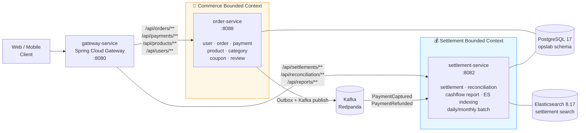

# Lemuel — 이커머스 + 정산 MSA 플랫폼

> 주문·결제·정산을 **2개 마이크로서비스 + API Gateway** 로 분리한 헥사고날 아키텍처 기반 백엔드 플랫폼.
> 단일 모놀리스에서 **Bounded Context 분리** → **이벤트 드리븐** → **Read-only Projection 패턴** 으로
> 진화시킨 포트폴리오 프로젝트.

---

## 아키텍처



### 서비스 책임 분리 근거

| 차원 | Commerce (order-service) | Settlement (settlement-service) |
|---|---|---|
| **컨텍스트** | 거래 (Transactional) | 백오피스 (Back-Office) |
| **SLA** | 사용자 응답 latency 우선 | 정합성·일관성 우선 |
| **데이터** | 쓰기 중심 (CRUD) | 읽기·집계 중심 |
| **장애 격리** | settlement 다운돼도 결제는 계속 | 정산 배치는 비동기 — 즉시 처리 X |
| **배포 주기** | 잦음 (UI 변경 동행) | 드뭄 (회계 사이클 단위) |

→ 위 차이점이 명확하므로 **서비스 분리** 가 자연스러운 경계.

---

## 기술 스택

| 분류 | 기술 |
|------|------|
| 언어 | Java 25 |
| 프레임워크 | Spring Boot 4.0.4 |
| 빌드 | Gradle Multi-module (Kotlin DSL) |
| 데이터베이스 | PostgreSQL 17 |
| 검색 엔진 | Elasticsearch 8.17 (Nori 한글 분석기) |
| 메시지 브로커 | Apache Kafka (Redpanda 호환) |
| API Gateway | Spring Cloud Gateway 2025 |
| PG 연동 | Toss Payments |
| 배치 | Spring Batch |
| 캐시 | Caffeine |
| 회복탄력성 | Resilience4j (Circuit Breaker, Retry) |
| Rate Limiting | Bucket4j |
| 인증 | JWT (HS256) |
| 비밀번호 | BCrypt (cost=12) |
| PDF | iText 8 (정산서, 캐시플로우 리포트) |
| 모니터링 | Micrometer + Prometheus + Grafana |
| 마이그레이션 | Flyway (V1~V34) |
| 코드 품질 | SonarCloud + JaCoCo |
| 테스트 | JUnit 5 + Mockito + ArchUnit + Testcontainers |
| 컨테이너 | Docker Compose (dev) / Kubernetes (prod) |

---

## 모듈 구조

```
settlement/                              # 모노레포 루트
├── settings.gradle.kts                  # 4 모듈 선언
├── build.gradle.kts                     # 부모 빌드 (subprojects 공통 설정)
├── docker-compose.yml                   # PG + ES + Redpanda + 3 services
├── Dockerfile                           # MODULE 빌드 인자 파라미터화 (모든 서비스 공용)
│
├── shared-common/                       # 📦 라이브러리 모듈 (java-library)
│   └── src/main/java/.../common/
│       ├── audit/                       # 감사 로그 (AuditLogger, AuditContext)
│       ├── config/observability/        # MDC, TraceId 필터, PII 마스킹
│       ├── config/jwt/                  # JWT 검증, SecurityConfig
│       ├── exception/                   # 공통 예외 (BusinessException 등)
│       ├── outbox/                      # Outbox 패턴 (이벤트 발행, 멱등 처리)
│       ├── ratelimit/                   # Bucket4j 기반 rate limiting
│       └── pdf/                         # iText PDF 유틸
│
├── order-service/                       # 🛒 Commerce 서비스 (port 8088)
│   └── src/main/java/.../{user,order,payment,product,category,coupon,review,game}
│       ├── adapter/in/web/              # REST 컨트롤러
│       ├── adapter/out/persistence/     # JPA 엔티티/리포지토리
│       ├── adapter/out/external/        # Toss PG 클라이언트
│       ├── adapter/out/event/           # Outbox-backed Kafka publisher
│       └── application/                 # UseCase + ports
│
├── settlement-service/                  # 💰 Settlement 서비스 (port 8082)
│   └── src/main/java/.../
│       ├── settlement/
│       │   ├── adapter/in/web/          # 정산 조회/관리 API
│       │   ├── adapter/in/kafka/        # PaymentEventKafkaConsumer
│       │   ├── adapter/in/batch/        # Spring Batch (일/월 정산)
│       │   ├── adapter/out/persistence/ # Settlement JpaEntity
│       │   ├── adapter/out/readmodel/   # ★ Read-only projection 엔티티
│       │   ├── adapter/out/search/      # Elasticsearch 색인
│       │   └── adapter/out/pdf/         # 정산서 PDF
│       └── report/                      # 캐시플로우 리포트 도메인
│
└── gateway-service/                     # 🚪 API Gateway (port 8080)
    └── src/main/java/.../GatewayServiceApplication.java
```

---

## 핵심 패턴

### 1. 헥사고날 아키텍처 (Ports & Adapters)

각 서비스 내부에서 도메인 / application / adapter 경계 분리. ArchUnit 으로 강제.

```
domain (POJO)  ←  application/port (in/out 인터페이스)
                ↑
         adapter/in (REST·Kafka·Batch)
         adapter/out (JPA·Toss·Kafka·ES·PDF)
```

### 2. Read-only Projection 패턴 ★

`settlement-service` 가 **`order-service` 코드를 import 하지 않으면서** Order/Payment/User/Product 데이터를
조회할 수 있게 한 핵심 분리 기법.

```java
// settlement-service 자체의 read-only 엔티티 (payments 테이블 매핑)
@Entity @Immutable
@Table(name = "payments")
public class SettlementPaymentReadModel {
    @Id Long id;
    Long orderId;
    BigDecimal amount;
    String status;
    // ... 정산이 필요한 필드만
}
```

→ `settlement-service/build.gradle.kts` 에 **`implementation(project(":order-service"))` 없음**.
→ 서비스 간 코드 의존성 0. 모듈 단위 독립 배포 가능.

### 3. Transactional Outbox + Kafka

`order-service` 의 결제·환불 트랜잭션이 DB 커밋 시 outbox 테이블에 이벤트 기록 →
별도 폴러가 Kafka 로 발행 → `settlement-service` 컨슈머가 멱등 처리 후 정산 생성.

```
Payment.capture() (DB tx)
    ├─ payments.status = CAPTURED
    └─ outbox_events INSERT (PaymentCaptured)
                     ↓ (poller, 2s)
                 Kafka: lemuel.payment.captured
                     ↓
        settlement-service Consumer
            ├─ processed_events (group, event_id) 멱등 체크
            └─ Settlement.createFromPayment()
```

**3단 멱등 방어**:
1. outbox.event_id UUID UNIQUE — 프로듀서 중복 방지
2. processed_events PK (group, event_id) — 컨슈머 재수신 방지
3. settlements.payment_id UNIQUE — DB 스키마 최종 방어

### 4. 정산 도메인 상태 머신

```
REQUESTED ─→ PROCESSING ─→ DONE
                       └─→ FAILED

(환불 발생 시)
DONE ─→ SettlementAdjustment 생성 (역정산)
```

### 5. 회복탄력성 (Resilience4j)

Toss PG 호출에 Circuit Breaker + Retry. 4xx (비즈니스 오류) 는 ignoreExceptions 로 서킷 판정 제외.

### 6. 헥사고날 경계 강제 (ArchUnit)

```java
// 도메인 → adapter/application 으로의 역방향 의존 금지
noClasses().that().resideInAPackage("..domain..")
    .should().dependOnClassesThat().resideInAnyPackage("..adapter..", "..application..")
```

### 7. Reconciliation (대사)

`settlements.payment_amount ≠ payments.amount` 같은 불일치를 일/주 단위로 탐지.
`docs/runbook/cashflow-reconciliation.md` 의 절차에 따라 알림·보정.

---

## 빠른 시작

### 사전 요구사항

- JDK 25+
- Docker & Docker Compose

### 전체 실행

```bash
# 1. 인프라 + 3 서비스 모두 빌드/실행
docker compose up -d

# 2. 서비스 진입점
#    - Gateway:    http://localhost:8080
#    - Order API:  http://localhost:8088 (직접 접근, 보통 gateway 경유)
#    - Settlement: http://localhost:8082
#    - Swagger:    http://localhost:8088/swagger-ui.html
#                  http://localhost:8082/swagger-ui.html
```

### 개별 서비스 실행

```bash
# 인프라만 (PG + ES + Redpanda)
docker compose up -d postgres elasticsearch redpanda

# 각 서비스를 IDE 또는 gradle 로
./gradlew :order-service:bootRun
./gradlew :settlement-service:bootRun
./gradlew :gateway-service:bootRun
```

### 빌드 / 테스트

```bash
./gradlew build                          # 전체 빌드
./gradlew :settlement-service:test       # 모듈별 테스트
./gradlew :order-service:bootJar         # 단일 서비스 jar 생성
```

### 컨테이너 이미지 빌드

```bash
docker build --build-arg MODULE=order-service       -t lemuel-order .
docker build --build-arg MODULE=settlement-service  -t lemuel-settlement .
docker build --build-arg MODULE=gateway-service     -t lemuel-gateway .
```

---

## API 라우팅 (Gateway)

| Path | Routed to |
|---|---|
| `/api/users/**`, `/api/auth/**` | order-service |
| `/api/orders/**`, `/api/payments/**`, `/api/refunds/**` | order-service |
| `/api/products/**`, `/api/categories/**` | order-service |
| `/api/coupons/**`, `/api/reviews/**` | order-service |
| `/api/settlements/**` | settlement-service |
| `/api/reconciliation/**` | settlement-service |
| `/api/reports/**` | settlement-service |

---

## 도메인 규칙

### Payment 상태
```
READY ─→ AUTHORIZED ─→ CAPTURED ─→ REFUNDED
```

### Order 상태
```
CREATED ─→ PAID ─→ REFUNDED
              └─→ CANCELED
```

### 정산 수수료
- 기본: **3%**
- 셀러 티어별 차등 (V32 마이그레이션) — VIP 셀러는 더 낮은 수수료

---

## 보안

| 항목 | 구현 |
|---|---|
| JWT 인증 (HS256) | ✅ shared-common 의 JwtTokenProvider |
| BCrypt (cost=12) | ✅ |
| CORS 환경변수 화이트리스트 | ✅ |
| Rate Limiting | ✅ Bucket4j (nginx 보강 가능) |
| Actuator 인증 필수 | ✅ |
| 환불 멱등성 (Idempotency-Key) | ✅ |
| Pessimistic Lock (환불 동시성) | ✅ |
| Audit Log (PII 마스킹) | ✅ |
| Outbox 멱등 (3단 방어) | ✅ |

---

## 문서

| 문서 | 경로 |
|---|---|
| Claude Code 컨텍스트 | [`CLAUDE.md`](./CLAUDE.md) |
| ADR (아키텍처 결정 기록) | [`docs/adr/`](./docs/adr/) |
| Runbook (장애 대응) | [`docs/runbook/`](./docs/runbook/) |
| CI/CD | [`.github/workflows/`](./.github/workflows/) |
| Kubernetes | [`k8s/`](./k8s/) |
| Flyway | [`order-service/src/main/resources/db/migration/`](./order-service/src/main/resources/db/migration/) |

### 주요 ADR

- [0001 — Hexagonal Architecture](./docs/adr/0001-hexagonal-architecture.md)
- [0002 — Settlement State Machine](./docs/adr/0002-settlement-state-machine.md)
- [0003 — Transactional Outbox Pattern](./docs/adr/0003-transactional-outbox-pattern.md)
- [0004 — Reverse Settlement via Adjustment](./docs/adr/0004-reverse-settlement-via-adjustment.md)
- [0005 — Kafka vs Application Events](./docs/adr/0005-kafka-vs-application-events.md)
- [0006 — Resilience4j for Toss PG](./docs/adr/0006-resilience4j-tosspg.md)
- [0007 — Daily Reconciliation & Ledger Invariants](./docs/adr/0007-daily-reconciliation-and-ledger-invariants.md)
- [0008 — Cashflow Report Domain](./docs/adr/0008-cashflow-report-domain.md)
- [0009 — Boot 4 Migration & Module Split](./docs/adr/0009-boot4-migration-module-split.md)

---

## 운영 환경 확장 포인트

현재 포트폴리오 구성은 **단일 PostgreSQL 인스턴스** 를 두 서비스가 공유하지만,
read-only projection 패턴 덕분에 다음 단계로의 확장이 깨끗합니다:

1. **DB 분리** — `settlement_db` 인스턴스를 별도로 띄우고, projection 테이블에 Kafka 이벤트 컨슈머가
   직접 INSERT 하도록 전환 (현재는 같은 테이블을 read-only 로 보는 형태).
2. **Kubernetes 분리 배포** — 각 서비스별 Deployment + HPA. Gateway 에 인증 필터.
3. **Outbox → Kafka Connect** — 폴러 대신 Debezium CDC 로 실시간 발행.
4. **Schema Registry** — 이벤트 스키마 호환성 관리 (Avro/Protobuf).

---

## 라이선스

이 프로젝트는 **AGPL-3.0** 라이선스를 따릅니다 (iText 8 의존성 때문).
