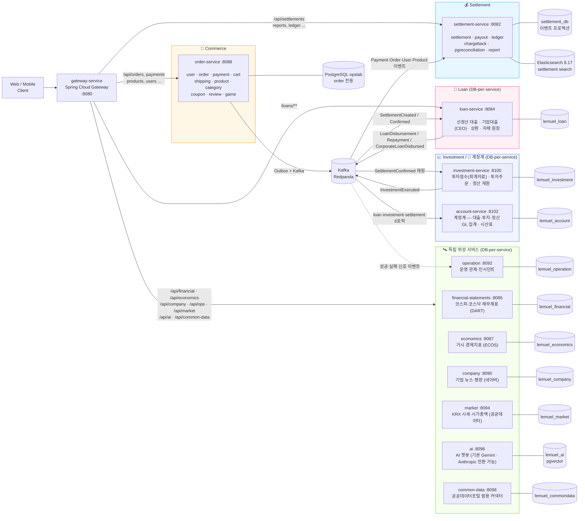

# Lemuel — 이커머스 + 정산 MSA 플랫폼

> **이커머스 주문 → 셀러 정산 → 복식부기 원장까지, "정확성을 기계로 강제한" 커머스 백엔드.**
> 커머스(order)·정산(settlement) 두 축의 **깊이**가 시그니처이고, 그 위에 대출·투자·계정계·조직·재무제표·경제지표·기업평판·운영관제·주식시세·AI챗봇·공공데이터를 **13개 마이크로서비스 + API Gateway**(JVM) 로 확장했다.
> 여기에 **Go·Python·Kotlin 폴리글랏 7종**(실시간 시세 스트리밍·결제 웹훅·스크리닝 백테스트·이상탐지·예측·알림·정산 대사)을 더해 **총 21개 서비스**의 폴리글랏 MSA 로 도메인·언어 양방향 확장력을 증명한다.
> 단일 모놀리스 → **Bounded Context 분리** → **이벤트 드리븐** → **DB-per-service + 이벤트 프로젝션 패턴**(ADR 0020) → **폴리글랏 MSA** 로 진화시킨 헥사고날 백엔드 포트폴리오.
>
> 📐 **전체 구성·아키텍처·디자인 패턴·기술 스택 한눈에 → [docs/ARCHITECTURE.md](docs/ARCHITECTURE.md)**

[](https://www.oracle.com/java/)
[](https://kotlinlang.org/)
[](https://go.dev/)
[](https://www.python.org/)
[](https://spring.io/projects/spring-boot)
[](https://www.postgresql.org/)
[](https://strimzi.io/)
[-teal)](docs/ARCHITECTURE.md)
[](docs/ARCHITECTURE.md#5-cicd-파이프라인)
[](docs/adr/0001-hexagonal-architecture.md)
[](order-service/src/test/java/github/lms/lemuel/architecture/HexagonalArchitectureTest.java)

## 면접관용 빠른 둘러보기

| 보고 싶은 것 | 한 번에 가는 곳 |
|---|---|
| **✅ "정말 작동하나" (5분, 재현 가능)** | **[docs/SETTLEMENT-VERIFICATION.md](docs/SETTLEMENT-VERIFICATION.md)** — 520 테스트·LINE 94.17% + 불변식 매핑 + 한계 |
| **📄 1장 요약 (이력서 첨부용)** | **[PORTFOLIO.md](PORTFOLIO.md)** |
| **시스템 전체 구조** | [아키텍처 다이어그램 (본 README)](#아키텍처) |
| **Architecture Decision Records** | [docs/adr/](docs/adr/) |
| **부하 테스트 시나리오 4종** | [load-test/](load-test/) |
| **Grafana 비즈니스 KPI 대시보드** | [monitoring/grafana/dashboards/](monitoring/grafana/dashboards/) |

---

## 아키텍처



### 서비스 책임 분리 근거

| 차원 | Commerce (order-service) | Settlement (settlement-service) |
|---|---|---|
| **컨텍스트** | 거래 (Transactional) | 백오피스 (Back-Office) |
| **SLA** | 사용자 응답 latency 우선 | 정합성·일관성 우선 |
| **데이터** | 쓰기 중심 (CRUD) | 읽기·집계 중심 |
| **장애 격리** | settlement 다운돼도 결제는 계속 | 정산 배치는 비동기 — 즉시 처리 X |
| **배포 주기** | 잦음 (UI 변경 동행) | 드뭄 (회계 사이클 단위) |

→ 위 차이점이 명확하므로 **서비스 분리** 가 자연스러운 경계. **13개 서비스 모두 DB-per-service**
(order=opslab · settlement=settlement_db · loan=lemuel_loan · financial=lemuel_financial ·
economics=lemuel_economics · company=lemuel_company · operation=lemuel_operation · market=lemuel_market ·
ai=lemuel_ai · commondata=lemuel_commondata · investment=lemuel_investment · account=lemuel_account ·
organization=lemuel_organization) 로 물리 분리하고,
연계는 **Kafka 이벤트로만** 한다. order↔settlement 는 settlement 가 자체 DB 에 이벤트 프로젝션을 적재하는
CQRS 로 분리하고, 대사는 order 의 내부 API 를 호출해 cross-DB 연결 0 을 유지한다
([ADR 0020](docs/adr/0020-order-settlement-db-split.md) — 완료).

---

## 기술 스택

| 분류 | 기술 |
|------|------|
| 언어 | **Java 25** (코어 14) · **Kotlin 2.0** (이벤트 서비스 2) · **Go 1.22** (엣지 2) · **Python 3.11** (ML 3) |
| 프레임워크 | Spring Boot 4.0.4 / Spring 7 (Java) · Spring Boot 3.3 (Kotlin) · FastAPI (Python) · `net/http`(Go) |
| 빌드 | Gradle Multi-module (Kotlin DSL) · 폴리글랏은 standalone 빌드 |
| 데이터베이스 | PostgreSQL 17 (DB-per-service) |
| 검색 엔진 | Elasticsearch 8.17 (Nori 한글 분석기) |
| 메시지 브로커 | Apache Kafka — dev: Redpanda 호환 / prod: Strimzi KRaft |
| ML/데이터 | pandas · numpy · scikit-learn · statsmodels (Python 서비스) |
| CI/CD | GitHub Actions → GHCR → **ArgoCD + image-updater (GitOps)** |
| API Gateway | Spring Cloud Gateway 2025 |
| PG 연동 | Toss Payments |
| 배치 | Spring Batch |
| AI/LLM | Google Gemini(기본) · Anthropic Claude(Spring AI 2.0) — provider 스위치. ai-service 챗봇·company 감성분석 |
| 캐시 | Caffeine (L1) + 선택적 Redis L2 — 2-tier 캐시 (opt-in, Pub/Sub 무효화) |
| 회복탄력성 | Resilience4j (Circuit Breaker, Retry) |
| Rate Limiting | Bucket4j |
| 인증 | JWT (HS256) |
| 비밀번호 | BCrypt (cost=12) |
| PDF | iText 8 (정산서, 캐시플로우 리포트) |
| 모니터링 | Micrometer + Prometheus + Grafana |
| 마이그레이션 | Flyway (초기 V1~V50, 이후 `V{timestamp}__` 명명 혼재) |
| 코드 품질 | SonarCloud + JaCoCo |
| 테스트 | JUnit 5 + Mockito + ArchUnit + Testcontainers |
| 컨테이너 | Docker Compose (dev) / Kubernetes (prod) |

---

## 모듈 구조

전체 디렉토리·모듈 트리 정본은 **[STRUCTURE.md](docs/STRUCTURE.md)** 로 분리했다.

- **JVM 코어**: Gradle 멀티모듈 — Java 13 서비스 + gateway, `shared-common` 은 composite build 라이브러리 (ADR 0021)
- **폴리글랏 7종**(Go 2 · Python 3 · Kotlin 2, 포트 8110~8131): 루트 레벨 standalone — Gradle·gateway 미포함,
  `polyglot-ci.yml` 분리 CI, 전용 차트 격리 배포 (정본: [polyglot-services.md](docs/polyglot-services.md))
- 각 서비스 내부는 헥사고날 고정 골격: `domain/` · `application/port·service/` · `adapter/{in,out}/`

---

## 핵심 패턴

### 1. 헥사고날 아키텍처 (Ports & Adapters)

각 서비스 내부에서 도메인 / application / adapter 경계 분리. ArchUnit 으로 강제.

```
domain (POJO)  ←  application/port (in/out 인터페이스)
                ↑
         adapter/in (REST·Kafka·Batch)
         adapter/out (JPA·Toss·Kafka·ES·PDF)
```

### 2. 이벤트 드리븐 프로젝션 패턴 ★ (ADR 0020 완료)

`settlement-service` 가 **`order-service` 코드를 import 하지 않고 DB 도 공유하지 않으면서** Order/Payment/User/Product
데이터를 조회할 수 있게 한 핵심 분리 기법. settlement 가 **자체 DB(settlement_db)에 소유한 프로젝션 테이블**을
두고, order 가 발행하는 Kafka 이벤트를 받아 로컬에 적재한다. (과거 opslab 의 같은 테이블을 `@Immutable` 로
read-only 매핑하던 방식에서 진화 — 이제 cross-DB 연결이 0.)

```java
// settlement-service 가 자체 DB 에 소유하는 프로젝션 엔티티 (settlement_order_view)
@Entity
@Table(name = "settlement_order_view")
public class SettlementOrderViewJpaEntity {
    @Id Long orderId;        // OrderEventKafkaConsumer 가 lemuel.order.created 로 적재
    Long userId;
    BigDecimal amount;
    String status;
    // ... 정산이 필요한 필드만
}
```

- 적재 컨슈머: `OrderEventKafkaConsumer` · `PaymentEventKafkaConsumer` · `PaymentRefundedViewConsumer` ·
  `ProductEventKafkaConsumer` · `UserRegisteredEventConsumer`
- 대사(reconciliation): `OrderReconClient` 가 order 의 내부 API `/internal/recon` 을 호출(공유 시크릿
  `X-Internal-Api-Key`)해 합계 비교 — 양측 모두 자기 DB 만 읽는다.

→ `settlement-service/build.gradle.kts` 에 **`implementation(project(":order-service"))` 없음**.
→ 서비스 간 **코드·DB 의존성 0**. 모듈 단위 독립 배포 가능.

### 3. Transactional Outbox + Kafka

`order-service` 의 결제·환불 트랜잭션이 DB 커밋 시 outbox 테이블에 이벤트 기록 →
별도 폴러가 Kafka 로 발행 → `settlement-service` 컨슈머가 멱등 처리 후 정산 생성.

```
Payment.capture() (DB tx)
    ├─ payments.status = CAPTURED
    └─ outbox_events INSERT (PaymentCaptured)
                     ↓ (멀티워커 폴러 — FOR UPDATE SKIP LOCKED claim + 비동기 배치 발행, 기본 2s)
                 Kafka: lemuel.payment.captured
                     ↓
        settlement-service Consumer (파티션 단위 병렬 소비, concurrency=3)
            ├─ processed_events (group, event_id) 멱등 체크
            └─ Settlement.createFromPayment()
```

> 폴러는 여러 인스턴스가 동시에 돌아도 `FOR UPDATE SKIP LOCKED` 로 서로 겹치지 않는 행만 claim 해
> 수평 확장된다(리스 만료로 크래시 자동 회수).

**3단 멱등 방어**:
1. outbox.event_id UUID UNIQUE — 프로듀서 중복 방지
2. processed_events PK (group, event_id) — 컨슈머 재수신 방지
3. settlements.payment_id UNIQUE — DB 스키마 최종 방어

### 4. 정산 도메인 상태 머신

```
REQUESTED ─→ PROCESSING ─→ DONE
                       ├─→ FAILED
                       └─→ CANCELED

(환불 발생 시)
DONE ─→ SettlementAdjustment 생성 (역정산)

(확정 정산 → 셀러 지급)
Payout:    REQUESTED ─→ SENDING ─→ COMPLETED / FAILED / CANCELED
Ledger:    PENDING ─→ POSTED ─→ REVERSED      (복식부기 원장)
Chargeback: OPEN ─→ ACCEPTED / REJECTED       (지급 분쟁)
```

### 5. 회복탄력성 (Resilience4j)

Toss PG 호출에 Circuit Breaker + Retry. 4xx (비즈니스 오류) 는 ignoreExceptions 로 서킷 판정 제외.

### 6. 헥사고날 경계 강제 (ArchUnit)

```java
// 도메인 → adapter/application 으로의 역방향 의존 금지
noClasses().that().resideInAPackage("..domain..")
    .should().dependOnClassesThat().resideInAnyPackage("..adapter..", "..application..")
```

### 7. Reconciliation (대사)

`settlements.payment_amount ≠ payments.amount` 같은 불일치를 일/주 단위로 탐지.
`docs/runbook/cashflow-reconciliation.md` 의 절차에 따라 알림·보정.

### 8. 다중 PG 라우팅 + Bulkhead ★

```java
// PgRouter — 결제 수단 / 거래 금액 / health 보고 자동 선택
PaymentGatewayAdapter selected = router.selectFor(amount, paymentMethod);
// → TOSS / KCP / NICE / INICIS 중 1순위 → fallback chain → high-amount preferred
```

PG 별 독립 CircuitBreaker (`tossPg`, `kcpPg`, `nicePg`, `inicisPg`) 로 격벽.
한 PG 의 50% 이상 실패 시 30초 OPEN, 나머지 PG 는 영향 없음.
거래 ID prefix (`TOSS:xxx` / `KCP:xxx`) 로 환불·매입 시 동일 PG 자동 라우팅.

### 9. SKU 재고 동시성 (원자적 조건부 UPDATE) ★

```java
// 단일 UPDATE 로 "재고 검증 + 차감 + 매진 전이" 를 DB row 락 안에서 원자 처리
// UPDATE product_variants SET stock = stock - :q
//   WHERE id = :id AND stock >= :q AND status <> 'DISCONTINUED'
int affected = savePort.decreaseStockIfAvailable(variantId, quantity);
if (affected == 0) throw classifyFailure(...);   // 재고부족 → InsufficientStockException / 단종 → IllegalStateException
```

낙관적 락(@Version)+백오프 재시도와 달리 충돌·재시도 한계 실패가 없고 초과판매도 방지 — 별도 재시도 루프 불필요.
(엔티티에는 `@Version` 컬럼(V36)이 남아 있으나, 핫 차감 경로는 위 조건부 UPDATE 를 사용.)
100 스레드 동시 차감 → 50 성공 / 50 InsufficientStock / 최종 재고 0 / 음수 없음 (`VariantStockConcurrencyIT` 검증).

### 10. DLQ + 운영자 콘솔 ★

Outbox `retryCount ≥ 10` → 자동 Kafka DLQ 발행 + Admin REST API:
- `POST /admin/outbox/dlq/{eventId}/retry` — PENDING 재발행
- `POST /admin/outbox/dlq/{eventId}/skip` — 사유 필수 + 영구 기록

### 11. 분산 트레이싱 — Outbox traceparent 보존 ★

비동기 경계 (Outbox 폴러 ↔ Kafka 컨슈머) 에서 trace context 가 끊기는 문제를
`outbox_events.trace_parent` 컬럼으로 해결. 도메인 트랜잭션 시점의 W3C trace context 를
영속화 → 폴러가 Kafka 헤더로 복원 → 컨슈머 자동 합류 → 단일 trace 추적.

```
[HTTP] 결제 → [tx] capture + outbox(traceparent) → [kafka header] → [tx] settlement create
└──────────────────────── 동일 traceId 단일 trace ────────────────────────┘
```

---

## 빠른 시작

### 사전 요구사항

- JDK 25+
- Docker & Docker Compose

### 환경변수 (.env)

`docker compose up` 전에 루트에 `.env` 를 만들어야 합니다 (`.env.example` 복사 후 값 채우기):

```bash
cp .env.example .env
```

```dotenv
# 최소 필수 값 (compose 기동에 반드시 필요)
POSTGRES_USER=lemuel
POSTGRES_PASSWORD=lemuel-local
ELASTICSEARCH_USER=elastic
ELASTICSEARCH_PASSWORD=es-local
JWT_ISSUER=lemuel
JWT_SECRET=local-dev-secret-key-32bytes-min!!   # HS256 — 32바이트 이상
JWT_TTL_SECONDS=3600
```

외부 데이터 수집 키는 전부 선택입니다(미설정 시 해당 서비스는 Flyway 시드 데이터로 동작).
발급처는 `.env.example` 의 각 항목 주석 참조 — 단, **공공데이터포털 계열 키는 발급만으로는
동작하지 않습니다**:

| 키 | 발급처 | 주의 |
|---|---|---|
| `KRX_API_KEY` (market-service) | [data.go.kr](https://www.data.go.kr) "금융위원회_주식시세정보" | 해당 API **활용신청 → 승인** 후 사용 가능. 승인 전에는 `403 Forbidden` |
| `DATA_GO_KR_API_KEY` (common-data-service) | [data.go.kr](https://www.data.go.kr) | 계정당 1개 키를 공용하되, **사용할 API 마다 개별 활용신청** 필요 |
| `DART_API_KEY` / `ECOS_API_KEY` | opendart.fss.or.kr / ecos.bok.or.kr | 발급 즉시 사용 가능 |

### 전체 실행

```bash
# 1. 인프라 + 12 서비스 모두 빌드/실행
#    기동 순서는 compose healthcheck 기반 depends_on 이 보장:
#    PG 12종·ES·Redpanda → order/settlement/loan/financial/economics/company/operation/market/ai/common-data/investment/account → gateway → prometheus/grafana
docker compose up -d --build

# 2. 전체 healthcheck 통과 확인 — 모든 서비스가 healthy 가 될 때까지 대기
docker compose ps        # STATUS 열이 전부 Up (healthy) 이면 성공

# 3. 서비스 진입점 / 헬스체크 URL
#    - Gateway:     http://localhost:8080  (health: /actuator/health)
#    - Order API:   http://localhost:8088/actuator/health (직접 접근, 보통 gateway 경유)
#    - Settlement:  http://localhost:8082/actuator/health
#    - Loan:        http://localhost:8084/actuator/health
#    - Financial:   http://localhost:8086/actuator/health
#    - Economics:   http://localhost:8087/actuator/health
#    - Company:     http://localhost:8090/actuator/health
#    - Operation:   http://localhost:8092/actuator/health
#    - Market:      http://localhost:8094/actuator/health
#    - AI:          http://localhost:8096/actuator/health
#    - Common-Data: http://localhost:8098/actuator/health
#    - Investment: http://localhost:8100/actuator/health
#    - Account(계정계): http://localhost:8102/actuator/health
#    - Swagger:     http://localhost:8088/swagger-ui.html
#                   http://localhost:8082/swagger-ui.html
```

### 모니터링 접속

| 항목 | 값 |
|---|---|
| Grafana | http://localhost:3001 (admin / admin) |
| Prometheus | http://localhost:9090 |
| 대표 대시보드 | **Lemuel — System (Uptime · CPU · Memory · HTTP)** — CPU·메모리·API 요청량 한 화면 |
| 그 외 대시보드 | Lemuel Business KPI · HTTP Traffic · Kafka Lag · Settlement Projection · Cache Hit Ratio |

**장애 판단 기준** (대시보드 패널 임계값과 동일):

| 지표 | 정상 | 경고 |
|---|---|---|
| API 5xx 비율 | < 1% | ≥ 1% 가 5분 지속 |
| p95 지연시간 | < 500ms | ≥ 1s 지속 |
| Kafka consumer lag | ≈ 0 (즉시 소비) | 1,000 이상 증가 추세 |
| JVM heap 사용률 | < 70% | 70~85% 경고, ≥ 85% 위험 (OOM 임박) |
| process CPU | < 60% | ≥ 70% 가 5분 지속 |

### E2E 최종 검증 (가입 → 주문 → 결제 → 취소 → 환불)

전체 구매 흐름을 gateway 경유로 한 번에 검증하는 시나리오:
[docs/demo/E2E-SCENARIO.md](docs/demo/E2E-SCENARIO.md) (단계별 요청값·기대 응답·데이터 초기화 포함)

```bash
npx newman run docs/demo/postman-e2e-purchase-flow.json -e docs/demo/postman-environment.json
```

**실행 증거**: [docs/demo/e2e-report.html](docs/demo/e2e-report.html) — 전체 재빌드 스택에서
14개 요청·14개 assertion 전부 통과한 newman HTML 리포트 (단계별 요청/응답 포함).
재생성: 위 명령에 `--reporters cli,htmlextra --reporter-htmlextra-export docs/demo/e2e-report.html` 추가.

### 개별 서비스 실행

```bash
# 인프라만 (PG 12종 + ES + Redpanda)
docker compose up -d postgres settlement-db loan-postgres financial-postgres economics-postgres company-postgres operation-postgres market-postgres ai-postgres commondata-postgres investment-postgres account-postgres elasticsearch redpanda

# 각 서비스를 IDE 또는 gradle 로
./gradlew :order-service:bootRun
./gradlew :settlement-service:bootRun
./gradlew :loan-service:bootRun
./gradlew :financial-statements-service:bootRun
./gradlew :economics-service:bootRun
./gradlew :company-service:bootRun
./gradlew :operation-service:bootRun
./gradlew :market-service:bootRun
./gradlew :ai-service:bootRun            # 루트 .env 를 셸에 export 후 실행 (JWT_SECRET 필요)
./gradlew :common-data-service:bootRun
./gradlew :investment-service:bootRun
./gradlew :account-service:bootRun
./gradlew :gateway-service:bootRun
```

### 빌드 / 테스트

```bash
./gradlew build                          # 전체 빌드
./gradlew :settlement-service:test       # 모듈별 테스트
./gradlew :order-service:bootJar         # 단일 서비스 jar 생성
```

### 컨테이너 이미지 빌드

```bash
docker build --build-arg MODULE=order-service       -t lemuel-order .
docker build --build-arg MODULE=settlement-service  -t lemuel-settlement .
docker build --build-arg MODULE=loan-service        -t lemuel-loan .
docker build --build-arg MODULE=financial-statements-service -t lemuel-financial .
docker build --build-arg MODULE=economics-service   -t lemuel-economics .
docker build --build-arg MODULE=company-service     -t lemuel-company .
docker build --build-arg MODULE=operation-service   -t lemuel-operation .
docker build --build-arg MODULE=market-service      -t lemuel-market .
docker build --build-arg MODULE=ai-service          -t lemuel-ai .
docker build --build-arg MODULE=common-data-service -t lemuel-commondata .
docker build --build-arg MODULE=investment-service  -t lemuel-investment .
docker build --build-arg MODULE=account-service     -t lemuel-account .
docker build --build-arg MODULE=gateway-service     -t lemuel-gateway .
```

---

## API 라우팅 (Gateway)

| Path | Routed to |
|---|---|
| `/api/users/**`, `/api/auth/**` | order-service |
| `/api/orders/**`, `/api/payments/**`, `/api/refunds/**` | order-service |
| `/api/products/**`, `/api/categories/**`, `/api/tags/**` | order-service |
| `/api/coupons/**`, `/api/reviews/**` | order-service |
| `/admin/categories/**`, `/admin/pg/**`, `/admin/products/**` | order-service |
| `/loans/**` | **loan-service** (자체 DB — 선정산 대출 + `/loans/corporate/**` 기업대출) |
| `/api/investment/**` | **investment-service** (자체 DB, JWT — 투자점수·투자주문·재원) |
| `/api/account/**` | **account-service** (자체 DB, JWT — 계정계 GL 집계·시산표) |
| `/api/financial/**` | **financial-statements-service** (자체 DB, 공개 조회) |
| `/api/economics/**` | **economics-service** (자체 DB, 공개 조회) |
| `/api/company/**` | **company-service** (자체 DB, 공개 조회) |
| `/api/ops/**` | **operation-service** (자체 DB, 운영 관제 — ADMIN 전용, webhook 은 Bearer 게이트) |
| `/api/market/**` | **market-service** (자체 DB, 공개 조회 — KRX 시세·시가총액) |
| `/api/ai/**` | **ai-service** (자체 DB, AI 챗봇 — JWT USER 이상 + rate limit) |
| `/api/common-data/**` | **common-data-service** (자체 DB, 공개 조회 — 공공데이터 범용 커넥터) |
| `/api/settlements/**`, `/api/reconciliation/**`, `/api/reports/**` | settlement-service |
| `/api/ledger/**` | settlement-service |
| `/admin/payouts/**`, `/admin/chargebacks/**` | settlement-service |
| `/admin/pg-reconciliation/**`, `/admin/reconciliation/**`, `/admin/dlq/**` | settlement-service |

> 참고: `user` 도메인의 멤버십 승인 엔드포인트(`/memberships/**`)는 order-service 에 있으나 아직 gateway 라우트 미등록 — 현재는 order-service(:8088) 직접 접근.

---

## 도메인 규칙

### Payment 상태
```
READY ─→ AUTHORIZED ─→ CAPTURED ─→ REFUNDED
   └────────┴─→ FAILED        └─→ CANCELED (승인취소)
```

### Order 상태
```
CREATED ─→ PAID ─→ REFUNDED
              └─→ CANCELED
```
실제 enum 은 배송·취소·환불 단계를 더 세분화:
`SHIPPING_PENDING, IN_TRANSIT, DELIVERED,
CANCELLATION_REQUESTED/APPROVED, REFUND_REQUESTED/COMPLETED`.
전이 규칙은 `OrderStatus.canTransitionTo()` 상태머신에 명시되어 `Order.transitionTo()` 가 강제한다.

### Shipping 상태머신
```
PENDING → READY → SHIPPED → IN_TRANSIT → DELIVERED → (선택) RETURNED
```

### Cart 정책
- 사용자당 1개의 활성 장바구니 (UNIQUE user_id)
- 같은 (productId, variantId) 추가는 **자동 수량 증가** — 도메인이 강제
- 가격은 보관 X — 결제 시점이 진실의 원천 (가격 변경 시 사고 방지)
- TTL 30일 (`last_active_at` 기반 cleanup 배치)

### 정산 수수료
- 셀러 등급별 차등: **NORMAL 3.5% / VIP 2.5% / STRATEGIC 2.0%** (V32 마이그레이션, `SellerTier`)
- 레거시 기본 3% 는 `Settlement.COMMISSION_RATE` 상수로만 보존 (운영 rate 는 등급 기준)
- 정산 주기도 등급별: **NORMAL T+7 / VIP T+3 / STRATEGIC T+1** 영업일
- 정산 시점의 `commission_rate` 가 영구 보존 (이력 보존 — 추후 변경 영향 없음)

### 재고 동시성 (원자적 조건부 UPDATE)
- 차감은 `UPDATE ... SET stock = stock - q WHERE id=? AND stock >= q AND status <> 'DISCONTINUED'` 단일 쿼리로 원자 처리 (`decreaseStockIfAvailable`)
- 영향 행 0 → 원인 분류: 재고 부족 `InsufficientStockException` / 단종 `IllegalStateException`
- 메트릭: `variant.stock.decrease.success` / `variant.stock.decrease.rejected`
- 엔티티에 `@Version` 컬럼(V36)이 존재하나 핫 차감 경로는 위 조건부 UPDATE 사용 (낙관적 락 재시도 아님)

### 투자점수 고지 (investment-service)
- 투자점수(수익성35+안정성35+성장성30, AAA~CCC)는 **정보 제공 목적의 참고 지표로 투자자문이 아니며**, 매수·매도 등 **투자 판단과 그 결과의 책임은 이용자 본인에게** 있음

---

## 보안

| 항목 | 구현 |
|---|---|
| JWT 인증 (HS256) | ✅ shared-common 의 JwtTokenProvider |
| BCrypt (cost=12) | ✅ |
| CORS 환경변수 화이트리스트 | ✅ |
| Rate Limiting | ✅ Bucket4j (nginx 보강 가능) |
| Actuator 인증 필수 | ✅ |
| 환불 멱등성 (Idempotency-Key) | ✅ |
| Pessimistic Lock (환불 동시성) | ✅ |
| Audit Log (PII 마스킹) | ✅ |
| Outbox 멱등 (3단 방어) | ✅ |

---

## 문서

| 문서 | 경로 |
|---|---|
| **🏛 아키텍처 개요 (서비스·패턴·스택)** | **[`docs/ARCHITECTURE.md`](./docs/ARCHITECTURE.md)** |
| Claude Code 컨텍스트 | [`CLAUDE.md`](./CLAUDE.md) |
| Ouroboros (명세 우선 AI 워크플로 엔진) | [`docs/ouroboros.md`](./docs/ouroboros.md) |
| ADR (아키텍처 결정 기록) | [`docs/adr/`](./docs/adr/) |
| Runbook (장애 대응) | [`docs/runbook/`](./docs/runbook/) |
| CI/CD | [`.github/workflows/`](./.github/workflows/) |
| Kubernetes | [`k8s/`](./k8s/) |
| Flyway | [`order-service/src/main/resources/db/migration/`](./order-service/src/main/resources/db/migration/) |

### 주요 ADR

- [0001 — Hexagonal Architecture](./docs/adr/0001-hexagonal-architecture.md)
- [0002 — Settlement State Machine](./docs/adr/0002-settlement-state-machine.md)
- [0003 — Transactional Outbox Pattern](./docs/adr/0003-transactional-outbox-pattern.md)
- [0004 — Reverse Settlement via Adjustment](./docs/adr/0004-reverse-settlement-via-adjustment.md)
- [0005 — Kafka vs Application Events](./docs/adr/0005-kafka-vs-application-events.md)
- [0006 — Resilience4j for Toss PG](./docs/adr/0006-resilience4j-tosspg.md)
- [0007 — Daily Reconciliation & Ledger Invariants](./docs/adr/0007-daily-reconciliation-and-ledger-invariants.md)
- [0008 — Cashflow Report Domain](./docs/adr/0008-cashflow-report-domain.md)
- [0009 — Boot 4 Migration & Module Split](./docs/adr/0009-boot4-migration-module-split.md)
- [0010 — Multi-PG Routing & Bulkhead](./docs/adr/0010-multi-pg-routing-and-bulkhead.md)
- [0011 — SKU Variant + 원자적 조건부 UPDATE 재고 차감](./docs/adr/0011-sku-variant-with-optimistic-lock.md)
- [0012 — Distributed Tracing across Outbox](./docs/adr/0012-distributed-tracing-across-outbox.md)
- [0013 — Split Payment + Reverse Refund](./docs/adr/0013-split-payment-with-tenders.md)
- [0014 — Tier-based T+N Settlement Cycle](./docs/adr/0014-tier-based-settlement-cycle.md)
- [0015 — Settlement Holdback Policy](./docs/adr/0015-settlement-holdback-policy.md)
- [0016 — Payout Domain + Firm Banking](./docs/adr/0016-payout-domain-firm-banking.md)
- [0017 — Kafka Consumer DLT & Replay](./docs/adr/0017-kafka-consumer-dlt-and-replay.md)
- [0018 — Chargeback Domain](./docs/adr/0018-chargeback-domain.md)
- [0020 — order ↔ settlement DB 물리 분리 (이벤트 CQRS)](./docs/adr/0020-order-settlement-db-split.md) *(완료 — settlement_db + 이벤트 프로젝션 + /internal/recon)*
- [0021 — shared-common 을 버전드 플랫폼 라이브러리로](./docs/adr/0021-shared-common-as-platform-library.md) *(완료 — composite build + maven-publish 1.0.0)*
- [0022 — Event Schema Registry](./docs/adr/0022-event-schema-registry.md)
- [0023 — company-service 뉴스·평판 (독립 위성 서비스)](./docs/adr/0023-company-service-news-reputation.md)

> 위성 서비스(financial · economics · company · market · common-data)는 **공개 read-only 조회**라 shared-common(JWT/Outbox)을 의존하지 않고
> 자체 최소 SecurityConfig 를 둔다. operation(콘솔 ADMIN 전용)과 ai(LLM 실비용 → USER 이상 필수)는 예외로 shared-common 의 JWT 스택을 쓴다.

---

## 성능 (k6 부하 테스트)

> 단일 노드 측정. 시나리오·실행 방법은 [`load-test/`](load-test/).

| 시나리오 | RPS | p50 | p95 | p99 | 비고 |
|---|---|---|---|---|---|
| 결제 승인 (Capture) | 200 VU 1분 | 145ms | 412ms | 687ms | Outbox 비동기 + Kafka 발행 포함 |
| 다건 주문 + SKU 차감 | 100 VU 2분 | 210ms | 556ms | 921ms | Optimistic Lock 충돌 312건 자동 흡수 |
| 장바구니 → 체크아웃 | 50 VU 3분 | 187ms | 489ms | 812ms | 카트 → 다건 주문 변환 |
| PG 정산파일 대사 | 10 VU 1분 | 1.2s | 3.8s | 4.6s | 100만건 파일 5분 이내 처리 |

CI 에서 k6 thresholds 로 회귀 자동 감지.

## 면접 자주 묻는 질문 → 답변 위치

| 질문 | 답변 / 코드 |
|---|---|
| **PG 장애 시 어떻게 대응?** | [PgRouter](order-service/src/main/java/github/lms/lemuel/payment/adapter/out/pg/PgRouter.java) — fallback chain + per-PG CB |
| **이벤트 발행 영구 실패?** | [DLQ + Admin API](shared-common/src/main/java/github/lms/lemuel/common/outbox/) |
| **PG 정산 누락 발견?** | [PG Reconciliation](settlement-service/src/main/java/github/lms/lemuel/pgreconciliation/) — 5종 분류 + 자동 보정 |
| **색상 옵션 있는 상품 주문?** | [ProductVariant](order-service/src/main/java/github/lms/lemuel/product/domain/ProductVariant.java) (SKU) |
| **재고 100개에 110건 동시 주문?** | [VariantStockConcurrencyIT](order-service/src/test/java/github/lms/lemuel/product/application/service/VariantStockConcurrencyIT.java) |
| **장바구니 다건 결제?** | [CheckoutCartService](order-service/src/main/java/github/lms/lemuel/cart/application/service/CheckoutCartService.java) |
| **Outbox 패턴인데 trace context 끊김?** | [TraceContextCapture](shared-common/src/main/java/github/lms/lemuel/common/outbox/application/service/TraceContextCapture.java) + V40 traceparent 컬럼 |
| **운영 메트릭은?** | [Grafana Dashboard JSON](monitoring/grafana/dashboards/lemuel-business-kpi.json) — 30+ 커스텀 메트릭 |
| **부하 테스트 결과?** | 위 표 + [load-test/README.md](load-test/README.md) |
| **왜 재무제표·경제지표·기업평판을 별도 서비스로?** | 공개 read-only 조회라 거래 컨텍스트와 경계가 다름 → DB-per-service + **shared-common(JWT/Outbox) 미의존**, 자체 최소 SecurityConfig ([ADR 0023](docs/adr/0023-company-service-news-reputation.md)) |
| **외부 API(DART/ECOS/네이버) 키 없이 데모?** | Flyway **시드 폴백** — 각 서비스 `V2__*_seed.sql` 이 대표 데이터를 적재해 키 없이도 조회 동작, 키 설정 시 수집 배치가 UNIQUE upsert 로 실데이터 대체 |
| **Alertmanager 알람이 인시던트가 되는 과정?** | [IngestAlertService](operation-service/src/main/java/github/lms/lemuel/operation/incident/application/service/IngestAlertService.java) — webhook(Bearer) → `(source, correlation_key)` partial unique 로 활성 중복 0, repeat firing refire 병합 |
| **위성 서비스도 코드·DB 의존 0?** | ✅ financial/economics/company/market/ai/common-data 는 타 서비스 import·DB 공유 없음(ArchUnit 강제). operation·ai 만 shared-common(JWT) 사용, 신호는 Kafka 이벤트로만 수신 |
| **AI 챗봇의 LLM 벤더 종속은?** | [ChatCompletionPort](ai-service/src/main/java/github/lms/lemuel/ai/chat/application/port/out/ChatCompletionPort.java) 뒤로 LLM 을 `adapter/out/llm` 에만 격리(ArchUnit 강제). 실제로 Gemini/Anthropic 두 어댑터를 `app.ai.provider` 로 스위치(기본 Gemini) — 벤더 전환이 설정 한 줄. LLM 실패 시 폴백 없이 503 + 이력 무저장, bucket4j 로 비용 가드 |

## 운영 환경 확장 포인트

현재 구성은 **13개 서비스 모두 DB-per-service** 로 물리 분리돼 있고(order=opslab · settlement=settlement_db ·
loan=lemuel_loan · financial=lemuel_financial · economics=lemuel_economics · company=lemuel_company ·
operation=lemuel_operation · market=lemuel_market · ai=lemuel_ai · commondata=lemuel_commondata ·
investment=lemuel_investment · account=lemuel_account · organization=lemuel_organization),
이벤트 프로젝션 패턴 덕분에 다음 단계로의 확장이 깨끗합니다:

1. ~~**DB 분리**~~ — ✅ 완료. settlement 가 자체 `settlement_db` 의 projection 테이블에 Kafka 이벤트 컨슈머가
   직접 INSERT 하고, 대사는 order 내부 API(`/internal/recon`)로 cross-DB 0 ([ADR 0020](docs/adr/0020-order-settlement-db-split.md)).
2. **Kubernetes 분리 배포** — 각 서비스별 Deployment + HPA. Gateway 에 인증 필터.
3. **Outbox → Kafka Connect** — 폴러 대신 Debezium CDC 로 실시간 발행.
4. **Schema Registry** — 이벤트 스키마 호환성 관리 (Avro/Protobuf).

---

## 라이선스

이 프로젝트는 **AGPL-3.0** 라이선스를 따릅니다 (iText 8 의존성 때문).
