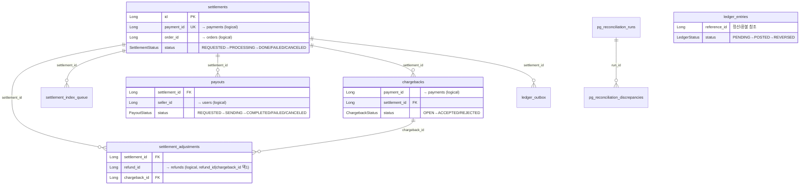
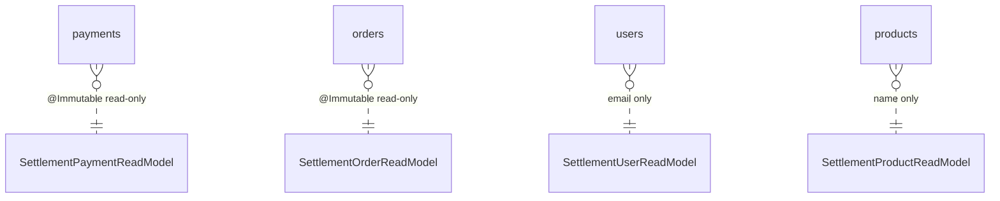
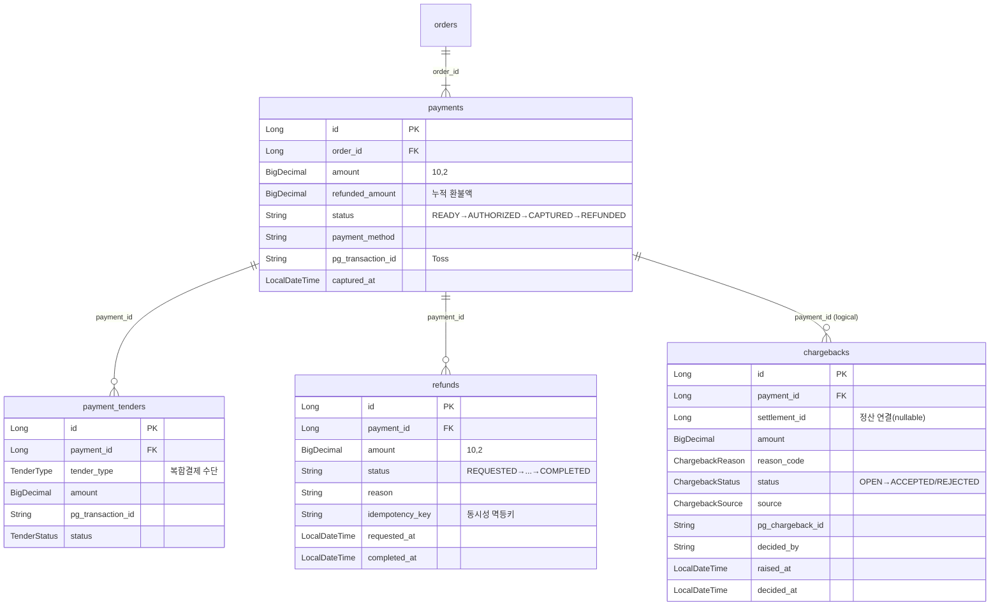
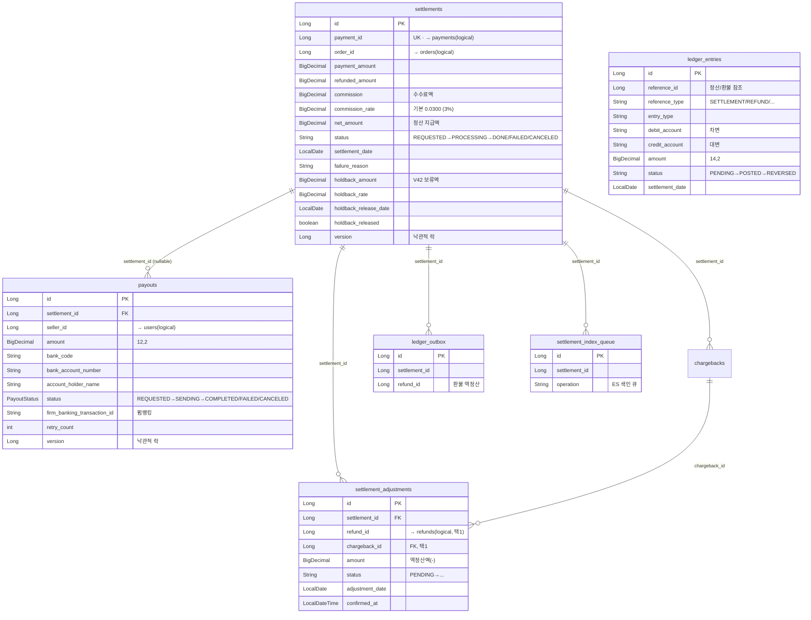
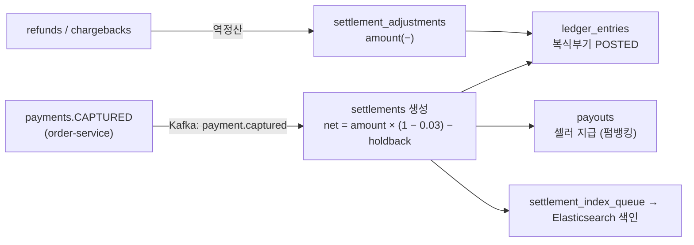

# Lemuel 데이터베이스 (DB) 문서

이커머스 + 정산 MSA 플랫폼의 데이터베이스 문서. **1부 ERD**(도메인 구조)와 **2부 RDBMS 비교 분석**(PostgreSQL vs MySQL vs MariaDB)으로 구성된다.

---

## 1부. 도메인 구조 ERD

실제 JPA 엔티티 컬럼 기준으로 작성됨.

MSA로 분리돼 있어 **2개의 Bounded Context**(order-service / settlement-service) + 공유 인프라 테이블로 구성된다.
두 컨텍스트 간 연결은 **DB FK가 아니라 Kafka 이벤트 + Read-only Projection**으로만 이뤄진다 (코드 의존성 0).
컨텍스트 경계를 넘는 참조(`payment_id`, `order_id`, `seller_id`, `refund_id`)는 DB FK가 아닌 논리적 참조이며 `(logical)`로 표기한다.

---

## 1) order-service (Commerce Context)

```mermaid
erDiagram
    users ||--o{ orders : "user_id"
    users ||--o| carts : "user_id (unique)"
    users ||--o{ reviews : "user_id"
    users ||--o{ coupon_usages : "user_id"
    users ||--o{ membership_approvals : "user_id"
    users ||--o{ password_reset_tokens : "user_id"
    users ||--o{ products : "seller_id"

    categories ||--o{ categories : "parent_id (self)"
    categories ||--o{ products : "category_id"
    ecommerce_categories ||--o{ ecommerce_categories : "parent_id (self)"

    products ||--o{ product_variants : "product_id"
    products ||--o{ product_images : "product_id"
    products ||--o{ product_tags : "product_id"
    tags ||--o{ product_tags : "tag_id"
    products ||--o{ product_ecommerce_categories : "product_id"
    ecommerce_categories ||--o{ product_ecommerce_categories : "category_id"

    carts ||--o{ cart_items : "cart_id"
    products ||--o{ cart_items : "product_id"
    product_variants ||--o{ cart_items : "variant_id"

    orders ||--o{ order_items : "order_id"
    orders ||--o{ order_status_history : "order_id"
    orders ||--o| shipments : "order_id (unique)"
    products ||--o{ order_items : "product_id"
    product_variants ||--o{ order_items : "variant_id"
    orders ||--o{ coupon_usages : "order_id"

    orders ||--|{ payments : "order_id"
    payments ||--o{ payment_tenders : "payment_id"
    payments ||--o{ refunds : "payment_id"

    coupons ||--o{ coupon_usages : "coupon_id"
    products ||--o{ reviews : "product_id"
    products ||--o{ reservations : "product_id"
```

**상태(enum) 보유 테이블**: `orders`(CREATED→PAID→REFUNDED/CANCELED), `payments`(READY→AUTHORIZED→CAPTURED→REFUNDED), `payment_tenders`(TenderStatus), `products`(ProductStatus), `product_variants`, `shipments`(ShippingStatus).

---

## 2) settlement-service (Settlement Context)

---

## 3) 서비스 경계 (Cross-Context, FK 없음)

- `settlements.payment_id / order_id`, `payouts.seller_id`, `chargebacks.payment_id`, `settlement_adjustments.refund_id`는 **논리적 참조**일 뿐 DB FK 제약이 없다. order-service 테이블을 코드 import 없이 `@Immutable` Read-Model로만 조회한다.
- 실제 데이터 흐름: `payments.CAPTURED` → `outbox_events` → Kafka → settlement-service consumer → `processed_events`(멱등) → `settlements` 생성.

---

## 4) shared-common (공유 인프라)

| 테이블 | PK | 핵심 컬럼 / 관계 |
|--------|-----|-----------------|
| `outbox_events` | id | `event_id` UUID UNIQUE, `aggregate_id`, status(OutboxEventStatus) — 멱등 1차 방어 |
| `processed_events` | (consumer_group, event_id) 복합 PK | 멱등 2차 방어 |
| `audit_logs` | id | `actor_id` → users(논리), `resource_id` — PII 마스킹 감사 로그 |

---

## 5) 결제 → 환불 → 차지백 관계 (상세 ERD)

**포인트**
- `payments.refunded_amount`가 부분환불 누적액 → `getRefundableAmount() = amount - refunded_amount`.
- `refunds.idempotency_key` + Pessimistic Lock으로 환불 동시성 방어.
- `payment_tenders`는 복합결제(카드+포인트 등) 분할 수단. 1 payment : N tender.
- `chargebacks`는 settlement-service 소속이라 `payment_id`는 **논리적 참조**(read-model 경유), `settlement_id`는 같은 컨텍스트 내 실제 참조.

---

## 6) 정산 집계 흐름 (상세 ERD — settlement-service)

**집계 / 역정산 흐름**

**포인트**
- `settlements.net_amount = payment_amount − commission − holdback_amount`. 기본 수수료율 3%(`commission_rate=0.0300`), 셀러 티어/홀드백 정책으로 차등.
- `settlement_adjustments`는 환불(`refund_id`) **또는** 차지백(`chargeback_id`) 중 **하나만** 채워지는 역정산 레코드 (V25 nullable 완화 + V44 chargeback 연결).
- `ledger_entries`는 복식부기(차변/대변) 원장. `ledger_outbox`로 원장 이벤트 비동기 발행.
- `settlements.version` / `payouts.version` 낙관적 락으로 동시 확정·지급 방어.
- 모든 정산 변경은 `settlement_index_queue`를 통해 Elasticsearch에 비동기 색인.

---

## 핵심 정리

- **2 DB 컨텍스트**: 거래(order) ↔ 정산(settlement). 같은 PostgreSQL이지만 코드/스키마 경계 100% 분리.
- **3단 멱등 방어**: `outbox_events.event_id` UNIQUE → `processed_events` PK → `settlements.payment_id` UNIQUE.
- **셀프 참조**: `categories`, `ecommerce_categories` 트리 구조.
- **M:N**: products↔tags(`product_tags`), products↔ecommerce_categories(`product_ecommerce_categories`).

---

# 2부. RDBMS 비교 분석 — PostgreSQL vs MySQL vs MariaDB

이 프로젝트는 **PostgreSQL 17** 을 사용한다. 왜 PostgreSQL 을 골랐는지, 그리고 가장 널리 쓰이는 대안인 MySQL·MariaDB 와 무엇이 다른지 비교한다.

## 2-1. 세 DB 한눈에

| 항목 | PostgreSQL | MySQL | MariaDB |
|------|------------|-------|---------|
| 성격 | 객체-관계형(ORDBMS), 표준 준수·기능 풍부 | 관계형, 단순·빠른 읽기에 강점 | MySQL 포크(2009, MySQL 창시자 주도) |
| 라이선스 | PostgreSQL License (BSD 계열, 매우 자유) | GPL + 상용 듀얼(Oracle 소유) | GPL (커뮤니티 주도) |
| 최초 릴리스 | 1996 | 1995 | 2009 (MySQL 5.1 fork) |
| 기본 스토리지 엔진 | 단일 통합 엔진(MVCC 내장) | InnoDB (트랜잭션), MyISAM(레거시) | InnoDB / Aria / 다양한 엔진 선택 |
| 지향점 | 정합성·복잡 쿼리·확장성 | 웹 표준 스택(LAMP)·범용 | MySQL 호환 + 오픈소스 자유 |

## 2-2. 기능 비교

| 기능 | PostgreSQL | MySQL | MariaDB |
|------|------------|-------|---------|
| MVCC(다중버전 동시성) | ✅ 강력(튜플 버전) | ✅ InnoDB | ✅ InnoDB |
| 트랜잭션/ACID | ✅ 완전 | ✅ InnoDB 한정 | ✅ InnoDB 한정 |
| `FOR UPDATE SKIP LOCKED` | ✅ (9.5+) | ✅ (8.0+) | ✅ (10.6+) |
| 복합/부분/표현식 인덱스 | ✅ 부분·표현식·GIN·GiST·BRIN | 제한적(부분 인덱스 없음) | 제한적 |
| JSON | ✅ `jsonb`(인덱싱·연산 풍부) | ✅ `json`(기능 제한적) | ✅ `json`(내부적으로 LONGTEXT) |
| CTE / 윈도우 함수 | ✅ 성숙 | ✅ (8.0+) | ✅ (10.2+) |
| 전문검색(Full-Text) | ✅ 내장(tsvector) | ✅ InnoDB FTS | ✅ |
| 지리정보(GIS) | ✅ PostGIS(업계 표준) | ✅ 기본 | ✅ 기본 |
| 머티리얼라이즈드 뷰 | ✅ | ❌ (미지원) | ❌ (미지원) |
| 사용자 정의 타입/배열/`ENUM` | ✅ 풍부 | 제한적 | 제한적 |
| 시퀀스 | ✅ 진짜 `SEQUENCE` | AUTO_INCREMENT(8.0부터 시퀀스) | ✅ 시퀀스 지원 |
| 복제 | 스트리밍/논리 복제 | 비동기/반동기/그룹 | Galera(동기 멀티마스터) 강점 |

## 2-3. 아키텍처 핵심 차이

- **PostgreSQL — 추가형(append-only) MVCC**: UPDATE 시 새 튜플을 쓰고 옛 튜플은 dead 처리 → `VACUUM`(autovacuum)으로 정리. 동시 읽기/쓰기가 서로 막지 않음. 대신 dead tuple 관리(bloat)와 vacuum 튜닝이 운영 포인트.
- **MySQL/MariaDB(InnoDB) — undo 로그형 MVCC**: 변경 전 이미지를 undo 로그에 보관해 일관 읽기 제공. clustered index(PK 기준 물리 정렬)라 PK 조회가 빠르고, secondary index 는 PK 를 다시 참조한다.
- **스토리지 엔진**: PostgreSQL 은 단일 통합 엔진. MySQL/MariaDB 는 테이블별 엔진 선택 가능(InnoDB 권장, MyISAM 은 트랜잭션·FK 미지원이라 지양). MariaDB 는 Aria·ColumnStore·Spider 등 선택지가 더 넓음.

## 2-4. 이 프로젝트가 PostgreSQL 을 쓴 이유

정산(금융성) 도메인의 요구사항과 PostgreSQL 강점이 정확히 맞물린다.

1. **강한 정합성 + 동시성**: 낙관적 락(`@Version`) + 비관적 락 + `FOR UPDATE SKIP LOCKED` 기반 Outbox 멀티워커 claim(`SpringDataOutboxEventRepository.selectClaimableIds`). PostgreSQL 의 MVCC 와 SKIP LOCKED 가 경합 없는 작업 분배를 안정적으로 제공.
2. **부분 인덱스·복합 인덱스**: `V20260611100000__add_missing_query_indexes` 등에서 쿼리 패턴 맞춤 인덱스. PostgreSQL 의 부분/표현식 인덱스가 정산 상태별 조회·풀스캔 방지에 유리(MySQL 은 부분 인덱스 미지원).
3. **스키마/네임스페이스**: `opslab.outbox_events` 처럼 스키마 네임스페이스 활용(Outbox 리포지토리 네이티브 쿼리에서 확인됨).
4. **트리거·불변성 강제**: `V30__settlement_immutability_trigger` — DONE 정산 변경 차단 트리거. PostgreSQL 의 성숙한 트리거/제약(체크 제약 `chk_ledger_status` 등)으로 원장 정합성 방어.
5. **금액 정밀도**: `NUMERIC/BigDecimal` 정확 연산. 세 DB 모두 `DECIMAL` 을 지원하지만 PostgreSQL 의 타입 시스템(도메인 타입·체크 제약)이 더 엄격.
6. **Flyway 마이그레이션 친화**: V1~V49 + timestamp 컨벤션. PostgreSQL 의 **트랜잭셔널 DDL**(DDL 도 롤백 가능)이 마이그레이션 안전성을 크게 높임 — MySQL/MariaDB 는 DDL 이 암묵 커밋되어 실패 시 부분 적용 위험.

## 2-5. 언제 MySQL / MariaDB 가 더 나을까

- **MySQL**: 단순 read-heavy 웹 서비스, LAMP 생태계, 매니지드 서비스(RDS/Aurora MySQL) 운영 편의, 풍부한 레퍼런스/인력 풀.
- **MariaDB**: Oracle 라이선스 회피가 필요할 때, **Galera 동기 멀티마스터 클러스터**로 고가용성 구성, ColumnStore 로 분석 워크로드 병행. MySQL 드롭인 호환이 강점.
- **PostgreSQL 이 과할 수 있는 경우**: 복잡 쿼리·확장 타입·정합성 요구가 낮고 단순 CRUD 위주라면 운영 단순성 측면에서 MySQL 계열이 가벼울 수 있음.

## 2-6. 마이그레이션 시 주의 (PostgreSQL → MySQL/MariaDB 가정)

이 프로젝트를 MySQL 계열로 옮긴다면 다음이 깨질 수 있다.

- `opslab.` **스키마 네임스페이스** → MySQL 의 "schema = database" 개념으로 재설계 필요.
- **머티리얼라이즈드 뷰**·부분 인덱스·표현식 인덱스 미지원 → 대체 설계(요약 테이블, 생성 컬럼+인덱스).
- **트랜잭셔널 DDL 부재** → 마이그레이션 실패 시 수동 롤백 절차 필요.
- `jsonb` → MySQL `json`(인덱싱·연산 제약) 으로 기능 축소.
- 시퀀스/`RETURNING` → AUTO_INCREMENT + `last_insert_id()` 패턴으로 변경.
- `boolean` → MySQL `TINYINT(1)`, `NUMERIC` 정밀도·정렬 규칙(collation) 차이 검증.

## 정리 (2부)

- 세 DB 모두 InnoDB/통합엔진 기반 ACID·MVCC·SKIP LOCKED 를 지원하는 성숙한 RDBMS.
- **PostgreSQL** = 정합성·복잡 쿼리·확장성·트랜잭셔널 DDL → **정산/금융 도메인에 최적** (이 프로젝트 선택 이유).
- **MySQL** = 단순·범용·생태계, **MariaDB** = 오픈소스 자유 + Galera 클러스터.
- 선택 기준은 "성능"보다 **워크로드 성격(정합성 vs 단순 읽기) + 운영 모델 + 라이선스**.
