# Lemuel 시퀀스 다이어그램 (Sequence Diagrams)

> 이커머스 + 정산 MSA 플랫폼(21개 서비스)의 **핵심 유스케이스별 시퀀스 다이어그램**.
> 서비스 간 연계는 Kafka 이벤트로만 이루어지며(코드·DB 직접 의존 0), 비동기 구간은 `-->>` 및 `Note` 로 명시한다.
>
> - 정본 근거: [`../SPEC.md`](../SPEC.md)(기능·이벤트 카탈로그) · [`ARCHITECTURE.md`](ARCHITECTURE.md)(패턴) · [`adr`](./docs/adr/)
> - 최종 갱신: 2026-07-16

---

## 1. 참여자(Participant) 정의

| 참여자 | 설명 |
|-------|------|
| User / Seller / CEO / Admin | 구매자 · 셀러 · 상장사 CEO · 운영자 |
| Gateway | gateway-service (8080, Spring Cloud Gateway — 라우팅만, 인증은 각 서비스) |
| Order | order-service (8088, opslab) — 회원·상품·주문·결제·환불·`/internal/recon` |
| Settlement | settlement-service (8082, settlement_db) — 정산·payout·원장·차지백·PG대사 |
| Loan | loan-service (8084, lemuel_loan) — 선정산·기업대출 |
| Investment | investment-service (8100, lemuel_investment) — 투자점수·투자주문 |
| Account | account-service (8102, lemuel_account) — 계정계 GL(소비 전용) |
| Kafka | Kafka(Redpanda) — 토픽 `lemuel.<domain>.<event>` |
| Outbox | 각 서비스 내 `outbox_events` + 멀티워커 폴러(FOR UPDATE SKIP LOCKED) |
| Toss | Toss Payments (외부 PG) |
| DART / ECOS / KRX / Naver | 외부 데이터 원천 (재무제표 · 경제지표 · 시세 · 뉴스) |
| Notification | notification-service (8130, Kotlin) — 다채널 알림 |
| PayWebhook | payment-webhook-service (8111, Go) — Toss 웹훅 수신 |
| LLM | Gemini / Anthropic Claude (ai-service provider 스위치) |

---

## 2. 전체 시스템 컨텍스트 — 커머스 → 정산 → 금융 이벤트 백본

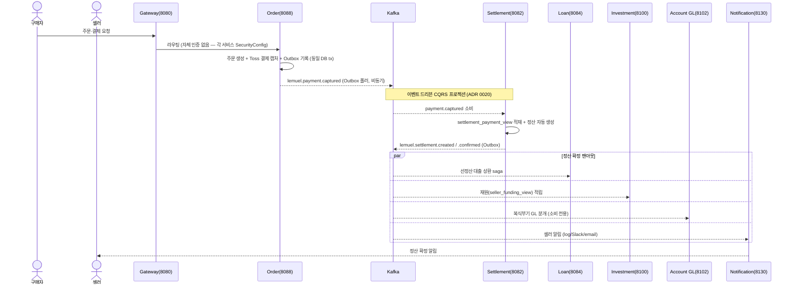
```mermaid
sequenceDiagram
    actor Buyer as 구매자
    actor Seller as 셀러
    participant GW as Gateway(8080)
    participant ORD as Order(8088)
    participant K as Kafka
    participant STL as Settlement(8082)
    participant LOAN as Loan(8084)
    participant INV as Investment(8100)
    participant ACC as Account GL(8102)
    participant NOTI as Notification(8130)

    Buyer->>GW: 주문·결제 요청
    GW->>ORD: 라우팅 (자체 인증 없음 — 각 서비스 SecurityConfig)
    ORD->>ORD: 주문 생성 + Toss 결제 캡처 + Outbox 기록 (동일 DB tx)
    ORD-->>K: lemuel.payment.captured (Outbox 폴러, 비동기)

    Note over K,STL: 이벤트 드리븐 CQRS 프로젝션 (ADR 0020)
    K-->>STL: payment.captured 소비
    STL->>STL: settlement_payment_view 적재 + 정산 자동 생성
    STL-->>K: lemuel.settlement.created / .confirmed (Outbox)

    par 정산 확정 팬아웃
        K-->>LOAN: 선정산 대출 상환 saga
    and
        K-->>INV: 재원(seller_funding_view) 적립
    and
        K-->>ACC: 복식부기 GL 분개 (소비 전용)
    and
        K-->>NOTI: 셀러 알림 (log/Slack/email)
    end
    NOTI-->>Seller: 정산 확정 알림
```

---

## 3. 인증 플로우 — JWT 발급 (order-service AuthController)

### 3.1 정상 플로우

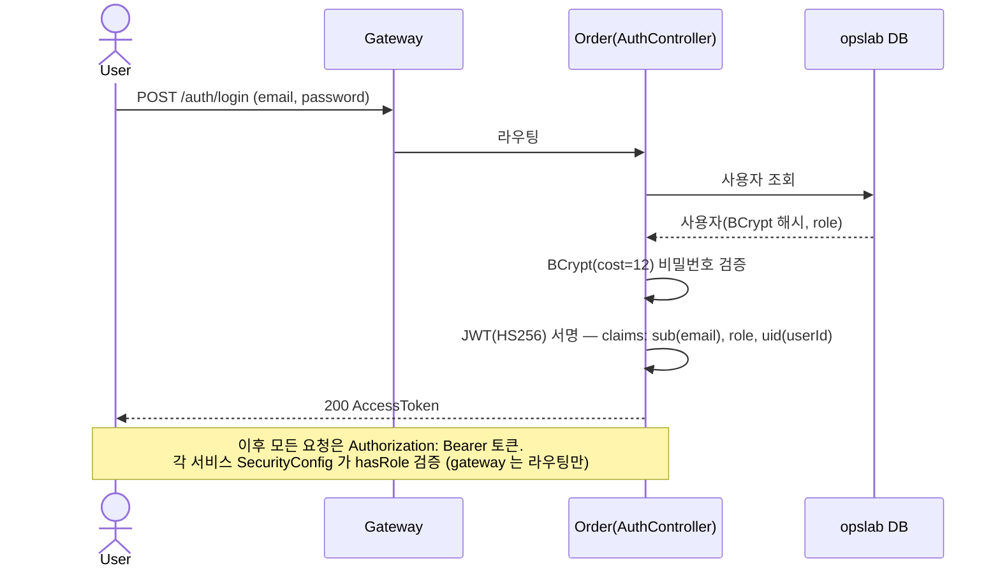
```mermaid
sequenceDiagram
    actor User
    participant GW as Gateway
    participant ORD as Order(AuthController)
    participant DB as opslab DB

    User->>GW: POST /auth/login (email, password)
    GW->>ORD: 라우팅
    ORD->>DB: 사용자 조회
    DB-->>ORD: 사용자(BCrypt 해시, role)
    ORD->>ORD: BCrypt(cost=12) 비밀번호 검증
    ORD->>ORD: JWT(HS256) 서명 — claims: sub(email), role, uid(userId)
    ORD-->>User: 200 AccessToken
    Note over User,ORD: 이후 모든 요청은 Authorization: Bearer 토큰.<br/>각 서비스 SecurityConfig 가 hasRole 검증 (gateway 는 라우팅만)
```

### 3.2 예외 플로우

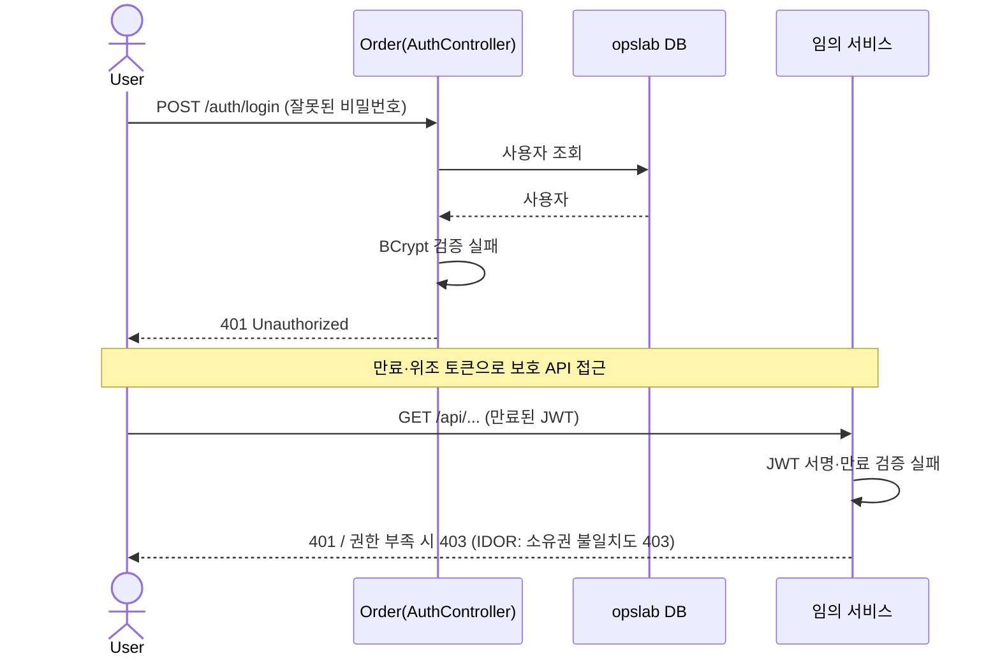
```mermaid
sequenceDiagram
    actor User
    participant ORD as Order(AuthController)
    participant DB as opslab DB
    participant SVC as 임의 서비스

    User->>ORD: POST /auth/login (잘못된 비밀번호)
    ORD->>DB: 사용자 조회
    DB-->>ORD: 사용자
    ORD->>ORD: BCrypt 검증 실패
    ORD-->>User: 401 Unauthorized

    Note over User,SVC: 만료·위조 토큰으로 보호 API 접근
    User->>SVC: GET /api/... (만료된 JWT)
    SVC->>SVC: JWT 서명·만료 검증 실패
    SVC-->>User: 401 / 권한 부족 시 403 (IDOR: 소유권 불일치도 403)
```

---

## 4. 주문 생성 + 결제 캡처 (order-service ↔ Toss)

### 4.1 정상 플로우 — 주문 → Toss 결제 → Outbox 발행

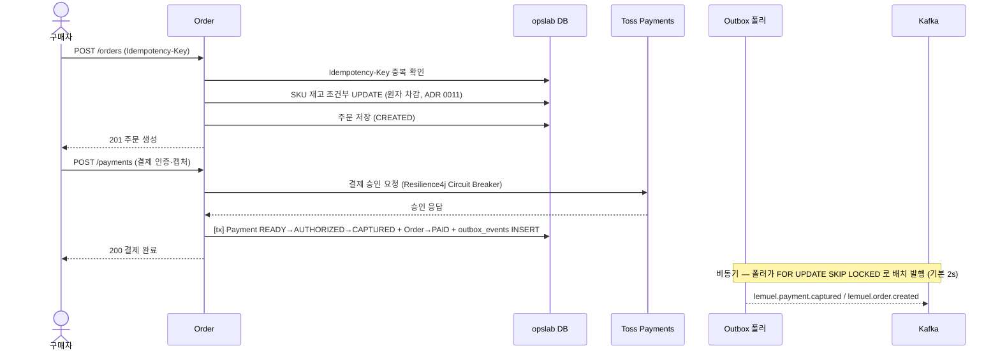
```mermaid
sequenceDiagram
    actor Buyer as 구매자
    participant ORD as Order
    participant DB as opslab DB
    participant Toss as Toss Payments
    participant OB as Outbox 폴러
    participant K as Kafka

    Buyer->>ORD: POST /orders (Idempotency-Key)
    ORD->>DB: Idempotency-Key 중복 확인
    ORD->>DB: SKU 재고 조건부 UPDATE (원자 차감, ADR 0011)
    ORD->>DB: 주문 저장 (CREATED)
    ORD-->>Buyer: 201 주문 생성

    Buyer->>ORD: POST /payments (결제 인증·캡처)
    ORD->>Toss: 결제 승인 요청 (Resilience4j Circuit Breaker)
    Toss-->>ORD: 승인 응답
    ORD->>DB: [tx] Payment READY→AUTHORIZED→CAPTURED + Order→PAID + outbox_events INSERT
    ORD-->>Buyer: 200 결제 완료

    Note over OB,K: 비동기 — 폴러가 FOR UPDATE SKIP LOCKED 로 배치 발행 (기본 2s)
    OB-->>K: lemuel.payment.captured / lemuel.order.created
```

### 4.2 예외 플로우 — 재고 부족 · 중복 제출 · PG 실패

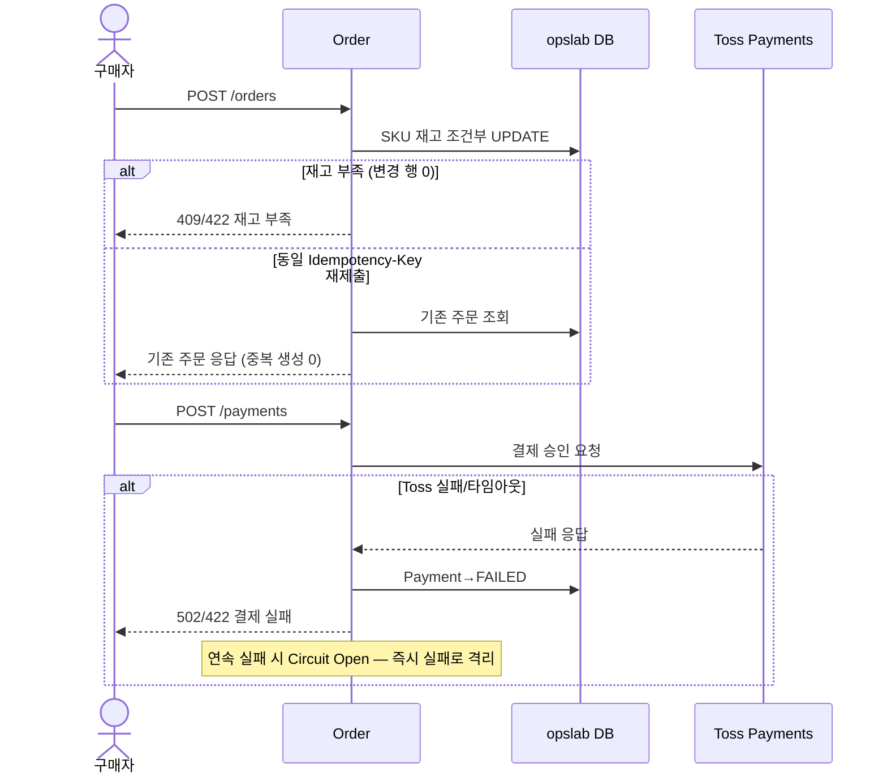
```mermaid
sequenceDiagram
    actor Buyer as 구매자
    participant ORD as Order
    participant DB as opslab DB
    participant Toss as Toss Payments

    Buyer->>ORD: POST /orders
    ORD->>DB: SKU 재고 조건부 UPDATE
    alt 재고 부족 (변경 행 0)
        ORD-->>Buyer: 409/422 재고 부족
    else 동일 Idempotency-Key 재제출
        ORD->>DB: 기존 주문 조회
        ORD-->>Buyer: 기존 주문 응답 (중복 생성 0)
    end

    Buyer->>ORD: POST /payments
    ORD->>Toss: 결제 승인 요청
    alt Toss 실패/타임아웃
        Toss-->>ORD: 실패 응답
        ORD->>DB: Payment→FAILED
        ORD-->>Buyer: 502/422 결제 실패
        Note over ORD: 연속 실패 시 Circuit Open — 즉시 실패로 격리
    end
```

---

## 5. ★ 이벤트 프로젝션 + 정산 자동 생성 (ADR 0020, 비동기)

settlement 는 order 코드·DB 를 일절 참조하지 않고, Kafka 이벤트를 자기 DB 프로젝션(`settlement_*_view`)으로 적재한다.
정산 생성의 진입점은 REST 가 아니라 **`payment.captured` 컨슈머**다.

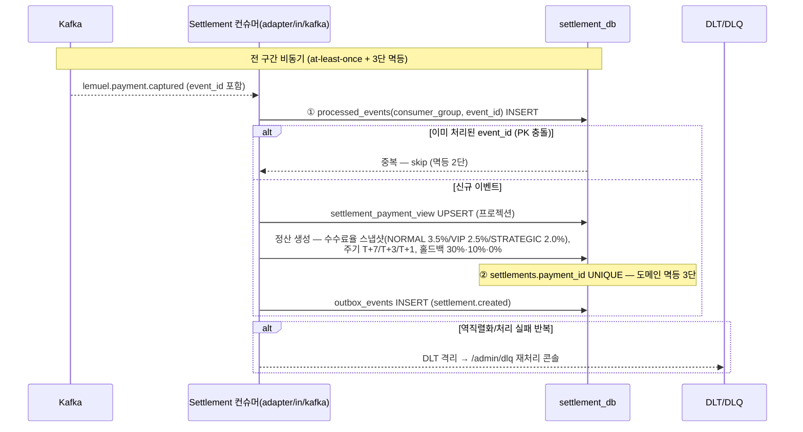
```mermaid
sequenceDiagram
    participant K as Kafka
    participant CONS as Settlement 컨슈머(adapter/in/kafka)
    participant SDB as settlement_db
    participant DLT as DLT/DLQ

    Note over K,SDB: 전 구간 비동기 (at-least-once + 3단 멱등)
    K-->>CONS: lemuel.payment.captured (event_id 포함)
    CONS->>SDB: ① processed_events(consumer_group, event_id) INSERT
    alt 이미 처리된 event_id (PK 충돌)
        SDB-->>CONS: 중복 — skip (멱등 2단)
    else 신규 이벤트
        CONS->>SDB: settlement_payment_view UPSERT (프로젝션)
        CONS->>SDB: 정산 생성 — 수수료율 스냅샷(NORMAL 3.5%/VIP 2.5%/STRATEGIC 2.0%),<br/>주기 T+7/T+3/T+1, 홀드백 30%·10%·0%
        Note over SDB: ② settlements.payment_id UNIQUE — 도메인 멱등 3단
        CONS->>SDB: outbox_events INSERT (settlement.created)
    end

    alt 역직렬화/처리 실패 반복
        CONS-->>DLT: DLT 격리 → /admin/dlq 재처리 콘솔
    end
```

---

## 6. 정산 확정 배치 → 이벤트 팬아웃

### 6.1 정상 플로우 — SettlementConfirmJob + 4개 컨슈머

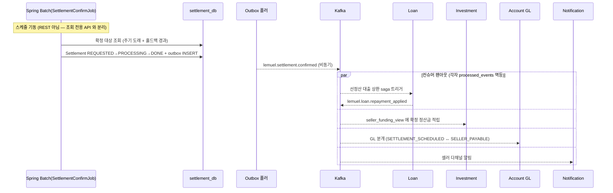
```mermaid
sequenceDiagram
    participant BATCH as Spring Batch(SettlementConfirmJob)
    participant SDB as settlement_db
    participant OB as Outbox 폴러
    participant K as Kafka
    participant LOAN as Loan
    participant INV as Investment
    participant ACC as Account GL
    participant NOTI as Notification

    Note over BATCH: 스케줄 기동 (REST 아님 — 조회 전용 API 와 분리)
    BATCH->>SDB: 확정 대상 조회 (주기 도래 + 홀드백 경과)
    BATCH->>SDB: Settlement REQUESTED→PROCESSING→DONE + outbox INSERT
    OB-->>K: lemuel.settlement.confirmed (비동기)

    par 컨슈머 팬아웃 (각자 processed_events 멱등)
        K-->>LOAN: 선정산 대출 상환 saga 트리거
        LOAN-->>K: lemuel.loan.repayment_applied
    and
        K-->>INV: seller_funding_view 에 확정 정산금 적립
    and
        K-->>ACC: GL 분개 (SETTLEMENT_SCHEDULED ↔ SELLER_PAYABLE)
    and
        K-->>NOTI: 셀러 다채널 알림
    end
```

### 6.2 예외 플로우 — 확정 실패

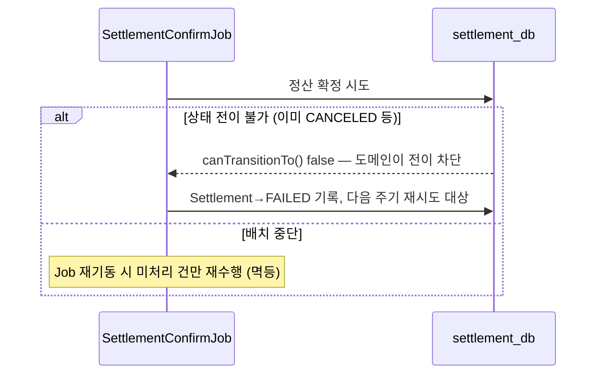
```mermaid
sequenceDiagram
    participant BATCH as SettlementConfirmJob
    participant SDB as settlement_db

    BATCH->>SDB: 정산 확정 시도
    alt 상태 전이 불가 (이미 CANCELED 등)
        SDB-->>BATCH: canTransitionTo() false — 도메인이 전이 차단
        BATCH->>SDB: Settlement→FAILED 기록, 다음 주기 재시도 대상
    else 배치 중단
        Note over BATCH: Job 재기동 시 미처리 건만 재수행 (멱등)
    end
```

---

## 7. 환불 → 역정산 (Saga 보상 트랜잭션, ADR 0004)

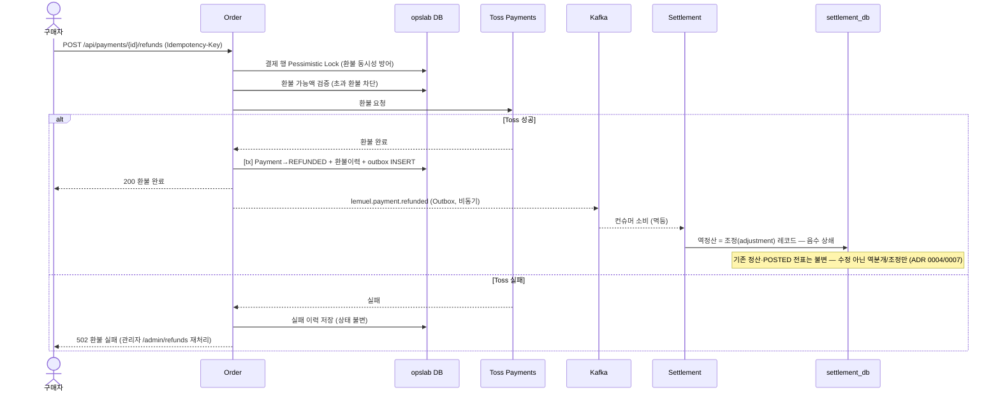
```mermaid
sequenceDiagram
    actor Buyer as 구매자
    participant ORD as Order
    participant ODB as opslab DB
    participant Toss as Toss Payments
    participant K as Kafka
    participant STL as Settlement
    participant SDB as settlement_db

    Buyer->>ORD: POST /api/payments/{id}/refunds (Idempotency-Key)
    ORD->>ODB: 결제 행 Pessimistic Lock (환불 동시성 방어)
    ORD->>ODB: 환불 가능액 검증 (초과 환불 차단)
    ORD->>Toss: 환불 요청
    alt Toss 성공
        Toss-->>ORD: 환불 완료
        ORD->>ODB: [tx] Payment→REFUNDED + 환불이력 + outbox INSERT
        ORD-->>Buyer: 200 환불 완료
        ORD-->>K: lemuel.payment.refunded (Outbox, 비동기)
        K-->>STL: 컨슈머 소비 (멱등)
        STL->>SDB: 역정산 = 조정(adjustment) 레코드 — 음수 상쇄
        Note over SDB: 기존 정산·POSTED 전표는 불변 — 수정 아닌 역분개/조정만 (ADR 0004/0007)
    else Toss 실패
        Toss-->>ORD: 실패
        ORD->>ODB: 실패 이력 저장 (상태 불변)
        ORD-->>Buyer: 502 환불 실패 (관리자 /admin/refunds 재처리)
    end
```

---

## 8. 지급(Payout) 실행 — 관리자 + 펌뱅킹 + 원장

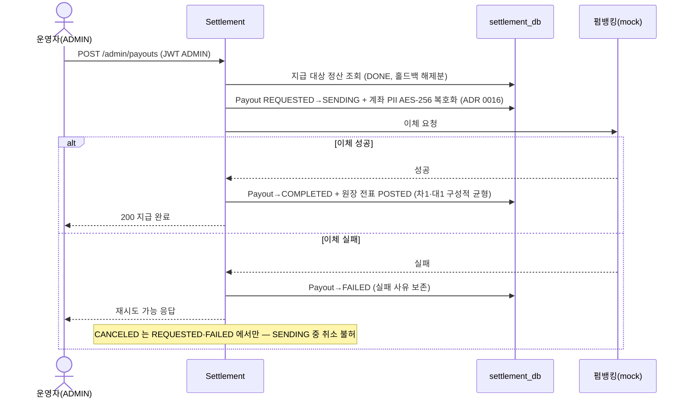
```mermaid
sequenceDiagram
    actor Admin as 운영자(ADMIN)
    participant STL as Settlement
    participant SDB as settlement_db
    participant BANK as 펌뱅킹(mock)

    Admin->>STL: POST /admin/payouts (JWT ADMIN)
    STL->>SDB: 지급 대상 정산 조회 (DONE, 홀드백 해제분)
    STL->>SDB: Payout REQUESTED→SENDING + 계좌 PII AES-256 복호화 (ADR 0016)
    STL->>BANK: 이체 요청
    alt 이체 성공
        BANK-->>STL: 성공
        STL->>SDB: Payout→COMPLETED + 원장 전표 POSTED (차1·대1 구성적 균형)
        STL-->>Admin: 200 지급 완료
    else 이체 실패
        BANK-->>STL: 실패
        STL->>SDB: Payout→FAILED (실패 사유 보존)
        STL-->>Admin: 재시도 가능 응답
        Note over STL: CANCELED 는 REQUESTED·FAILED 에서만 — SENDING 중 취소 불허
    end
```

---

## 9. 선정산 대출 · 기업대출 (loan-service)

### 9.1 선정산 대출 — 신청 → 정산 확정 시 상환 saga

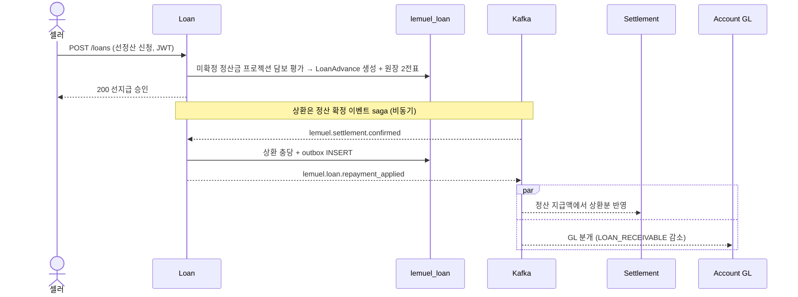
```mermaid
sequenceDiagram
    actor Seller as 셀러
    participant LOAN as Loan
    participant LDB as lemuel_loan
    participant K as Kafka
    participant STL as Settlement
    participant ACC as Account GL

    Seller->>LOAN: POST /loans (선정산 신청, JWT)
    LOAN->>LDB: 미확정 정산금 프로젝션 담보 평가 → LoanAdvance 생성 + 원장 2전표
    LOAN-->>Seller: 200 선지급 승인

    Note over K,LOAN: 상환은 정산 확정 이벤트 saga (비동기)
    K-->>LOAN: lemuel.settlement.confirmed
    LOAN->>LDB: 상환 충당 + outbox INSERT
    LOAN-->>K: lemuel.loan.repayment_applied
    par
        K-->>STL: 정산 지급액에서 상환분 반영
    and
        K-->>ACC: GL 분개 (LOAN_RECEIVABLE 감소)
    end
```

### 9.2 기업 신용대출 — 신청 심사(422 게이트) → ADMIN 실행

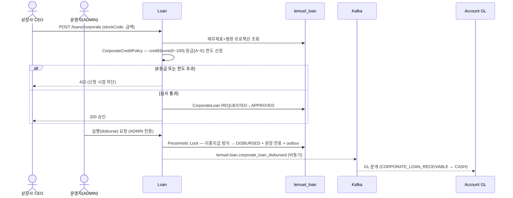
```mermaid
sequenceDiagram
    actor CEO as 상장사 CEO
    actor Admin as 운영자(ADMIN)
    participant LOAN as Loan
    participant LDB as lemuel_loan
    participant K as Kafka
    participant ACC as Account GL

    CEO->>LOAN: POST /loans/corporate (stockCode, 금액)
    LOAN->>LDB: 재무제표+평판 프로젝션 조회
    LOAN->>LOAN: CorporateCreditPolicy — creditScore(0~100)·등급(A~E)·한도 산정
    alt E등급 또는 한도 초과
        LOAN-->>CEO: 422 (신청 시점 차단)
    else 심사 통과
        LOAN->>LDB: CorporateLoan REQUESTED→APPROVED
        LOAN-->>CEO: 200 승인
    end

    Admin->>LOAN: 실행(disburse) 요청 (ADMIN 전용)
    LOAN->>LDB: Pessimistic Lock — 이중지급 방지 → DISBURSED + 원장 전표 + outbox
    LOAN-->>K: lemuel.loan.corporate_loan_disbursed (비동기)
    K-->>ACC: GL 분개 (CORPORATE_LOAN_RECEIVABLE ↔ CASH)
```

---

## 10. 투자 주문 (investment-service) — 재원 검증 + 소유권 강제

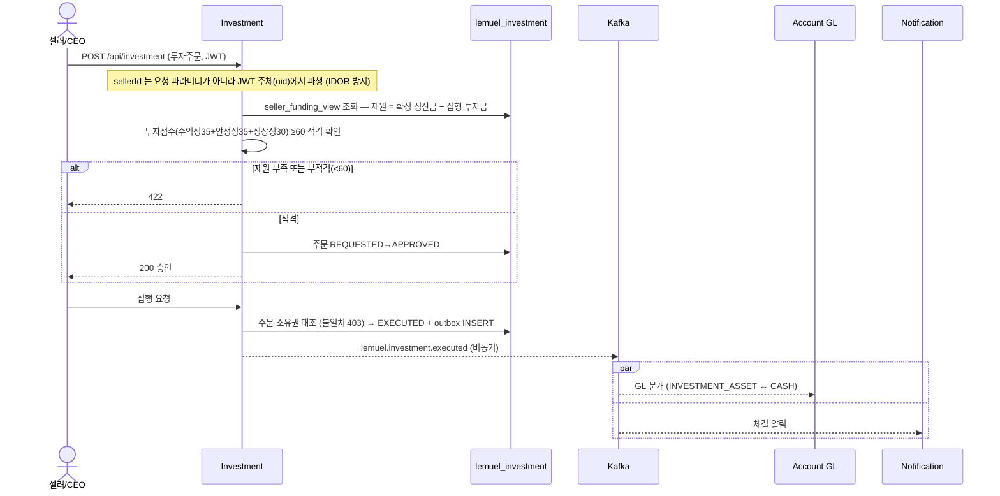
```mermaid
sequenceDiagram
    actor CEO as 셀러/CEO
    participant INV as Investment
    participant IDB as lemuel_investment
    participant K as Kafka
    participant ACC as Account GL
    participant NOTI as Notification

    CEO->>INV: POST /api/investment (투자주문, JWT)
    Note over INV: sellerId 는 요청 파라미터가 아니라 JWT 주체(uid)에서 파생 (IDOR 방지)
    INV->>IDB: seller_funding_view 조회 — 재원 = 확정 정산금 − 집행 투자금
    INV->>INV: 투자점수(수익성35+안정성35+성장성30) ≥60 적격 확인
    alt 재원 부족 또는 부적격(<60)
        INV-->>CEO: 422
    else 적격
        INV->>IDB: 주문 REQUESTED→APPROVED
        INV-->>CEO: 200 승인
    end

    CEO->>INV: 집행 요청
    INV->>IDB: 주문 소유권 대조 (불일치 403) → EXECUTED + outbox INSERT
    INV-->>K: lemuel.investment.executed (비동기)
    par
        K-->>ACC: GL 분개 (INVESTMENT_ASSET ↔ CASH)
    and
        K-->>NOTI: 체결 알림
    end
```

---

## 11. 계정계 GL 소비 (account-service — 소비 전용, 발행 0)

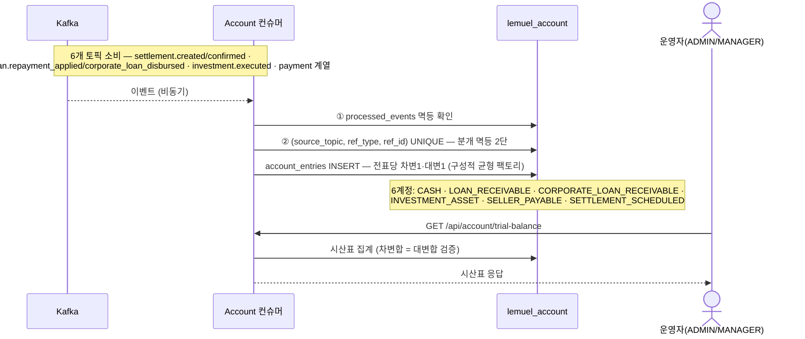
```mermaid
sequenceDiagram
    participant K as Kafka
    participant ACC as Account 컨슈머
    participant ADB as lemuel_account
    actor Admin as 운영자(ADMIN/MANAGER)

    Note over K,ACC: 6개 토픽 소비 — settlement.created/confirmed ·<br/>loan.repayment_applied/corporate_loan_disbursed · investment.executed · payment 계열
    K-->>ACC: 이벤트 (비동기)
    ACC->>ADB: ① processed_events 멱등 확인
    ACC->>ADB: ② (source_topic, ref_type, ref_id) UNIQUE — 분개 멱등 2단
    ACC->>ADB: account_entries INSERT — 전표당 차변1·대변1 (구성적 균형 팩토리)
    Note over ADB: 6계정: CASH · LOAN_RECEIVABLE · CORPORATE_LOAN_RECEIVABLE ·<br/>INVESTMENT_ASSET · SELLER_PAYABLE · SETTLEMENT_SCHEDULED

    Admin->>ACC: GET /api/account/trial-balance
    ACC->>ADB: 시산표 집계 (차변합 = 대변합 검증)
    ACC-->>Admin: 시산표 응답
```

---

## 12. 대사(Reconciliation) — 3계층

### 12.1 일일 대사 — settlement → order `/internal/recon` (cross-DB 0)

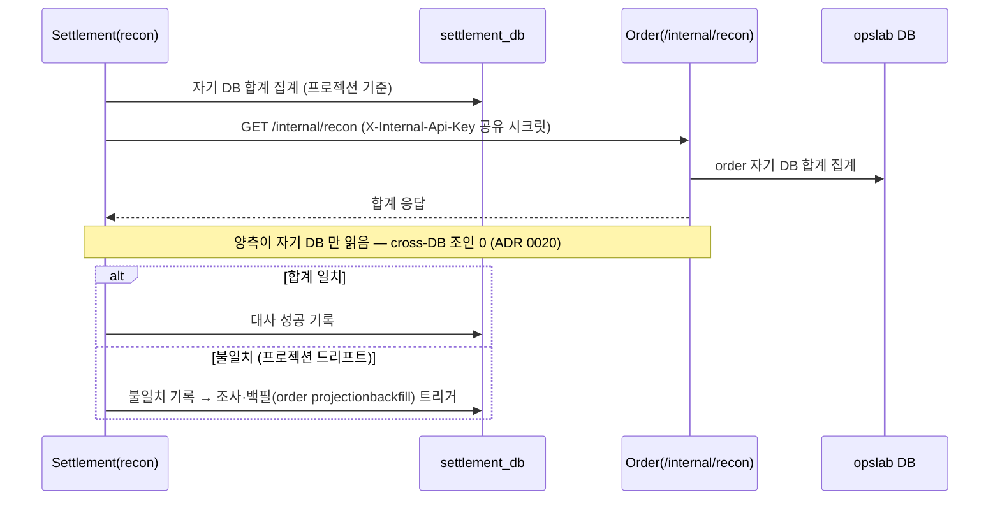
```mermaid
sequenceDiagram
    participant STL as Settlement(recon)
    participant SDB as settlement_db
    participant ORD as Order(/internal/recon)
    participant ODB as opslab DB

    STL->>SDB: 자기 DB 합계 집계 (프로젝션 기준)
    STL->>ORD: GET /internal/recon (X-Internal-Api-Key 공유 시크릿)
    ORD->>ODB: order 자기 DB 합계 집계
    ORD-->>STL: 합계 응답
    Note over STL,ORD: 양측이 자기 DB 만 읽음 — cross-DB 조인 0 (ADR 0020)
    alt 합계 일치
        STL->>SDB: 대사 성공 기록
    else 불일치 (프로젝션 드리프트)
        STL->>SDB: 불일치 기록 → 조사·백필(order projectionbackfill) 트리거
    end
```

### 12.2 PG 대사 — 정산파일 업로드 → 차이 승인/역정산

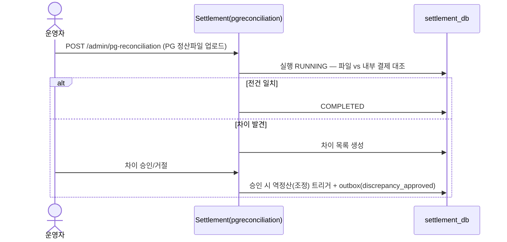
```mermaid
sequenceDiagram
    actor Admin as 운영자
    participant STL as Settlement(pgreconciliation)
    participant SDB as settlement_db

    Admin->>STL: POST /admin/pg-reconciliation (PG 정산파일 업로드)
    STL->>SDB: 실행 RUNNING — 파일 vs 내부 결제 대조
    alt 전건 일치
        STL->>SDB: COMPLETED
    else 차이 발견
        STL->>SDB: 차이 목록 생성
        Admin->>STL: 차이 승인/거절
        STL->>SDB: 승인 시 역정산(조정) 트리거 + outbox(discrepancy_approved)
    end
```

### 12.3 reconciliation-service (Kotlin, 8131) — 스케줄 다소스 병렬 대사

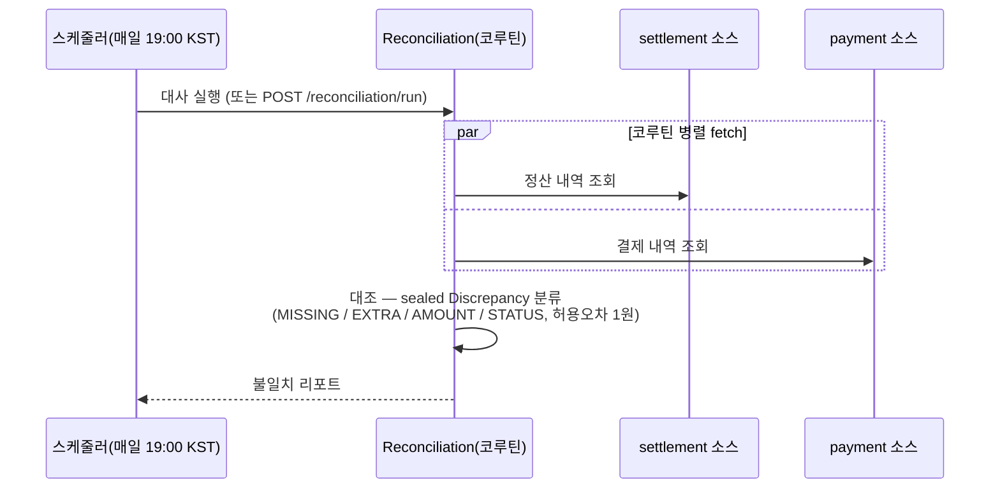
```mermaid
sequenceDiagram
    participant SCH as 스케줄러(매일 19:00 KST)
    participant REC as Reconciliation(코루틴)
    participant SRC1 as settlement 소스
    participant SRC2 as payment 소스

    SCH->>REC: 대사 실행 (또는 POST /reconciliation/run)
    par 코루틴 병렬 fetch
        REC->>SRC1: 정산 내역 조회
    and
        REC->>SRC2: 결제 내역 조회
    end
    REC->>REC: 대조 — sealed Discrepancy 분류<br/>(MISSING / EXTRA / AMOUNT / STATUS, 허용오차 1원)
    REC-->>SCH: 불일치 리포트
```

---

## 13. 외부 데이터 수집 — 위성 서비스 공통 패턴 (DART·ECOS·KRX·네이버)

financial(8086) · economics(8087) · market(8094) · company(8090) · common-data(8098) 가 동일 패턴을 공유한다.

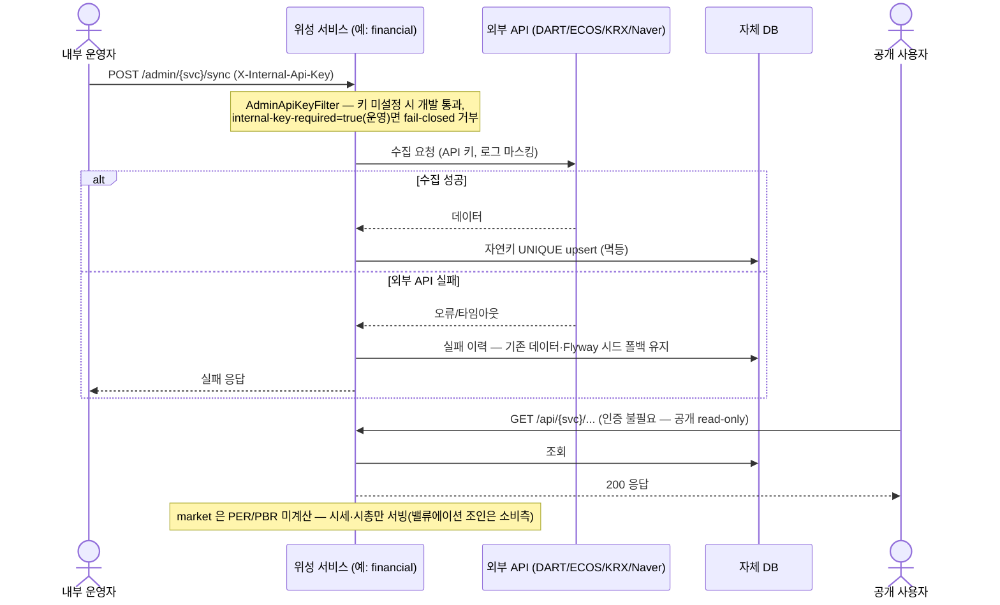
```mermaid
sequenceDiagram
    actor Ops as 내부 운영자
    participant SVC as 위성 서비스 (예: financial)
    participant EXT as 외부 API (DART/ECOS/KRX/Naver)
    participant DB as 자체 DB
    actor Public as 공개 사용자

    Ops->>SVC: POST /admin/{svc}/sync (X-Internal-Api-Key)
    Note over SVC: AdminApiKeyFilter — 키 미설정 시 개발 통과,<br/>internal-key-required=true(운영)면 fail-closed 거부
    SVC->>EXT: 수집 요청 (API 키, 로그 마스킹)
    alt 수집 성공
        EXT-->>SVC: 데이터
        SVC->>DB: 자연키 UNIQUE upsert (멱등)
    else 외부 API 실패
        EXT-->>SVC: 오류/타임아웃
        SVC->>DB: 실패 이력 — 기존 데이터·Flyway 시드 폴백 유지
        SVC-->>Ops: 실패 응답
    end

    Public->>SVC: GET /api/{svc}/... (인증 불필요 — 공개 read-only)
    SVC->>DB: 조회
    SVC-->>Public: 200 응답
    Note over SVC: market 은 PER/PBR 미계산 — 시세·시총만 서빙(밸류에이션 조인은 소비측)
```

---

## 14. 폴리글랏 엣지 — Toss 웹훅(Go) → Kafka → 알림(Kotlin)

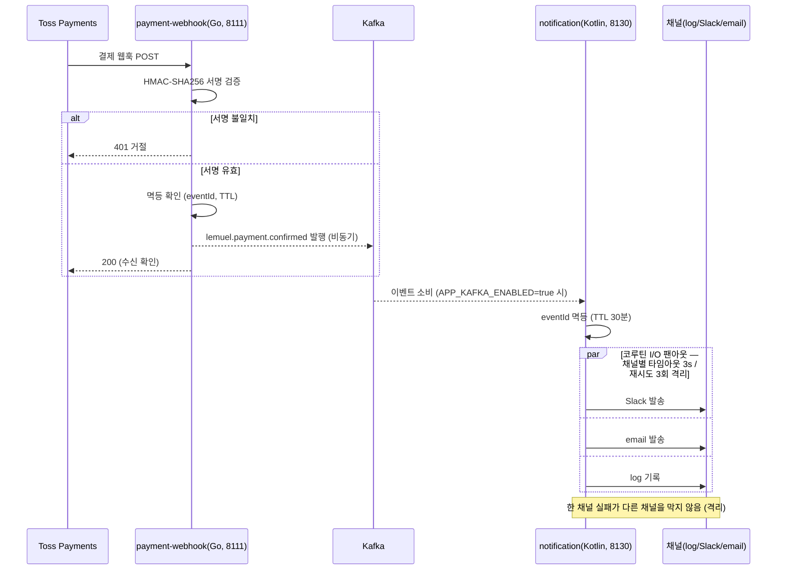
```mermaid
sequenceDiagram
    participant Toss as Toss Payments
    participant PW as payment-webhook(Go, 8111)
    participant K as Kafka
    participant NOTI as notification(Kotlin, 8130)
    participant CH as 채널(log/Slack/email)

    Toss->>PW: 결제 웹훅 POST
    PW->>PW: HMAC-SHA256 서명 검증
    alt 서명 불일치
        PW-->>Toss: 401 거절
    else 서명 유효
        PW->>PW: 멱등 확인 (eventId, TTL)
        PW-->>K: lemuel.payment.confirmed 발행 (비동기)
        PW-->>Toss: 200 (수신 확인)
    end

    K-->>NOTI: 이벤트 소비 (APP_KAFKA_ENABLED=true 시)
    NOTI->>NOTI: eventId 멱등 (TTL 30분)
    par 코루틴 I/O 팬아웃 — 채널별 타임아웃 3s / 재시도 3회 격리
        NOTI->>CH: Slack 발송
    and
        NOTI->>CH: email 발송
    and
        NOTI->>CH: log 기록
    end
    Note over NOTI,CH: 한 채널 실패가 다른 채널을 막지 않음 (격리)
```

---

## 15. AI 챗봇 (ai-service, SSE 스트리밍)

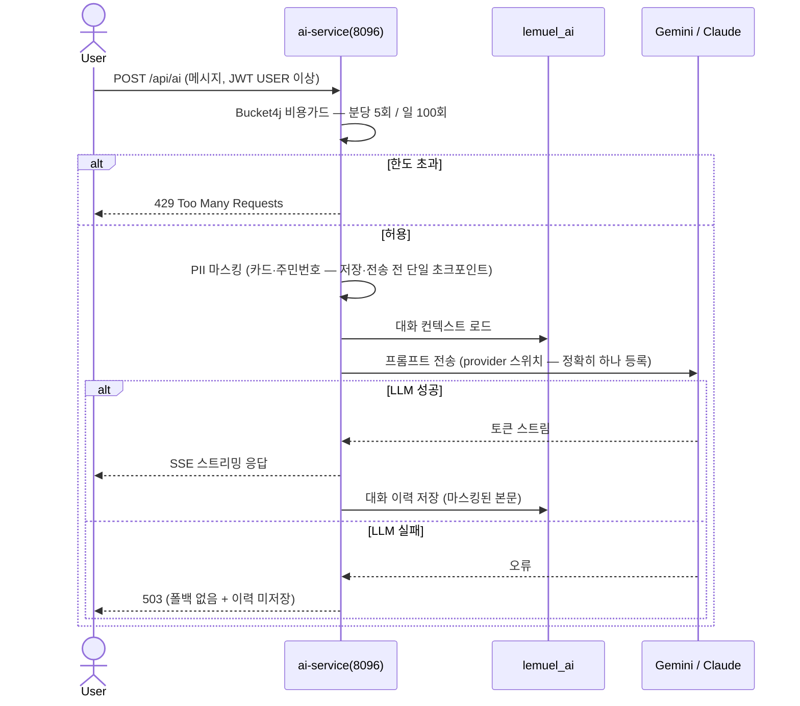
```mermaid
sequenceDiagram
    actor User
    participant AI as ai-service(8096)
    participant DB as lemuel_ai
    participant LLM as Gemini / Claude

    User->>AI: POST /api/ai (메시지, JWT USER 이상)
    AI->>AI: Bucket4j 비용가드 — 분당 5회 / 일 100회
    alt 한도 초과
        AI-->>User: 429 Too Many Requests
    else 허용
        AI->>AI: PII 마스킹 (카드·주민번호 — 저장·전송 전 단일 초크포인트)
        AI->>DB: 대화 컨텍스트 로드
        AI->>LLM: 프롬프트 전송 (provider 스위치 — 정확히 하나 등록)
        alt LLM 성공
            LLM-->>AI: 토큰 스트림
            AI-->>User: SSE 스트리밍 응답
            AI->>DB: 대화 이력 저장 (마스킹된 본문)
        else LLM 실패
            LLM-->>AI: 오류
            AI-->>User: 503 (폴백 없음 + 이력 미저장)
        end
    end
```

---

## 16. 실시간 시세 스트리밍 (market-stream-service, Go)

```mermaid
sequenceDiagram
    actor Client as 구독 클라이언트 N명
    participant MS as market-stream(Go, 8110)
    participant HUB as goroutine Hub
    participant SRC as 시세 소스(env base-url, 기본 시뮬레이션)

    Client->>MS: GET /stream/{code} (SSE) 또는 /ws/{code} (WebSocket)
    MS->>HUB: 구독자 등록
    loop 시세 갱신
        SRC-->>HUB: 종목 시세 틱
        HUB-->>Client: 팬아웃 브로드캐스트 (goroutine, 누수 0)
    end
    Client->>MS: 연결 종료
    MS->>HUB: 구독자 해제
```

---

## 17. 이벤트 카탈로그 참조 (cross-service 12 계약 토픽)

| 토픽 | 프로듀서 | 컨슈머 | 등장 다이어그램 |
|------|---------|--------|----------------|
| `lemuel.payment.captured` / `.refunded` | order | settlement · notification | §4, §5, §7 |
| `lemuel.order.created` · `lemuel.user.registered` · `lemuel.product.changed` | order | settlement(프로젝션) · company(user) | §5 |
| `lemuel.settlement.created` | settlement | loan · account | §5, §11 |
| `lemuel.settlement.confirmed` | settlement | loan · investment · account · notification | §6, §9.1, §10 |
| `lemuel.loan.repayment_applied` | loan | settlement · account | §9.1 |
| `lemuel.loan.corporate_loan_disbursed` | loan | account | §9.2 |
| `lemuel.investment.executed` | investment | account · notification | §10 |
| `lemuel.organization.created` / `.member_joined` | organization | (소비처 미배선 — 발행 전용) | — |
| `lemuel.payment.confirmed` (내부 계약) | payment-webhook(Go) | notification | §14 |

> 계약 스키마·정본 샘플: `../shared-common/src/testFixtures/resources/contracts/events` (ADR 0024).
> 모든 컨슈머는 `processed_events` + 도메인 UNIQUE 로 멱등하며, 발행은 Outbox 를 경유한다(직접 발행 예외: payment-webhook 은 Go 엣지 — 자체 TTL 멱등).
