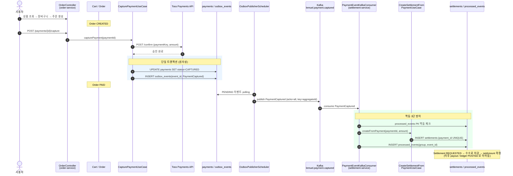
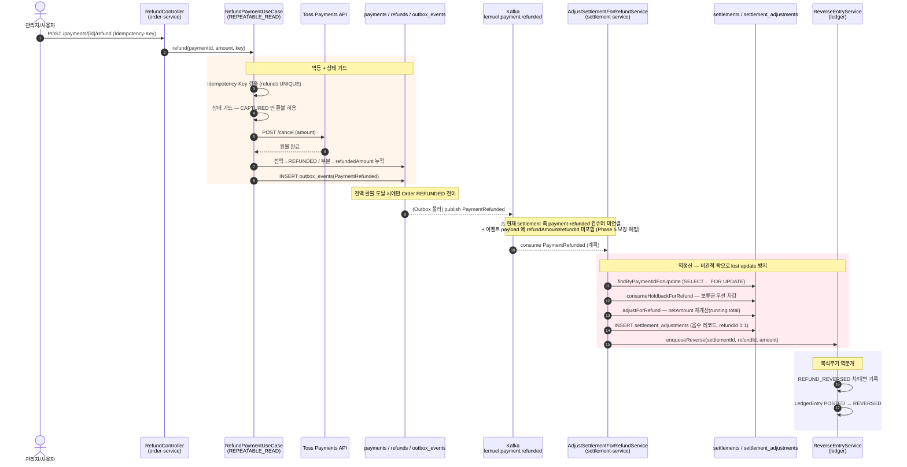

# 정상 주문 vs 환불 역정산 — 시퀀스 대비

> 같은 도메인 백본(**상품 → 주문 → 결제 → 정산**) 위에서,
> happy-path(정상 주문)와 예외-path(환불 역정산)를 나란히 비교한다.
> 참여자 이름은 실제 클래스/토픽명을 반영했고, 미구현/미연결 구간은 ⚠️ 로 표시했다.

---

## A. 정상 주문 → 정산 생성 (happy path)

사용자가 상품을 주문·결제하면, 결제 승인(CAPTURED)이 **같은 트랜잭션에서 Outbox 이벤트**를
남기고, 로컬 폴러가 Kafka로 발행 → settlement-service가 수신해 **정산을 자동 생성**한다.

핵심 방어선:
- **Outbox**: 도메인 커밋과 이벤트 발행 원자성 (커밋 안 된 이벤트 유출 / 커밋된 이벤트 누수 차단)
- **멱등 3단**: `outbox_events.event_id` UNIQUE → `processed_events` PK → `settlements.payment_id` UNIQUE

---

## B. 환불 → 정산 역정산 (예외 path)

환불은 **결제 완료(CAPTURED) 이후**에 발생한다. 정산이 이미 생성/확정됐을 수 있어
단순 차감이 아니라 **역정산(조정) + 복식부기 역분개**가 필요하다.

핵심 방어선:
- **Idempotency-Key**(`refunds` UNIQUE) — 환불 재요청 중복 차감 방지
- **상태 가드** — `CAPTURED` 상태에서만 환불 허용
- **Pessimistic Lock**(`findByPaymentIdForUpdate`) — 동시 환불 2건의 lost update 방지
- **Holdback 우선 차감** — 보류금에서 먼저 빼 셀러 추가 부담/마이너스 정산 흡수
- **SettlementAdjustment 음수 레코드** — 정산 원본을 건드리지 않고 역정산 이력 보존(감사 추적)
- **Ledger 역분개**(REFUND_REVERSED, POSTED→REVERSED) — 차대 균형 유지

---

## C. 두 흐름의 대비 요약

| 구분 | A. 정상 주문 | B. 환불 역정산 |
|------|-------------|----------------|
| 트리거 | `PaymentCaptured` | `PaymentRefunded` (결제 후) |
| 정산 작용 | settlements **생성** | settlement_adjustments **음수 보정** + netAmount 재계산 |
| 원장 | (정상 분개 / POSTED) | **역분개** REFUND_REVERSED, POSTED→REVERSED |
| 동시성 방어 | 멱등 3단 (outbox·processed·UNIQUE) | + Idempotency-Key + **Pessimistic Lock** + Holdback 우선차감 |
| 주문 상태 | CREATED→PAID | (전액 시) →REFUNDED |
| 구현 상태 | ✅ E2E 동작 | ✅ 조정·역분개 로직 구현, ⚠️ 환불 이벤트 컨슈머 연결은 Phase 5 |

---

## 부록 — 정직성 노트 (실체 반영)

- **A 흐름**은 order→Kafka→settlement 까지 컨슈머(`PaymentEventKafkaConsumer`)가
  `payment-captured` 토픽을 실제 수신해 동작한다.
- **B 흐름**의 order-service 측(환불 처리 + `PaymentRefunded` Outbox 발행)은 구현돼 있고,
  settlement-service 측 역정산 로직(`AdjustSettlementForRefundService`)·역분개
  (`ReverseEntryService`)도 구현·테스트돼 있다.
- 다만 **settlement-service 에 `payment-refunded` 토픽 `@KafkaListener` 가 아직 없다**
  (현재 컨슈머는 captured 전용). 또한 `PaymentRefunded` Outbox payload 는 현재
  `paymentId`/`orderId` 만 담고 있어 `refundAmount`/`refundId` 가 빠져 있다.
  → 두 흐름을 잇는 컨슈머 + payload 보강이 Phase 5 과제. (다이어그램의 ⚠️ 구간)
