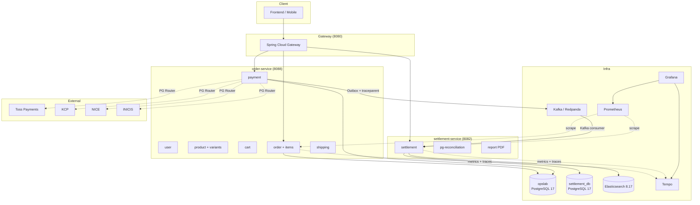
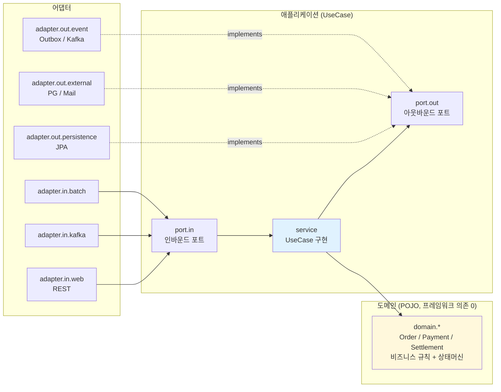
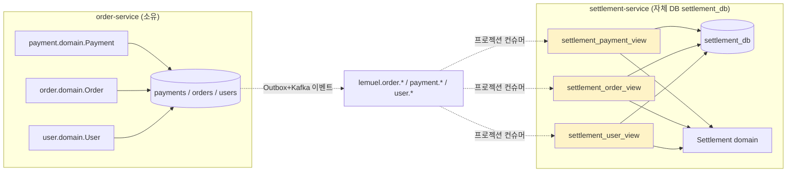

# 헥사고날 아키텍처 + MSA 경계

## 전체 구조

## 헥사고날 패키지 의존 방향 (서비스 1개 단면)

**핵심 원칙** (ArchUnit 으로 강제):
1. `domain.*` 은 Spring/JPA 의존 금지 — 순수 POJO
2. `application.service.*` 는 `adapter.out.persistence.*` 직접 의존 금지 — 포트 경유
3. 어댑터끼리는 다른 도메인 영역의 `adapter.out.persistence` 직접 import 금지
4. `application.port.*` 의 `*Port` 는 인터페이스만

## MSA 경계 — settlement-service ↛ order-service 코드 의존 0

**이벤트 드리븐 프로젝션 패턴 (CQRS, ADR 0020)**:
- settlement-service 가 자체 DB(settlement_db)에 소유하는 `settlement_*_view` 프로젝션 테이블에 order 가 발행한 Kafka 이벤트를 적재
- `settlement-service/build.gradle.kts` 에 `implementation(project(":order-service"))` **없음**
- 비즈니스 로직 변경은 양 서비스가 독립 배포 가능
- 대사는 order 내부 API(`/internal/recon`) 호출로 처리 — 양측 모두 자기 DB 만 읽어 cross-DB 연결 0

## 통신 매트릭스

| From | To | 방식 | 동기/비동기 | 보장 |
|------|----|----|-------------|------|
| Client | Gateway | HTTP | 동기 | — |
| Gateway | order/settlement | HTTP | 동기 | Resilience4j |
| order-service | PG (Toss/KCP/NICE/INICIS) | HTTPS | 동기 | CB + Retry per-PG |
| order-service | settlement-service | Kafka (lemuel.payment.*) | 비동기 | Outbox + 멱등 3단 |
| settlement-service | order-service | 내부 대사 API `/internal/recon` (HTTP) | 동기 | 대사 전용, 조회는 이벤트 CQRS 프로젝션으로 대체 |
| order-service | DB (opslab) | JPA / JDBC | 동기 | Optimistic Lock (Variant), Pessimistic (Refund) |
| settlement-service | DB (settlement_db) | JPA / JDBC | 동기 | 자체 DB, Kafka 이벤트 프로젝션 적재 |
| settlement-service | ES | REST | 동기 | 비동기 큐 (settlement_index_queue) |
| order-service | Tempo | OTLP/HTTP | 비동기 | Sampling 1.0 (개발) |
