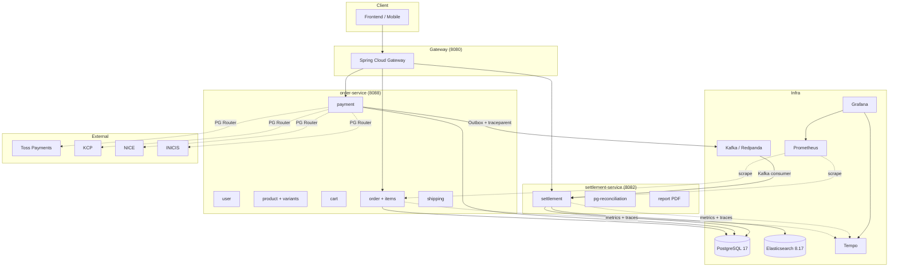
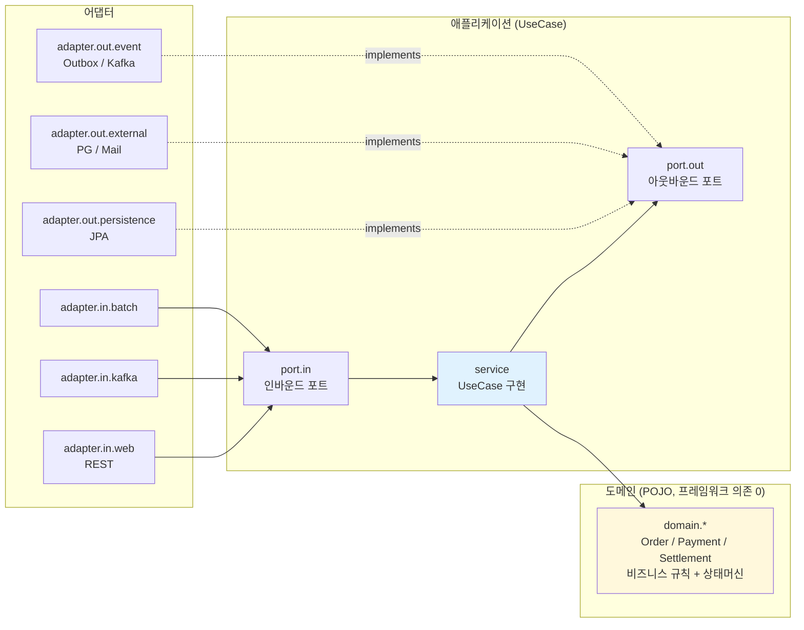

# 헥사고날 아키텍처 + MSA 경계

## 전체 구조



## 헥사고날 패키지 의존 방향 (서비스 1개 단면)



**핵심 원칙** (ArchUnit 으로 강제):
1. `domain.*` 은 Spring/JPA 의존 금지 — 순수 POJO
2. `application.service.*` 는 `adapter.out.persistence.*` 직접 의존 금지 — 포트 경유
3. 어댑터끼리는 다른 도메인 영역의 `adapter.out.persistence` 직접 import 금지
4. `application.port.*` 의 `*Port` 는 인터페이스만

## MSA 경계 — settlement-service ↛ order-service 코드 의존 0

```mermaid
graph LR
    subgraph "order-service (소유)"
        OPay[payment.domain.Payment]
        OOrder[order.domain.Order]
        OUser[user.domain.User]
        DB1[(payments / orders / users)]
        OPay --> DB1
        OOrder --> DB1
        OUser --> DB1
    end

    subgraph "settlement-service (참조만)"
        SRead1[SettlementPaymentReadModel<br/>@Immutable]
        SRead2[SettlementOrderReadModel<br/>@Immutable]
        SRead3[SettlementUserReadModel<br/>@Immutable]
        SDom[Settlement domain]

        SRead1 --> SDom
        SRead2 --> SDom
        SRead3 --> SDom
    end

    DB1 -.- SRead1
    DB1 -.- SRead2
    DB1 -.- SRead3

    style SRead1 fill:#fef3c7
    style SRead2 fill:#fef3c7
    style SRead3 fill:#fef3c7
```

**Read-only Projection 패턴**:
- settlement-service 가 `payments` / `orders` / `users` 테이블을 직접 매핑하되 별도 `@Immutable` JPA 엔티티로
- `settlement-service/build.gradle.kts` 에 `implementation(project(":order-service"))` **없음**
- 비즈니스 로직 변경은 양 서비스가 독립 배포 가능
- 데이터 일관성은 단일 DB 가 보장 (장기적으로 별도 DB + CDC 로 분리 가능)

## 통신 매트릭스

| From | To | 방식 | 동기/비동기 | 보장 |
|------|----|----|-------------|------|
| Client | Gateway | HTTP | 동기 | — |
| Gateway | order/settlement | HTTP | 동기 | Resilience4j |
| order-service | PG (Toss/KCP/NICE/INICIS) | HTTPS | 동기 | CB + Retry per-PG |
| order-service | settlement-service | Kafka (lemuel.payment.*) | 비동기 | Outbox + 멱등 3단 |
| settlement-service | order-service | ❌ 없음 | — | Read-only projection 으로 대체 |
| order-service | DB | JPA / JDBC | 동기 | Optimistic Lock (Variant), Pessimistic (Refund) |
| settlement-service | DB | JPA / JDBC | 동기 | 같은 DB, projection만 read |
| settlement-service | ES | REST | 동기 | 비동기 큐 (settlement_index_queue) |
| order-service | Tempo | OTLP/HTTP | 비동기 | Sampling 1.0 (개발) |
