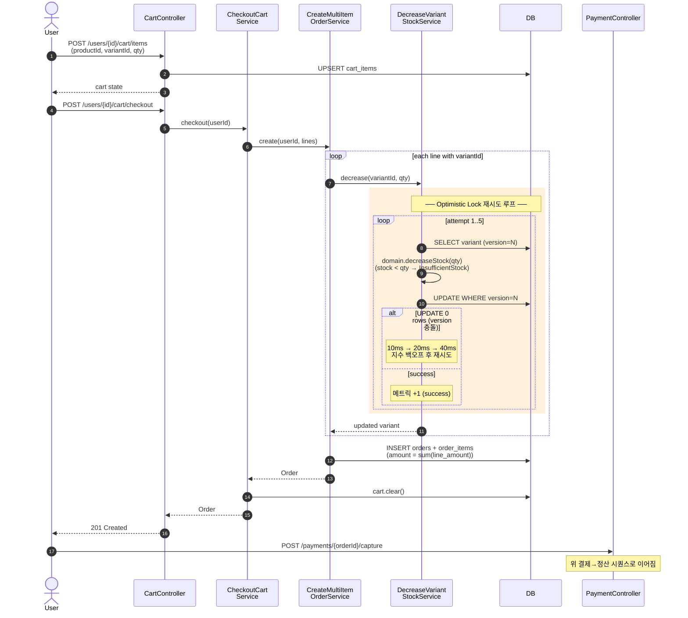

# 시퀀스 — 장바구니 → 다건 주문 (재고 동시성 포함)

> 100 명이 동시에 같은 SKU 를 결제하는 시나리오에서 정확히 N 명만 성공하는 흐름.

## 동시성 보장 증거

`VariantStockConcurrencyIT` 통합 테스트가 검증:

| 시나리오 | 입력 | 기대 결과 | 실측 |
|----------|------|-----------|------|
| 100 스레드 동시 차감 | 재고 50, 각 1개 | 50 성공 / 50 InsufficientStock | ✅ |
| 최종 재고 | — | 정확히 0 (음수 X) | ✅ |
| version 증가량 | — | 정확히 50 (성공 횟수와 일치) | ✅ |
| 재시도 한계 초과 | — | 0 건 (5회 재시도로 모두 흡수) | ✅ |

## 면접 답변 포인트

**Q: 동시 100명이 같은 SKU 주문하면?**
> "각 요청은 독립 트랜잭션에서 `@Version` 으로 보호되는 SELECT/UPDATE 를 수행합니다. 충돌 발생 시 5회까지 지수 백오프(10/20/40/80/160ms) 재시도, 최종 실패는 `StockConcurrencyException` 으로 운영자 알람. 100건 / 50개 재고 시나리오 통합 테스트로 실측 검증 완료."

**Q: 더 hot 한 SKU (수천 RPS) 면?**
> "현재는 Optimistic. 충돌률이 retry 5회로 흡수 안 될 정도면 Redis 분산 락 또는 DB Pessimistic Lock 으로 격상이 정답. `outbox.failed.count` Gauge 와 `variant.stock.decrease.retry` Counter 로 격상 시점 판단."
