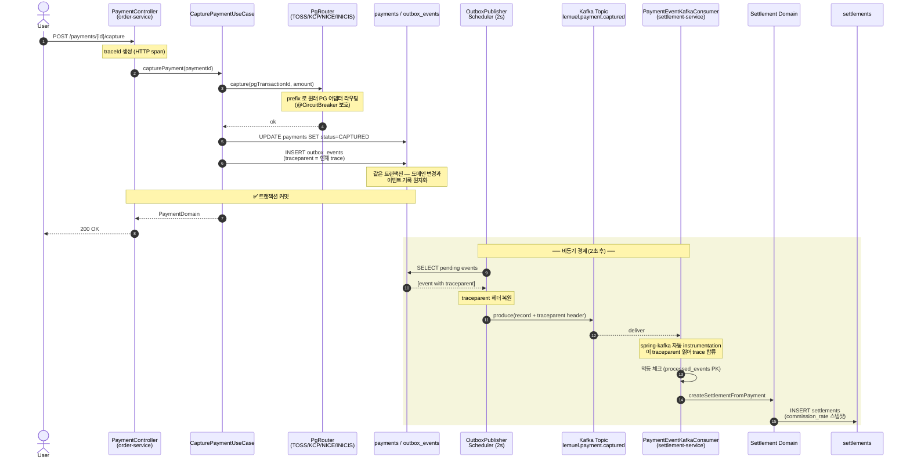
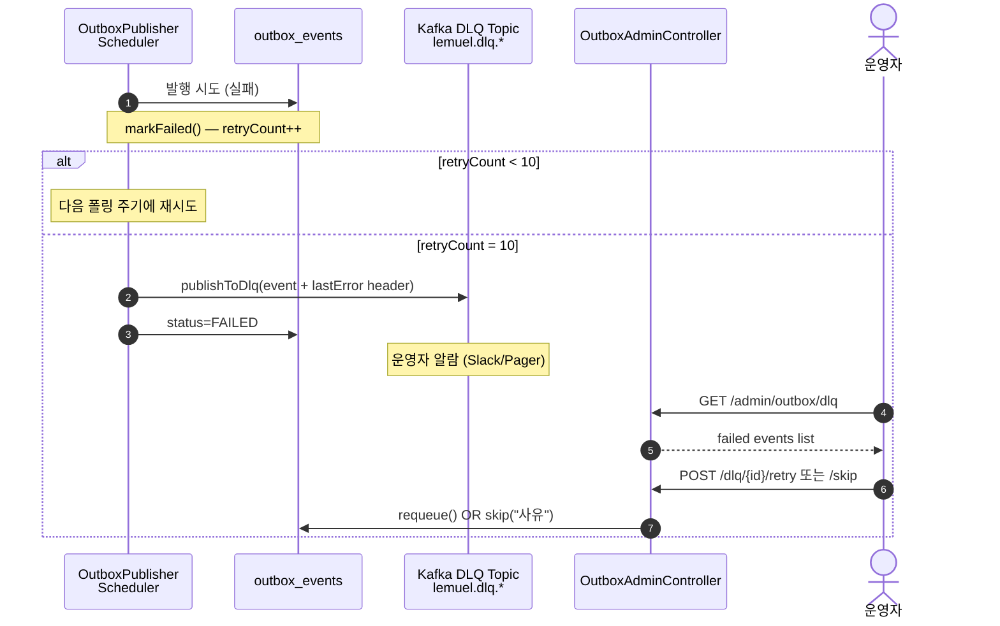

# 시퀀스 — 결제 → Outbox → Kafka → 정산 (단일 Trace 경로)

> Lemuel 의 핵심 비동기 흐름. 분산 트레이싱 traceparent 가 모든 경계에 전파되어
> Tempo / Grafana 에서 단일 trace 로 가시화된다.

## 멱등성 3 단 방어

| 레이어 | 메커니즘 | 실패 시 동작 |
|--------|----------|--------------|
| 프로듀서 | `outbox_events.event_id UUID UNIQUE` | DB 제약 위반 → 비즈니스 트랜잭션 롤백 |
| 폴러 | `app.kafka.enabled=true` 일 때만 publish + Kafka producer `enable.idempotence=true` | 동일 record 중복 발행 방지 |
| 컨슈머 | `processed_events(consumer_group, event_id)` PK | 같은 이벤트 재배달 시 즉시 ACK + 본문 처리 스킵 |
| 도메인 | `settlements.payment_id UNIQUE` | 위 3 단을 다 뚫어도 스키마가 최종 방어 |

## DLQ 분기 (재시도 한계 초과)

