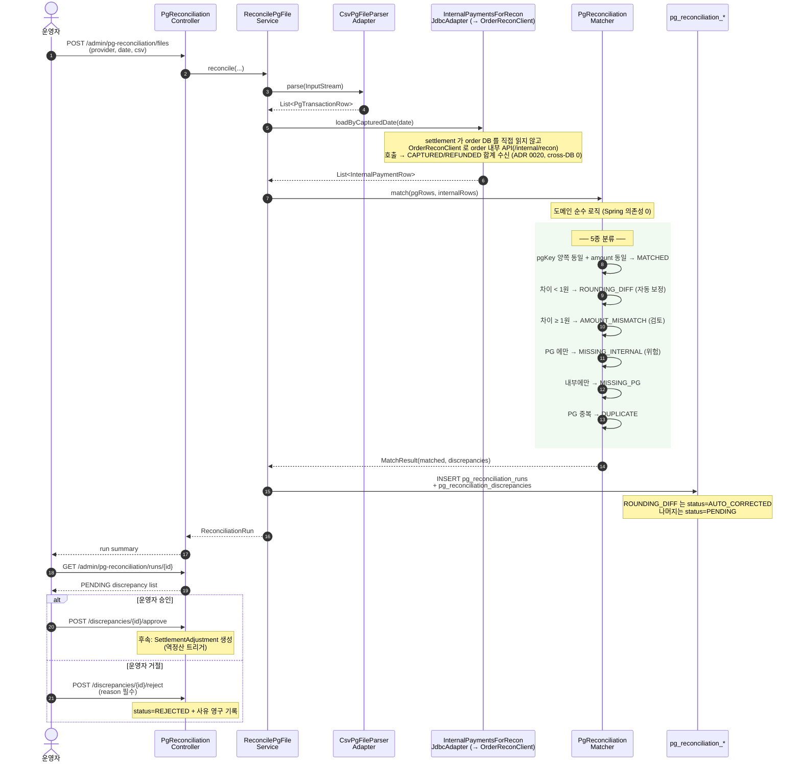

# 시퀀스 — PG 정산파일 대사 (자동 차액 보정)

> 매일 PG 사가 보내주는 정산 CSV 와 내부 결제 원장을 비교 → 차액 분류 → 일부 자동 보정.



## 5종 차이 분류 매트릭스

| Type | 양측 존재 | 금액 차이 | 처리 정책 | 운영 영향 |
|------|-----------|-----------|-----------|-----------|
| **MATCHED** | ✅ | 0원 | 통과 | 없음 |
| **ROUNDING_DIFF** | ✅ | < 1원 | 자동 보정 (`AUTO_CORRECTED`) | 없음 |
| **AMOUNT_MISMATCH** | ✅ | ≥ 1원 | `PENDING` → 운영자 검토 | 매월 1~2건 정상 |
| **MISSING_INTERNAL** | PG만 | — | `PENDING` ⚠️ | **거래 누락 의심 — 가장 위험** |
| **MISSING_PG** | 내부만 | — | `PENDING` | PG 정산 지연 가능성 |
| **DUPLICATE** | ✅ + 중복 | — | `PENDING` | 이중 청구 의심 |

## 운영 메트릭

Prometheus 카운터 (Grafana 알람 연계):
- `pg.reconciliation.discrepancies{provider, type}` — 발견 건수
- `pg.reconciliation.discrepancies.approved` — 운영자 승인 누적
- `pg.reconciliation.discrepancies.rejected` — 운영자 거절 누적

```promql
# 매일 MISSING_INTERNAL 발생 시 즉시 알람
sum by (provider) (rate(pg_reconciliation_discrepancies_total{type="MISSING_INTERNAL"}[1d])) > 0
```
