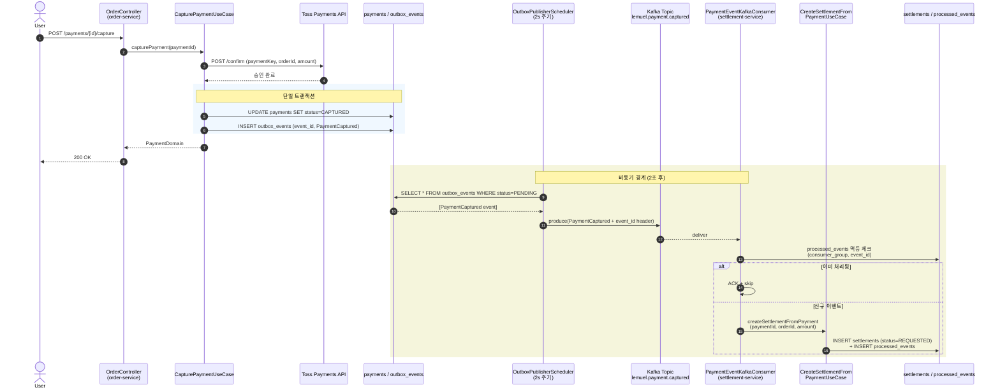
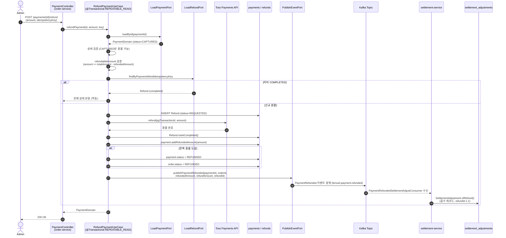
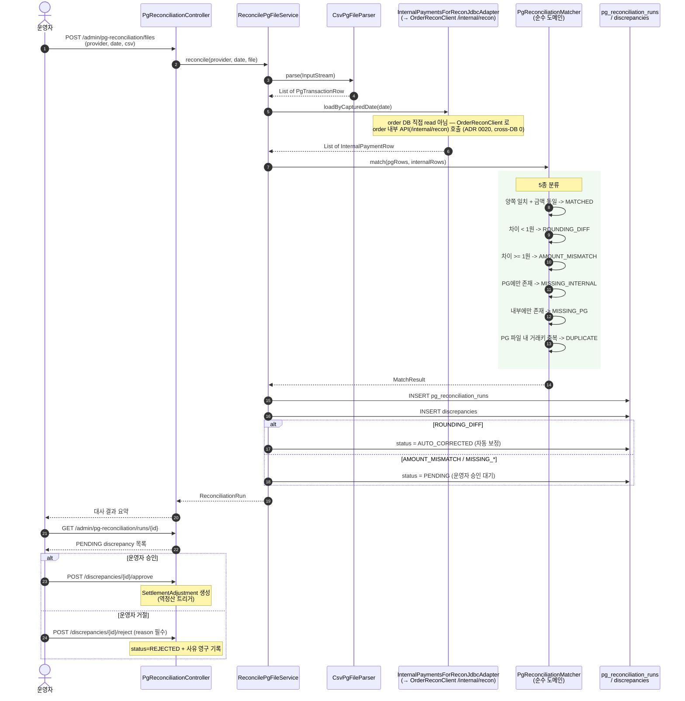
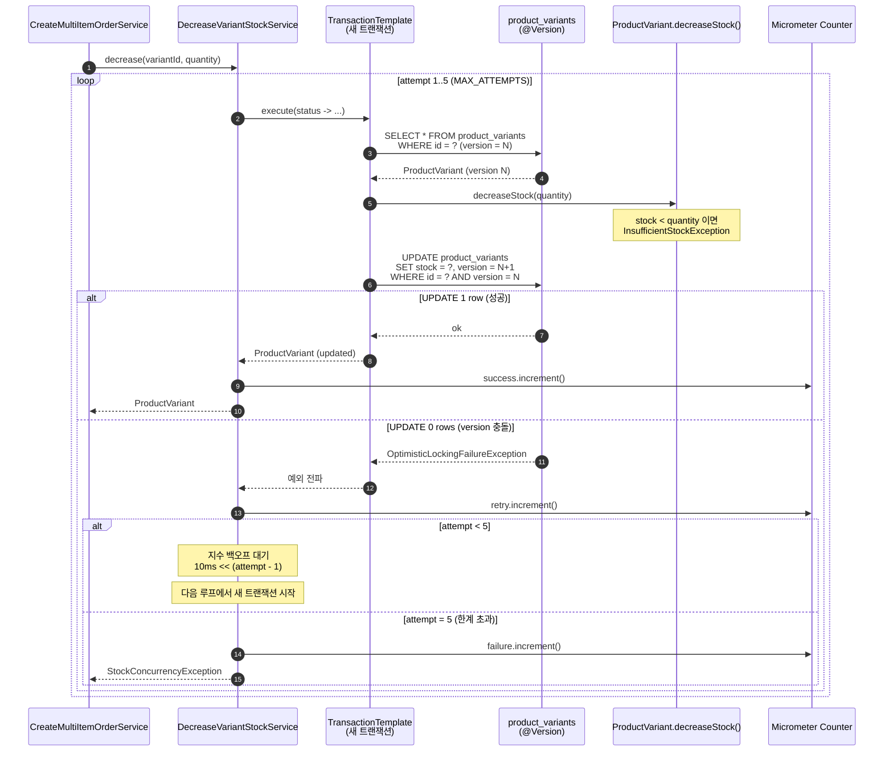
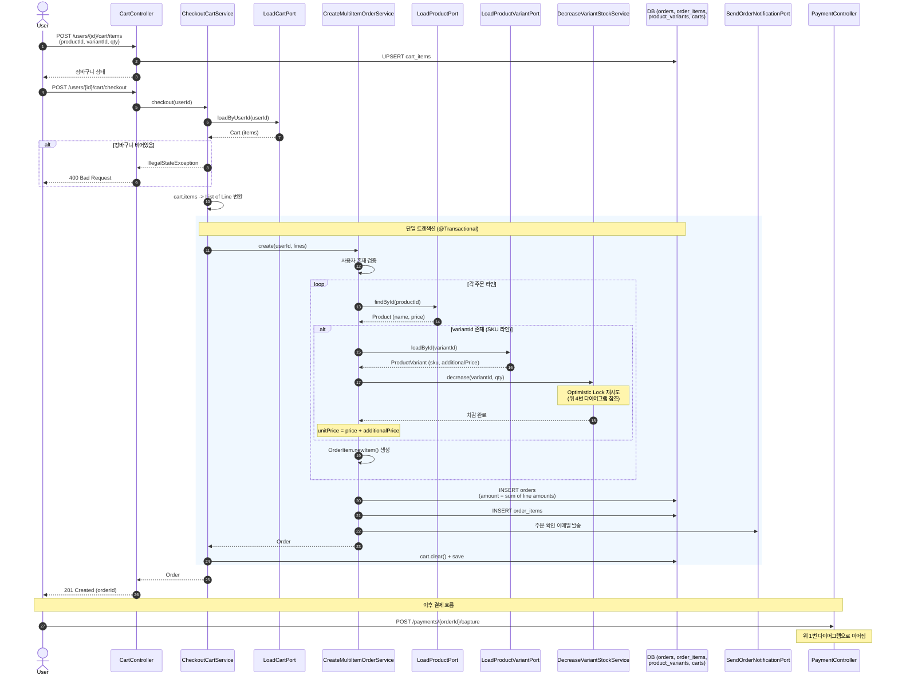

# 주요 시퀀스 다이어그램 / Key Sequence Diagrams

이 문서는 Lemuel 플랫폼의 핵심 비동기/동시성 흐름을 Mermaid 시퀀스 다이어그램으로 정리한다.
각 다이어그램의 참여자 이름은 실제 클래스명을 반영한다.

---

## 1. 결제 -> 정산 생성 (Outbox + Kafka)

결제가 승인(CAPTURED)되면 같은 트랜잭션에서 Outbox 이벤트를 기록하고,
`OutboxPublisherScheduler`(2초 주기)가 Kafka로 발행한다.
`settlement-service`의 `PaymentEventKafkaConsumer`가 이벤트를 수신해 정산을 자동 생성한다.

멱등성 3단 방어: outbox event_id UNIQUE -> processed_events PK -> settlements.payment_id UNIQUE.

---

## 2. 부분 환불 + 정산 조정

부분 환불은 `RefundPaymentUseCase`에서 처리한다.
호출자가 `idempotencyKey`를 반드시 제공해야 하며, 트랜잭션 격리 수준은 `REPEATABLE_READ`이다.
환불 완료 후 `publishPaymentRefunded` 이벤트를 발행하면
settlement-service가 `SettlementAdjustment`(음수 금액 레코드)를 생성해 감사 추적을 보존한다.

---

## 3. PG 대사 (Reconciliation)

매일 PG사가 보내는 정산 CSV 파일과 내부 결제 원장을 1:1 비교한다.
`PgReconciliationMatcher`는 순수 도메인 로직(Spring 의존성 0)으로 5종 분류를 수행한다.
1원 미만 차이는 `AUTO_CORRECTED`로 자동 보정하고, 나머지는 운영자 승인을 대기한다.

---

## 4. SKU 재고 Optimistic Lock 재시도

`DecreaseVariantStockService`는 `@Version` 기반 Optimistic Lock으로 동시성을 제어한다.
각 재시도는 `TransactionTemplate`으로 새 트랜잭션을 열어 stale 1차 캐시를 방지한다.
백오프: 10ms -> 20ms -> 40ms -> 80ms -> 160ms. 5회 초과 시 `StockConcurrencyException`.

---

## 5. 장바구니 -> 체크아웃 -> 다건 주문

사용자가 장바구니에 담은 복수 상품을 한 번에 주문으로 전환하는 흐름이다.
`CheckoutCartService`가 `CreateMultiItemOrderService`를 호출하며,
같은 트랜잭션 안에서 재고 차감 + 주문 생성 + 장바구니 비우기가 원자적으로 수행된다.
실패 시 전체 롤백되어 장바구니가 유지되므로 사용자가 재시도할 수 있다.

