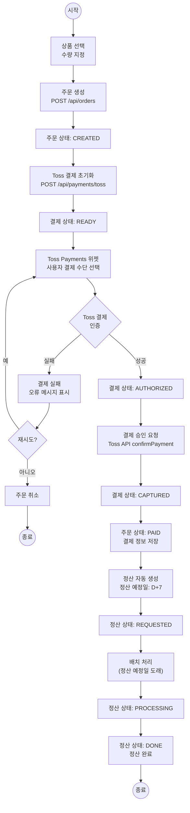
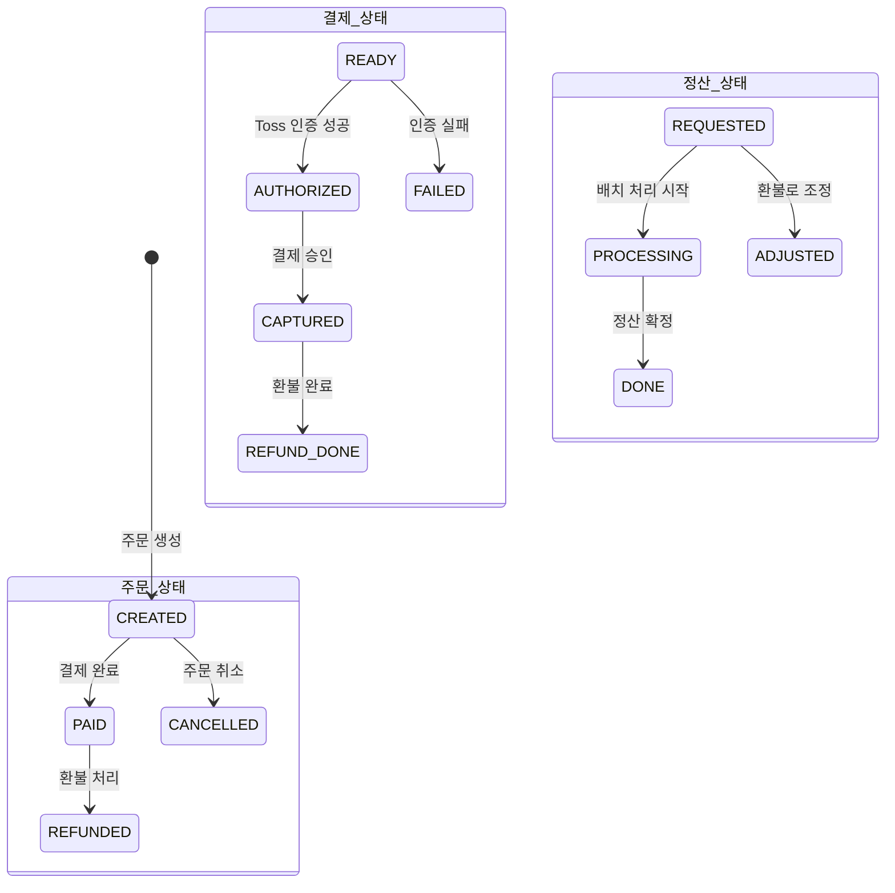
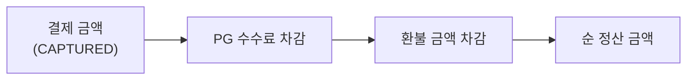
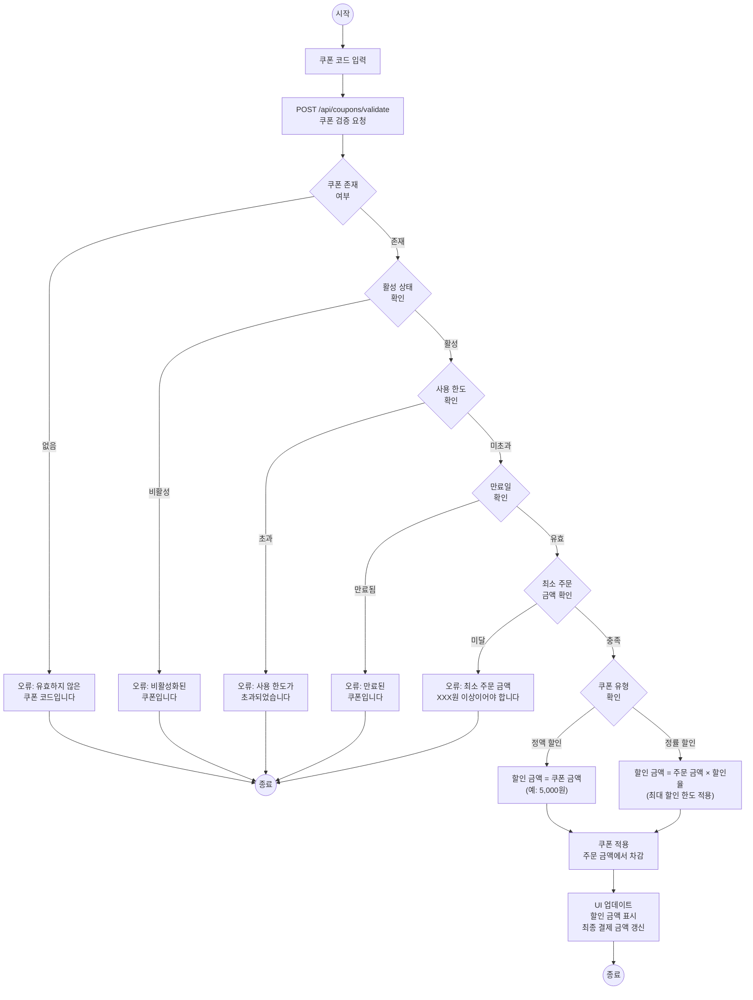

# 프로세스 정의서 — 주문·결제·정산 시스템

## 목차

| # | 프로세스명 | 설명 |
|---|-----------|------|
| 1 | 주문→결제→정산 프로세스 | 상품 선택부터 정산 완료까지 전체 흐름 |
| 2 | 환불 프로세스 | 환불 요청 → PG 환불 → 정산 조정 |
| 3 | 일일 정산 배치 | 일일 자동 정산 생성 및 확정 |
| 4 | 쿠폰 적용 프로세스 | 쿠폰 검증 → 할인 계산 → 적용 |

---

## 1. 주문→결제→정산 프로세스

### 전체 흐름도



### 상태 전이도



### 프로세스 상세

| 단계 | 행위자 | 입력 | 처리 | 출력 | 상태 변경 |
|------|--------|------|------|------|----------|
| 1. 상품 선택 | 고객 | 상품 ID, 수량 | 장바구니/바로 구매 | 주문 정보 | - |
| 2. 주문 생성 | 서버 | 상품, 수량, 쿠폰 | Order 엔티티 생성 | 주문 번호 | Order: CREATED |
| 3. 결제 초기화 | 서버 | 주문 번호, 금액 | Toss API 호출 | paymentKey | Payment: READY |
| 4. 결제 인증 | 고객/Toss | 결제 수단 | Toss 위젯 결제 | 인증 결과 | Payment: AUTHORIZED |
| 5. 결제 승인 | 서버 | paymentKey | Toss confirmPayment | 승인 결과 | Payment: CAPTURED |
| 6. 주문 확정 | 서버 | 결제 결과 | Order 상태 변경 | - | Order: PAID |
| 7. 정산 생성 | 서버 | 주문/결제 정보 | Settlement 생성 (D+7) | 정산 ID | Settlement: REQUESTED |
| 8. 배치 확정 | 배치 | 정산 예정일 | 예정일 도래 건 처리 | - | Settlement: DONE |

---

## 2. 환불 프로세스

### 프로세스 흐름도

```mermaid
flowchart TD
    START((시작)) --> REFUND_REQUEST[환불 요청\nPOST /api/orders/{id}/refund]

    REFUND_REQUEST --> CHECK_ORDER{주문 상태\n확인}
    CHECK_ORDER -->|PAID가 아님| REJECT["환불 거부\n'환불 가능한 상태가 아닙니다'"]
    REJECT --> END_FAIL((종료))

    CHECK_ORDER -->|PAID| CHECK_PAYMENT[결제 정보 조회]
    CHECK_PAYMENT --> PG_REFUND[PG 환불 요청\nToss cancelPayment API]

    PG_REFUND --> PG_RESULT{PG 환불\n결과}
    PG_RESULT -->|실패| PG_ERROR["PG 환불 실패\n오류 로그 기록"]
    PG_ERROR --> RETRY{재시도?}
    RETRY -->|예| PG_REFUND
    RETRY -->|아니오, 수동 처리| MANUAL["수동 처리 대기\n관리자 알림"]
    MANUAL --> END_MANUAL((종료))

    PG_RESULT -->|성공| PAYMENT_REFUND["Payment.refund()\n결제 상태 변경"]
    PAYMENT_REFUND --> ORDER_REFUND["Order.REFUNDED\n주문 상태 변경"]
    ORDER_REFUND --> CHECK_SETTLEMENT{정산 존재\n여부 확인}

    CHECK_SETTLEMENT -->|정산 없음| END_SUCCESS((종료))
    CHECK_SETTLEMENT -->|정산 존재| ADJUST_SETTLEMENT["Settlement.adjustForRefund()\n정산 금액 조정"]

    ADJUST_SETTLEMENT --> CHECK_SETTLE_STATUS{정산 상태}
    CHECK_SETTLE_STATUS -->|REQUESTED| CANCEL_SETTLEMENT["정산 취소"]
    CHECK_SETTLE_STATUS -->|PROCESSING/DONE| DEDUCT_SETTLEMENT["차액 차감\n다음 정산에서 공제"]

    CANCEL_SETTLEMENT --> END_SUCCESS
    DEDUCT_SETTLEMENT --> END_SUCCESS
```

### 프로세스 상세

| 단계 | 행위자 | 입력 | 처리 | 출력 |
|------|--------|------|------|------|
| 1. 환불 요청 | 고객 | 주문 ID | 환불 가능 여부 확인 | 가능/불가 |
| 2. PG 환불 | 서버 | paymentKey, 금액 | Toss cancelPayment 호출 | 환불 결과 |
| 3. Payment 상태 변경 | 서버 | 환불 결과 | `Payment.refund()` | REFUNDED |
| 4. Order 상태 변경 | 서버 | - | `Order` 상태 변경 | REFUNDED |
| 5. 정산 조정 | 서버 | 정산 ID | `Settlement.adjustForRefund()` | 조정된 정산 |

---

## 3. 일일 정산 배치

### 프로세스 흐름도

```mermaid
flowchart TD
    START((시작)) --> TRIGGER_CREATE["02:00\nCreateDailySettlements\n배치 트리거"]

    subgraph 정산_생성["정산 생성 배치 (02:00)"]
        TRIGGER_CREATE --> QUERY_CAPTURED["전일 CAPTURED 건 조회\n(어제 00:00 ~ 23:59)"]
        QUERY_CAPTURED --> CHECK_EXISTS{이미 정산\n생성됨?}
        CHECK_EXISTS -->|예| SKIP["건너뛰기"]
        CHECK_EXISTS -->|아니오| CREATE_SETTLE["Settlement 생성\n상태: REQUESTED\n예정일: 결제일 + 7일"]
        CREATE_SETTLE --> LOG_CREATE["생성 로그 기록\n건수, 총액"]
    end

    LOG_CREATE --> WAIT["대기"]
    SKIP --> WAIT

    WAIT --> TRIGGER_CONFIRM["03:00\nConfirmDailySettlements\n배치 트리거"]

    subgraph 정산_확정["정산 확정 배치 (03:00)"]
        TRIGGER_CONFIRM --> QUERY_DUE["정산 예정일 도래 건 조회\n(예정일 <= 오늘)"]
        QUERY_DUE --> FILTER_STATUS["REQUESTED 상태만 필터"]
        FILTER_STATUS --> LOOP_START{처리할 건\n있음?}
        LOOP_START -->|없음| BATCH_END["배치 종료"]
        LOOP_START -->|있음| PROCESS_ONE["정산 처리\nREQUESTED → PROCESSING"]
        PROCESS_ONE --> VALIDATE{검증\n(환불/조정 확인)}
        VALIDATE -->|정상| CONFIRM["상태: DONE\n정산 확정"]
        VALIDATE -->|조정 필요| ADJUST["금액 조정 후\n상태: DONE"]
        CONFIRM --> LOOP_START
        ADJUST --> LOOP_START
    end

    BATCH_END --> LOG_CONFIRM["확정 로그 기록\n처리 건수, 총액, 실패 건수"]
    LOG_CONFIRM --> END_NODE((종료))
```

### 배치 스케줄

| 배치명 | 실행 시각 | 대상 | 처리 |
|--------|----------|------|------|
| CreateDailySettlements | 매일 02:00 | 전일 CAPTURED 결제 | Settlement(REQUESTED) 생성 |
| ConfirmDailySettlements | 매일 03:00 | 정산 예정일 도래 건 | REQUESTED → PROCESSING → DONE |

### 정산 금액 계산



---

## 4. 쿠폰 적용 프로세스

### 프로세스 흐름도



### 쿠폰 검증 단계

| 단계 | 검증 항목 | 실패 시 메시지 |
|------|----------|---------------|
| 1 | 쿠폰 존재 여부 | "유효하지 않은 쿠폰 코드입니다" |
| 2 | 활성 상태 | "비활성화된 쿠폰입니다" |
| 3 | 사용 한도 | "사용 한도가 초과되었습니다" |
| 4 | 만료일 | "만료된 쿠폰입니다" |
| 5 | 최소 주문 금액 | "최소 주문 금액 XXX원 이상이어야 합니다" |

### 할인 계산 로직

| 쿠폰 유형 | 계산 방법 | 예시 |
|-----------|----------|------|
| 정액 할인 (FIXED) | `할인 = coupon.amount` | 5,000원 할인 |
| 정률 할인 (PERCENT) | `할인 = orderAmount × coupon.rate` | 10% 할인 (최대 10,000원) |

### 프로세스 상세

| 단계 | 행위자 | 입력 | 처리 | 출력 |
|------|--------|------|------|------|
| 1. 코드 입력 | 고객 | 쿠폰 코드 | UI 입력 | 코드 문자열 |
| 2. 검증 요청 | 클라이언트 | 코드 + 주문 금액 | POST API 호출 | 검증 결과 |
| 3. 5단계 검증 | 서버 | 쿠폰 엔티티 | 존재/활성/한도/만료/최소금액 | 유효/무효 |
| 4. 할인 계산 | 서버 | 유형 + 주문 금액 | 정액/정률 계산 | 할인 금액 |
| 5. UI 반영 | 클라이언트 | 할인 금액 | 결제 금액 재계산 | 갱신된 UI |
