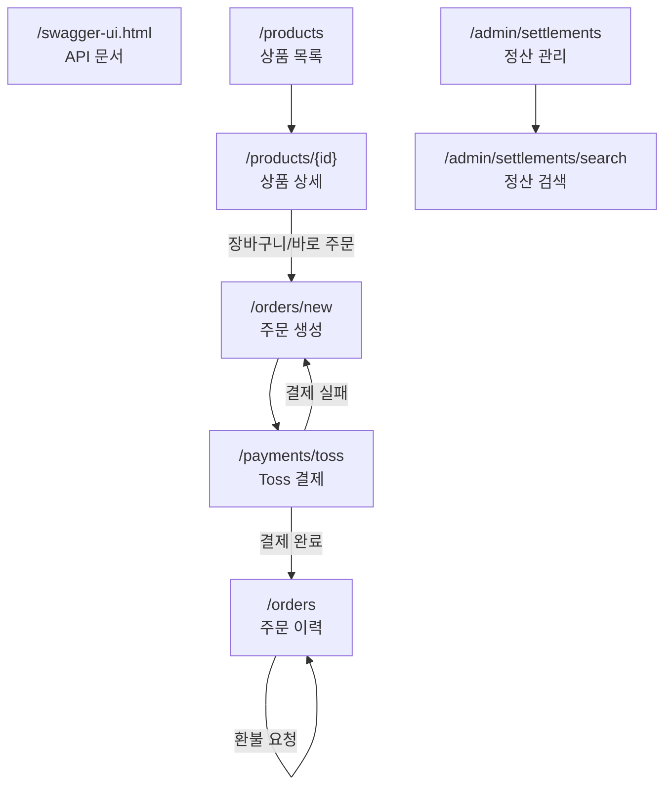
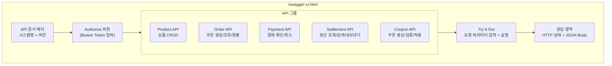
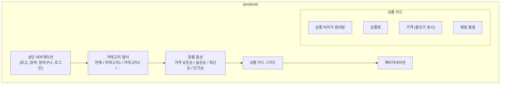
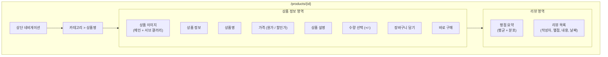
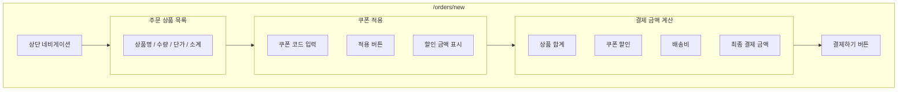
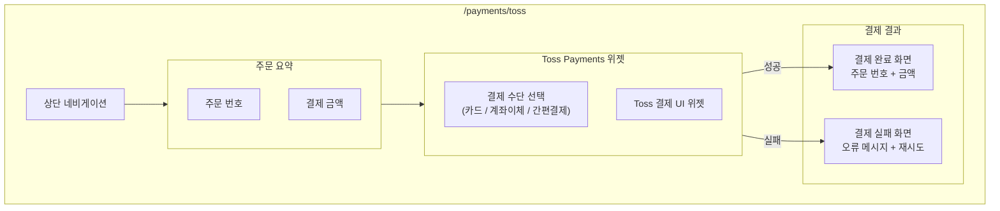
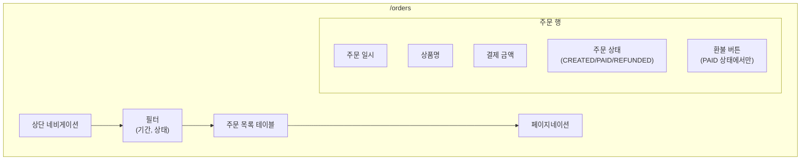
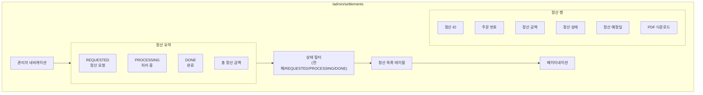
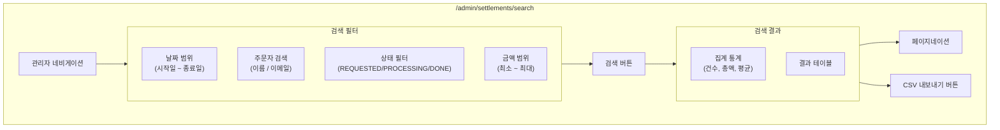

# 화면설계서 — 주문·결제·정산 시스템

## 목차

| # | 페이지명 | URL | 접근 권한 |
|---|---------|-----|----------|
| 1 | Swagger UI | `/swagger-ui.html` | 개발자 |
| 2 | 상품 목록 | `/products` | 전체 |
| 3 | 상품 상세 | `/products/{id}` | 전체 |
| 4 | 주문 생성 | `/orders/new` | 회원 |
| 5 | Toss 결제 | `/payments/toss` | 회원 |
| 6 | 주문 이력 | `/orders` | 회원 |
| 7 | 정산 관리 | `/admin/settlements` | 관리자 |
| 8 | 정산 검색 | `/admin/settlements/search` | 관리자 |

---

## 전체 화면 흐름도

---

## 1. Swagger UI

| 항목 | 내용 |
|------|------|
| **URL** | `/swagger-ui.html` |
| **접근 권한** | 개발자 (개발/스테이징 환경) |

### 화면 구성

### 주요 컴포넌트

| 컴포넌트 | 설명 |
|----------|------|
| API 그룹 | 태그별 엔드포인트 분류 (5개 그룹) |
| Authorize | Bearer Token 입력으로 인증된 API 테스트 |
| Try It Out | 파라미터 입력 후 실시간 API 호출 |
| 응답 뷰어 | HTTP 상태 코드 + JSON 응답 본문 |
| Schema 모델 | DTO 스키마 정의 열람 |

### 사용자 액션

| 액션 | 동작 |
|------|------|
| Authorize 클릭 | Bearer Token 입력 모달 |
| Try It Out 클릭 | 파라미터 입력 필드 활성화 |
| Execute 클릭 | API 호출 실행 + 응답 표시 |

---

## 2. 상품 목록

| 항목 | 내용 |
|------|------|
| **URL** | `/products` |
| **접근 권한** | 전체 (비회원 포함) |

### 화면 구성

### 주요 컴포넌트

| 컴포넌트 | 설명 |
|----------|------|
| 카테고리 필터 | 탭 또는 사이드바 방식, 다중 선택 불가 |
| 정렬 드롭다운 | 가격 낮은순/높은순, 최신순, 인기순 |
| 상품 카드 | 이미지 + 상품명 + 가격 + 평점 (그리드 레이아웃) |
| 페이지네이션 | 페이지 번호 + 이전/다음 |

### 출력 데이터

| 데이터 | 타입 | 설명 |
|--------|------|------|
| 상품 이미지 | URL | 썸네일 이미지 |
| 상품명 | string | 상품 명칭 |
| 원가 | number | 정상 가격 |
| 할인가 | number | 할인 적용 가격 (없으면 원가와 동일) |
| 평점 | number | 1.0~5.0 별점 |
| 리뷰 수 | number | 리뷰 건수 |

### 사용자 액션

| 액션 | 동작 |
|------|------|
| 카테고리 선택 | 해당 카테고리 상품만 필터 |
| 정렬 변경 | 선택한 기준으로 재정렬 |
| 상품 카드 클릭 | `/products/{id}`로 이동 |
| 페이지 이동 | 해당 페이지 데이터 로드 |

---

## 3. 상품 상세

| 항목 | 내용 |
|------|------|
| **URL** | `/products/{id}` |
| **접근 권한** | 전체 |

### 화면 구성

### 주요 컴포넌트

| 컴포넌트 | 설명 |
|----------|------|
| 이미지 갤러리 | 메인 이미지 + 서브 이미지 슬라이더 |
| 가격 표시 | 원가 취소선 + 할인가 강조 |
| 수량 선택 | +/- 버튼, 최소 1 / 최대 재고 |
| 장바구니 버튼 | 장바구니에 추가 (토스트 알림) |
| 바로 구매 버튼 | `/orders/new`로 이동 (상품 정보 전달) |
| 리뷰 목록 | 별점 + 내용 + 작성일 (페이지네이션) |

### 입력 필드

| 필드명 | 타입 | 필수 | 유효성 검사 |
|--------|------|------|-------------|
| quantity | number | O | 1 이상, 재고 이하 |

### 사용자 액션

| 액션 | 동작 |
|------|------|
| 수량 변경 | +/- 클릭으로 수량 조절 |
| 장바구니 담기 | POST → 장바구니에 추가 + 토스트 |
| 바로 구매 | `/orders/new?productId={id}&qty={n}`로 이동 |
| 리뷰 더보기 | 리뷰 페이지네이션 |

---

## 4. 주문 생성

| 항목 | 내용 |
|------|------|
| **URL** | `/orders/new` |
| **접근 권한** | 회원 (로그인 필수) |

### 화면 구성

### 주요 컴포넌트

| 컴포넌트 | 설명 |
|----------|------|
| 주문 상품 목록 | 상품 이미지, 이름, 수량, 단가, 소계 |
| 쿠폰 입력 | 텍스트 필드 + 적용 버튼 |
| 할인 결과 | 적용된 쿠폰명 + 할인 금액 (또는 오류 메시지) |
| 결제 금액 | 상품 합계 - 쿠폰 할인 + 배송비 = 최종 금액 |
| 결제하기 버튼 | 비활성: 0원 이하 / 활성: 결제 페이지로 이동 |

### 입력 필드

| 필드명 | 타입 | 필수 | 유효성 검사 |
|--------|------|------|-------------|
| couponCode | string | X | 유효한 쿠폰 코드 |
| quantity (변경 가능) | number | O | 1 이상 |

### 출력 데이터

| 데이터 | 설명 |
|--------|------|
| 상품 합계 | 단가 × 수량의 합 |
| 쿠폰 할인액 | 정액: 고정 금액 / 정률: 합계 × 할인율 |
| 배송비 | 조건부 무료 또는 고정 금액 |
| 최종 결제 금액 | 합계 - 할인 + 배송비 |

### 사용자 액션

| 액션 | 동작 |
|------|------|
| 쿠폰 적용 | POST `/api/coupons/validate` → 할인 금액 반영 |
| 수량 변경 | 금액 재계산 |
| 결제하기 | 주문 생성(CREATED) → `/payments/toss`로 이동 |

---

## 5. Toss 결제

| 항목 | 내용 |
|------|------|
| **URL** | `/payments/toss` |
| **접근 권한** | 회원 |

### 화면 구성

### 주요 컴포넌트

| 컴포넌트 | 설명 |
|----------|------|
| 주문 요약 | 주문 번호, 상품명, 결제 금액 |
| Toss Payments 위젯 | Toss SDK 임베드 결제 UI |
| 결제 수단 선택 | 카드, 계좌이체, 간편결제 등 |
| 결제 완료 화면 | 성공 메시지 + 주문 이력 이동 버튼 |
| 결제 실패 화면 | 오류 사유 + 재시도/주문 취소 버튼 |

### 출력 데이터

| 데이터 | 설명 |
|--------|------|
| paymentKey | Toss 결제 키 |
| orderId | 주문 번호 |
| amount | 결제 금액 |
| status | READY → AUTHORIZED → CAPTURED |

### 사용자 액션

| 액션 | 동작 |
|------|------|
| 결제 수단 선택 | Toss 위젯 내 선택 |
| 결제 확인 | Toss 결제 진행 → callback 처리 |
| 결제 완료 후 | `/orders`로 이동 |
| 결제 실패 시 | 재시도 또는 `/orders/new`로 복귀 |

---

## 6. 주문 이력

| 항목 | 내용 |
|------|------|
| **URL** | `/orders` |
| **접근 권한** | 회원 |

### 화면 구성

### 주요 컴포넌트

| 컴포넌트 | 설명 |
|----------|------|
| 기간 필터 | 1주/1개월/3개월/전체 |
| 상태 필터 | 전체/결제완료/환불완료 |
| 주문 목록 테이블 | 주문일, 상품명, 금액, 상태, 액션 |
| 환불 버튼 | PAID 상태의 주문에만 표시 |

### 출력 데이터

| 컬럼 | 타입 | 설명 |
|------|------|------|
| 주문 일시 | datetime | 주문 생성 시각 |
| 상품명 | string | 주문 상품 |
| 결제 금액 | number | 실결제 금액 |
| 주문 상태 | enum | CREATED / PAID / REFUNDED |
| 결제 수단 | string | 카드/계좌이체 등 |

### 사용자 액션

| 액션 | 동작 |
|------|------|
| 필터 적용 | 목록 갱신 |
| 환불 요청 | 확인 다이얼로그 → POST `/api/orders/{id}/refund` |
| 주문 상세 클릭 | 주문 상세 모달 (결제 정보, 쿠폰 등) |

---

## 7. 정산 관리

| 항목 | 내용 |
|------|------|
| **URL** | `/admin/settlements` |
| **접근 권한** | 관리자 |

### 화면 구성

### 주요 컴포넌트

| 컴포넌트 | 설명 |
|----------|------|
| 정산 요약 카드 | 상태별 건수 + 총 정산 금액 |
| 상태 필터 | REQUESTED / PROCESSING / DONE / 전체 |
| 정산 테이블 | ID, 주문 번호, 금액, 상태, 예정일, 액션 |
| PDF 다운로드 | DONE 상태 정산의 명세서 PDF |

### 출력 데이터

| 컬럼 | 타입 | 설명 |
|------|------|------|
| 정산 ID | number | 정산 고유 번호 |
| 주문 번호 | string | 연관 주문 |
| 정산 금액 | number | 정산 대상 금액 |
| 상태 | enum | REQUESTED / PROCESSING / DONE |
| 정산 예정일 | date | 결제일 + 7일 |
| 생성일 | datetime | 정산 생성 시각 |

### 사용자 액션

| 액션 | 동작 |
|------|------|
| 상태 필터 | 해당 상태의 정산만 표시 |
| PDF 다운로드 | 정산 명세서 PDF 생성 및 다운로드 |
| 정산 상세 클릭 | 상세 모달 (주문 정보, 결제 정보, 이력) |
| 검색 이동 | `/admin/settlements/search`로 이동 |

---

## 8. 정산 검색

| 항목 | 내용 |
|------|------|
| **URL** | `/admin/settlements/search` |
| **접근 권한** | 관리자 |

### 화면 구성

### 주요 컴포넌트

| 컴포넌트 | 설명 |
|----------|------|
| 날짜 범위 | DateRangePicker (정산 생성일 기준) |
| 주문자 검색 | 텍스트 입력 (이름 또는 이메일) |
| 상태 필터 | 다중 선택 체크박스 |
| 금액 범위 | 최소/최대 금액 입력 |
| 집계 통계 | 검색 결과의 건수, 총액, 평균 금액 |
| 결과 테이블 | 정산 관리와 동일 컬럼 + 주문자 정보 |
| CSV 내보내기 | 검색 결과를 CSV로 다운로드 |

### 입력 필드

| 필드명 | 타입 | 필수 | 설명 |
|--------|------|------|------|
| startDate | date | X | 검색 시작일 |
| endDate | date | X | 검색 종료일 |
| ordererName | string | X | 주문자 이름/이메일 |
| statuses | enum[] | X | 정산 상태 (복수) |
| minAmount | number | X | 최소 금액 |
| maxAmount | number | X | 최대 금액 |

### 출력 데이터

| 데이터 | 설명 |
|--------|------|
| 검색 건수 | 조건에 맞는 정산 수 |
| 총 정산 금액 | 검색 결과 합계 |
| 평균 정산 금액 | 검색 결과 평균 |
| 결과 목록 | 정산 ID, 주문자, 금액, 상태, 날짜 |

### 사용자 액션

| 액션 | 동작 |
|------|------|
| 검색 실행 | 필터 조건으로 조회 |
| 필터 초기화 | 모든 필터 리셋 |
| CSV 내보내기 | 검색 결과 CSV 다운로드 |
| 정산 상세 클릭 | 상세 모달 |
