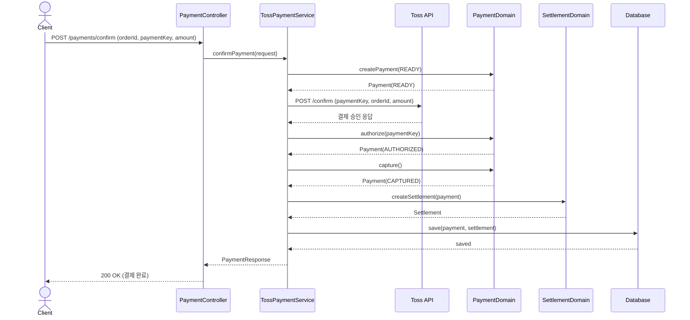
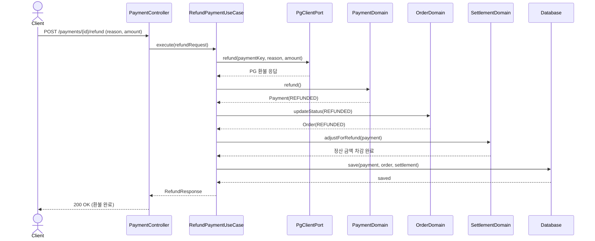
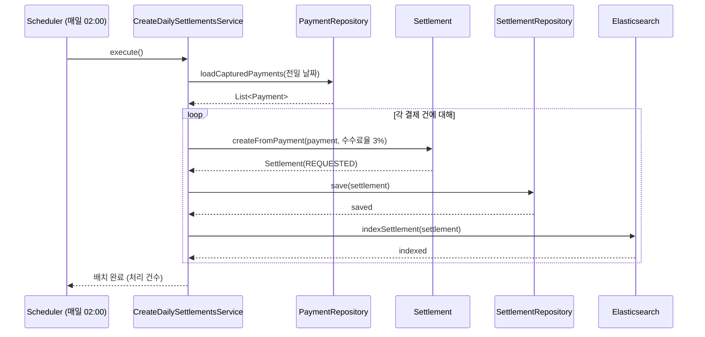
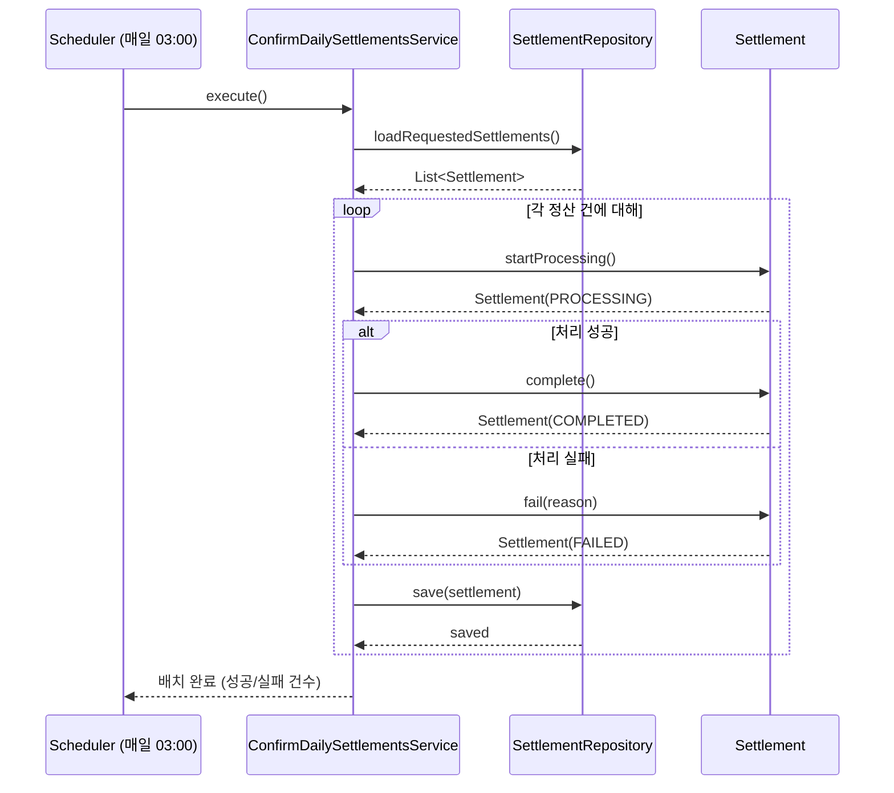

# 주요 시퀀스 다이어그램

## 1. Toss 결제 확인 플로우

```mermaid
sequenceDiagram
    actor Client
    participant PaymentController
    participant TossPaymentService
    participant TossAPI as Toss API
    participant PaymentDomain
    participant SettlementDomain
    participant Database

    Client->>PaymentController: POST /payments/confirm (orderId, paymentKey, amount)
    PaymentController->>TossPaymentService: confirmPayment(request)
    TossPaymentService->>PaymentDomain: createPayment(READY)
    PaymentDomain-->>TossPaymentService: Payment(READY)
    TossPaymentService->>TossAPI: POST /confirm (paymentKey, orderId, amount)
    TossAPI-->>TossPaymentService: 결제 승인 응답
    TossPaymentService->>PaymentDomain: authorize(paymentKey)
    PaymentDomain-->>TossPaymentService: Payment(AUTHORIZED)
    TossPaymentService->>PaymentDomain: capture()
    PaymentDomain-->>TossPaymentService: Payment(CAPTURED)
    TossPaymentService->>SettlementDomain: createSettlement(payment)
    SettlementDomain-->>TossPaymentService: Settlement
    TossPaymentService->>Database: save(payment, settlement)
    Database-->>TossPaymentService: saved
    TossPaymentService-->>PaymentController: PaymentResponse
    PaymentController-->>Client: 200 OK (결제 완료)
```

## 2. 환불 플로우

```mermaid
sequenceDiagram
    actor Client
    participant PaymentController
    participant RefundPaymentUseCase
    participant PgClientPort
    participant PaymentDomain
    participant OrderDomain
    participant SettlementDomain
    participant Database

    Client->>PaymentController: POST /payments/{id}/refund (reason, amount)
    PaymentController->>RefundPaymentUseCase: execute(refundRequest)
    RefundPaymentUseCase->>PgClientPort: refund(paymentKey, reason, amount)
    PgClientPort-->>RefundPaymentUseCase: PG 환불 응답
    RefundPaymentUseCase->>PaymentDomain: refund()
    PaymentDomain-->>RefundPaymentUseCase: Payment(REFUNDED)
    RefundPaymentUseCase->>OrderDomain: updateStatus(REFUNDED)
    OrderDomain-->>RefundPaymentUseCase: Order(REFUNDED)
    RefundPaymentUseCase->>SettlementDomain: adjustForRefund(payment)
    SettlementDomain-->>RefundPaymentUseCase: 정산 금액 차감 완료
    RefundPaymentUseCase->>Database: save(payment, order, settlement)
    Database-->>RefundPaymentUseCase: saved
    RefundPaymentUseCase-->>PaymentController: RefundResponse
    PaymentController-->>Client: 200 OK (환불 완료)
```

## 3. 일일 정산 배치

```mermaid
sequenceDiagram
    participant Scheduler as Scheduler (매일 02:00)
    participant CreateDailySettlementsService
    participant PaymentRepository
    participant Settlement
    participant SettlementRepository
    participant Elasticsearch

    Scheduler->>CreateDailySettlementsService: execute()
    CreateDailySettlementsService->>PaymentRepository: loadCapturedPayments(전일 날짜)
    PaymentRepository-->>CreateDailySettlementsService: List<Payment>

    loop 각 결제 건에 대해
        CreateDailySettlementsService->>Settlement: createFromPayment(payment, 수수료율 3%)
        Settlement-->>CreateDailySettlementsService: Settlement(REQUESTED)
        CreateDailySettlementsService->>SettlementRepository: save(settlement)
        SettlementRepository-->>CreateDailySettlementsService: saved
        CreateDailySettlementsService->>Elasticsearch: indexSettlement(settlement)
        Elasticsearch-->>CreateDailySettlementsService: indexed
    end

    CreateDailySettlementsService-->>Scheduler: 배치 완료 (처리 건수)
```

## 4. 정산 확정 배치

```mermaid
sequenceDiagram
    participant Scheduler as Scheduler (매일 03:00)
    participant ConfirmDailySettlementsService
    participant SettlementRepository
    participant Settlement

    Scheduler->>ConfirmDailySettlementsService: execute()
    ConfirmDailySettlementsService->>SettlementRepository: loadRequestedSettlements()
    SettlementRepository-->>ConfirmDailySettlementsService: List<Settlement>

    loop 각 정산 건에 대해
        ConfirmDailySettlementsService->>Settlement: startProcessing()
        Settlement-->>ConfirmDailySettlementsService: Settlement(PROCESSING)

        alt 처리 성공
            ConfirmDailySettlementsService->>Settlement: complete()
            Settlement-->>ConfirmDailySettlementsService: Settlement(COMPLETED)
        else 처리 실패
            ConfirmDailySettlementsService->>Settlement: fail(reason)
            Settlement-->>ConfirmDailySettlementsService: Settlement(FAILED)
        end

        ConfirmDailySettlementsService->>SettlementRepository: save(settlement)
        SettlementRepository-->>ConfirmDailySettlementsService: saved
    end

    ConfirmDailySettlementsService-->>Scheduler: 배치 완료 (성공/실패 건수)
```
