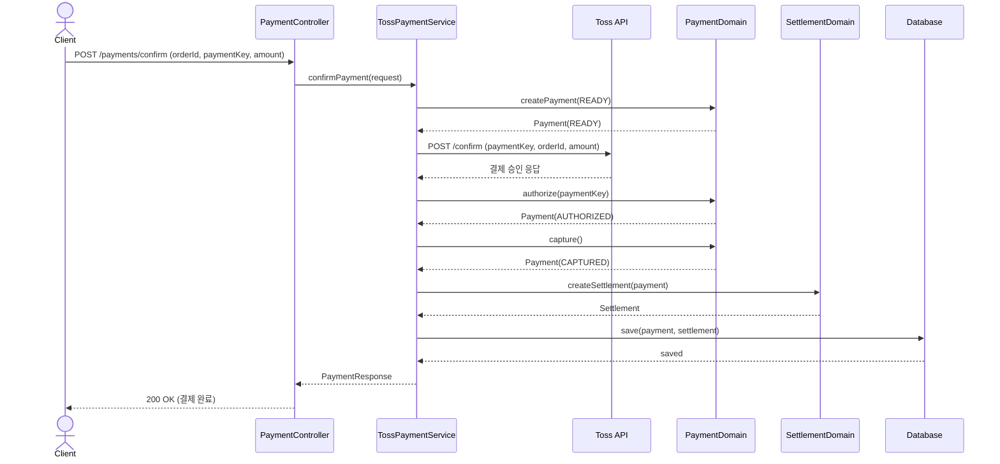
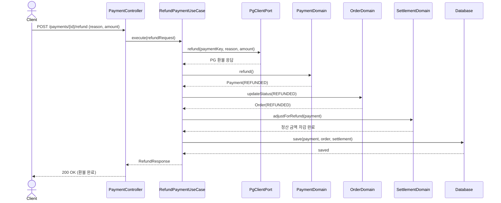
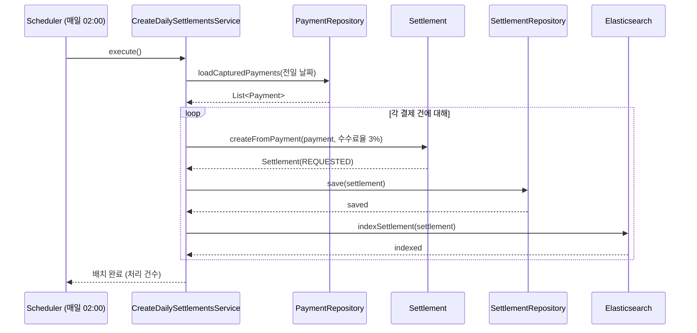

# 주요 시퀀스 다이어그램

> ⚠️ **[STALE — MSA 분리 이전(모놀리스) 흐름]** 이 문서의 다이어그램들은 order/settlement 가 한 프로세스·한 DB 를
> 공유하던 시절의 동기 흐름을 그린 것이다. 현재 아키텍처와 다르다:
> - 결제→정산은 **동기 호출이 아니라 Outbox + Kafka 비동기**(`lemuel.payment.captured` → `PaymentEventKafkaConsumer`)로
>   생성된다. settlement 는 별도 서비스·별도 DB(settlement_db)이며 `TossPaymentService` 가 `SettlementDomain` 을 직접
>   호출하지 않는다.
> - 정산 상태 종료값은 `COMPLETED` 가 아니라 **`DONE`** 이다(`SettlementStatus`).
> - `CreateDailySettlementsService`(#3) 처럼 settlement 가 `PaymentRepository` 를 직접 읽는 일일 배치는 없다 —
>   정산 생성은 이벤트 드리븐이고, 확정만 Spring Batch(`SettlementConfirmJobConfig`)로 처리한다.
>
> 최신 흐름은 `docs/etc/SEQUENCE_DIAGRAMS.md`, `docs/etc/SEQUENCE-ORDER-VS-REFUND.md`,
> `docs/diagrams/sequence-*.md` 를 참조. 아래는 이력 보존용.

## 1. Toss 결제 확인 플로우

## 2. 환불 플로우

## 3. 일일 정산 배치

## 4. 정산 확정 배치

