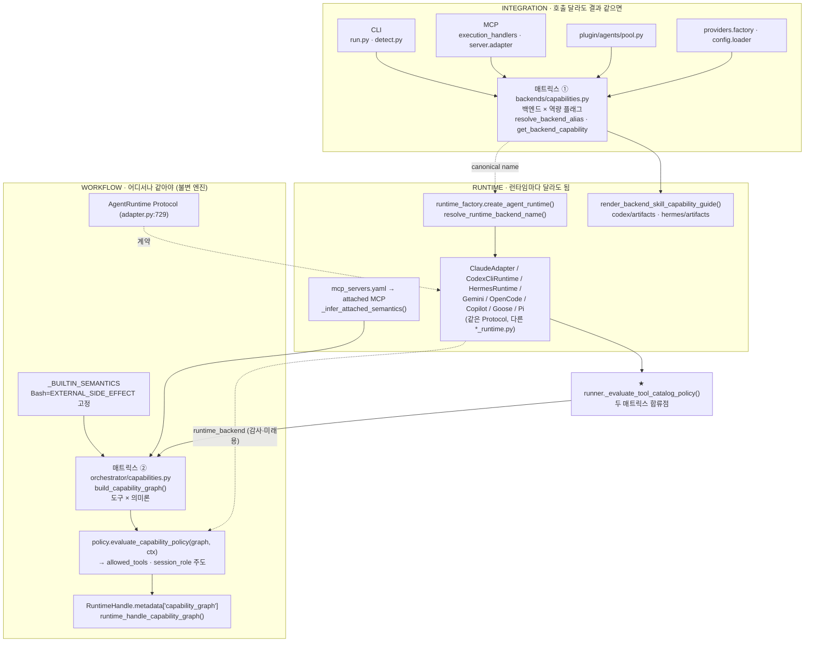

# 2005-2-2. Capability Matrix — workflow / runtime / integration 세 레이어 흐름도

> Ouroboros 백엔드 코드를 근거로, 강의 문장의 세 레이어가 실제 어디에 매핑되는지 추적한 자료.
> 출처 레포: `https://github.com/Q00/ouroboros` (chapter-05 승인 reference repo). 로컬 경로 기준 분석.

---

## 0. 출발점이 된 강의 문장

> 본인 업무의 capability matrix를 그릴 때도 같은 세 레이어로 본다.
> 무엇은 어디서나 같아야 하는가(**workflow**), 무엇이 런타임마다 달라도 되는가(**runtime**),
> 무엇이 호출 방식이 다르더라도 결과가 같으면 되는가(**integration**).

이 세 질문이 비유가 아니라 Ouroboros 코드의 실제 구조와 1:1로 맞물린다. 핵심은 두 가지다.

1. **`capabilities.py`가 두 개 존재한다.**
   - 매트릭스 ① `src/ouroboros/backends/capabilities.py` — *백엔드 × 역량 플래그* 표
   - 매트릭스 ② `src/ouroboros/orchestrator/capabilities.py` — *도구 × 의미론* 표
2. **두 표는 `orchestrator/runner.py`의 `_evaluate_tool_catalog_policy`에서 합류한다.**

---

## 1. 세 레이어 ↔ 코드 매핑 요약

| 레이어 | 질문 | 코드 위치 |
|---|---|---|
| **workflow** | 어디서나 같아야 하는 것 | 추상 역량 이름 `SkillExecutionCapability`(backends/capabilities.py:44-171), `policy.evaluate_capability_policy`, `_BUILTIN_SEMANTICS`, `AgentRuntime` Protocol(adapter.py:729), `workflow_ir`/`workflow_state`/`workflow_lifecycle` |
| **runtime** | 런타임마다 달라도 되는 것 | 매트릭스 ①의 백엔드별 행(guidance·플래그), `runtime_factory.create_agent_runtime`, 각 `*_runtime.py` 구현체, `render_backend_skill_capability_guide`, attached MCP + `_infer_attached_semantics` |
| **integration** | 호출 방식 달라도 결과 같으면 | 매트릭스 ①의 `name`/`aliases`/`cli_name`/`cli_config_key` + 리졸버, 호출 표면(CLI·MCP·plugin·providers·config) |

---

## 2. ASCII 흐름도

읽는 방향: 위(들어오는 호출) → 아래(불변 엔진).

```
┌──────────────────────────────────────────────────────────────────────────────────┐
│ INTEGRATION  ── "호출 방식이 달라도 결과가 같으면"                                   │
│ 여러 호출 표면이 하나의 레지스트리를 거쳐 같은 canonical 백엔드로 수렴               │
│                                                                                     │
│   CLI               MCP                  Plugin            providers / config        │
│   run.py:631        execution_handlers   pool.py:249       factory.py:11             │
│   detect.py:82      server/adapter:1229                    loader.py:1197            │
│      │                   │                   │                  │                    │
│      └───────────────────┴─────────┬─────────┴──────────────────┘                   │
│                                     ▼                                                │
│        ╔══════════════════════════════════════════════════════════════╗            │
│        ║  매트릭스 ①  backends/capabilities.py                          ║            │
│        ║  행=백엔드(claude·codex·gemini·hermes…) × 열=역량 플래그       ║            │
│        ║  resolve_backend_alias · get_backend_capability               ║            │
│        ║  name · aliases · cli_name · cli_config_key                   ║            │
│        ╚══════════════════════════════════════════════════════════════╝            │
└─────────────────────────────────────┬──────────────────────────────────────────────┘
                                       │ canonical name (예: "codex_cli" → "codex")
                                       ▼
┌──────────────────────────────────────────────────────────────────────────────────┐
│ RUNTIME  ── "런타임마다 달라도 되는 것"                                              │
│                                                                                     │
│   runtime_factory.py  create_agent_runtime()                                        │
│      └ resolve_runtime_backend_name()   ← 매트릭스 ①의 supports_runtime 열로 검증    │
│                     │                                                                │
│        ┌────────────┼─────────────┬──────────────┬────────────────┐                 │
│        ▼            ▼             ▼              ▼                ▼                  │
│   ClaudeAdapter CodexCliRuntime HermesRuntime Gemini/OpenCode  Copilot/Goose/Pi     │
│   └────── 전부 같은 AgentRuntime Protocol 의 서로 다른 구현체 (*_runtime.py) ──────┘ │
│                                                                                     │
│   per-backend 지침 (같은 추상역량, 다른 문장):                                       │
│      render_backend_skill_capability_guide()  →  codex/artifacts · hermes/artifacts │
│   환경마다 다른 도구 표면:                                                           │
│      ~/.ouroboros/mcp_servers.yaml → attached MCP → _infer_attached_semantics()     │
└─────────────────────────────────────┬──────────────────────────────────────────────┘
                                       │
     ┌─────────────────────────────────┴──────────────────────────────────┐
     │  ★ 두 매트릭스가 만나는 곳:  runner._evaluate_tool_catalog_policy()   │
     ▼                                                                      ▼
 AgentRuntime 인스턴스                                build_capability_graph(tool_catalog)
 (runtime_backend 이름 보유)                          ╔════════════════════════════════╗
     │                                                ║ 매트릭스 ② orchestrator/        ║
     │                                                ║ capabilities.py                ║
     │                                                ║ 행=도구 × 열=의미론             ║
     │                                                ║ (mutation/parallel/approval…)  ║
     │                                                ╚════════════════════════════════╝
     │                                                                      │
     └──────────────────────────┬──────────────────────────────────────────┘
                                 ▼
            PolicyContext(runtime_backend=…, session_role=IMPLEMENTATION)
                                 ▼
┌──────────────────────────────────────────────────────────────────────────────────┐
│ WORKFLOW  ── "어디서나 같아야 하는 것"  (불변 엔진)                                  │
│                                                                                     │
│   policy.evaluate_capability_policy(graph, ctx)  →  visible/executable → allowed_tools│
│      ※ 오늘은 session_role 이 결정을 주도. runtime_backend 는 감사·미래분기용으로     │
│        실려만 감 (policy.py:52 주석)                                                 │
│                                                                                     │
│   _BUILTIN_SEMANTICS = 엔진 계약   (Bash 는 사용자 YAML 로도 못 바꿈)                │
│   AgentRuntime Protocol (adapter.py:729) = 모든 런타임이 지키는 동일 계약            │
│   workflow_ir / workflow_state / workflow_lifecycle = 백엔드 무관 동일 IR            │
│                                                                                     │
│   산출: CapabilityGraph(직렬화) → RuntimeHandle.metadata["capability_graph"]         │
│          → runtime_handle_capability_graph() 로 세션 간 재수화                       │
└──────────────────────────────────────────────────────────────────────────────────┘
```

---

## 3. 연결의 핵심

1. **매트릭스 ①이 "어느 런타임이냐"를 정한다.** 호출 표면(CLI/MCP/plugin)이 무엇이든 `backends/capabilities.py`의 리졸버를 거쳐 canonical 백엔드 이름 하나로 좁혀지고, `runtime_factory`가 그 이름으로 구체 런타임 객체를 만든다.
2. **매트릭스 ②가 "그 런타임이 쥔 도구가 무엇을 할 수 있나"를 정한다.** `build_capability_graph`가 도구 카탈로그를 입력으로 도구별 의미론(파괴적/읽기전용/승인등급 등)을 매긴다.
3. **둘은 `runner._evaluate_tool_catalog_policy`에서 합류한다.** 런타임 객체에서 꺼낸 `runtime_backend`로 `PolicyContext`를 구성하고, 매트릭스 ②의 그래프와 함께 `policy.evaluate_capability_policy`에 넣어 **allowed_tools**를 산출한다.
4. 결과 그래프는 직렬화되어 `RuntimeHandle.metadata["capability_graph"]`에 담기고, `runtime_handle_capability_graph`로 세션 간 재사용된다.

---

## 4. Mermaid (렌더러 붙여넣기용)



---

## 5. 정직한 단서

- **매트릭스 ②는 빌트인 도구에 사용자 오버라이드를 적용하지 않는다.** `_BUILTIN_SEMANTICS`가 엔진 계약이라 `~/.ouroboros/tool_capabilities.yaml`(현재 환경에는 없음)로도 바꿀 수 없다. 오버라이드는 attached MCP 도구에만 적용된다.
- **`runtime_backend`는 정책 게이팅에 아직 쓰이지 않는다.** `PolicyContext`에 실려 감사 이벤트(`policy.capabilities.evaluated`)로 남지만, 현재 visible/executable 판정은 `session_role`이 주도한다(`policy.py:52`). 매트릭스 ①과 ②는 한 컨텍스트에 같이 담겨 흐르되, 백엔드별 정책 분기는 미래용 훅으로만 열려 있다.
- **`tool_capabilities.yaml`은 선택적 오버라이드다.** 없으면 `_load_raw_tool_capability_overrides`가 빈 dict를 돌려주고, 의미론은 전부 코드 내장 기본값(`_BUILTIN_SEMANTICS` + `_infer_attached_semantics`)으로 채워진다.

---

## 6. 코드 앵커 (file:line)

### 매트릭스 ① `src/ouroboros/backends/capabilities.py`
- `SkillExecutionCapability` 정의 / `_CODEX_…`·`_GENERIC_…` guidance: `:14-171`
- `BackendCapability` 플래그(`supports_runtime`·`switchable_runtime`·`soft_tool_enforcement`·`supports_tool_envelope`): `:22-36`
- 백엔드 등록부 `_CAPABILITIES`: `:173-279`
- 리졸버 `resolve_backend_alias` / `resolve_runtime_backend_name` / `get_backend_capability`: `:309-344`
- `render_backend_skill_capability_guide`: `:286`

### 매트릭스 ② `src/ouroboros/orchestrator/capabilities.py`
- 의미론 enum(`CapabilityMutationClass` 등): `:26-75`
- `_BUILTIN_SEMANTICS`(엔진 계약): `:114-187`
- `_infer_attached_semantics`(추론): `:214-244`
- `build_capability_graph`: `:549-593`
- 빌트인 오버라이드 우회 주석: `:487-489`

### 합류·런타임·정책
- `runtime_factory.create_agent_runtime` / 백엔드별 분기: `orchestrator/runtime_factory.py:41-160`
- `_evaluate_tool_catalog_policy`(두 표 합류): `orchestrator/runner.py:594-614`
- `evaluate_capability_policy`: `orchestrator/policy.py:175-215`
- `PolicyContext`(runtime_backend 휴면 주석): `orchestrator/policy.py:48-65`
- `AgentRuntime` Protocol: `orchestrator/adapter.py:729`
- `runtime_handle_capability_graph` / `runtime_handle_tool_catalog`: `orchestrator/adapter.py:345-375`
