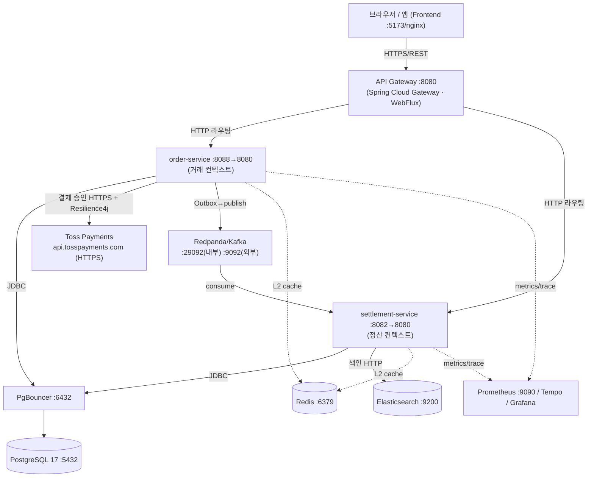

# Lemuel 네트워크 통신 문서

**1부 네트워크 통신 개념 정리** + **2부 이 프로젝트의 네트워크 통신 구조 분석**으로 구성된다.

> 근거: `gateway-service/application.yml`(라우팅), `order/settlement application.yml`(Kafka·PG·Resilience4j), `docker-compose.yml`(포트·토폴로지), Outbox/Kafka/PG 어댑터.

---

# 1부. 네트워크 통신 개념 정리

## 1-1. 통신 방향: North-South vs East-West

| 구분 | 의미 | 이 프로젝트 |
|------|------|-------------|
| **North-South** | 외부 클라이언트 ↔ 시스템 | 브라우저/앱 → Gateway → 서비스 |
| **East-West** | 시스템 내부 서비스 간 | order-service ↔ settlement-service (Kafka) |

## 1-2. 동기 vs 비동기

- **동기(Synchronous)**: 요청-응답을 기다림(HTTP/REST, gRPC). 강한 결합·즉시성. 호출 대상 장애가 전파됨 → 타임아웃·서킷브레이커 필요.
- **비동기(Asynchronous)**: 메시지를 큐/브로커에 던지고 끝(Kafka). 느슨한 결합·탄력성·최종 일관성(eventual consistency).

## 1-3. 핵심 프로토콜

- **HTTP/REST**: 클라이언트↔게이트웨이↔서비스, 외부 PG API. 텍스트(JSON), stateless.
- **메시지 브로커(Kafka)**: pub/sub, 파티션 기반 병렬, at-least-once.
- **TCP 기반 바이너리**: PostgreSQL wire protocol, Redis RESP.
- **HTTP(S)**: Elasticsearch REST, Toss PG.

## 1-4. 통신을 지키는 패턴

타임아웃 → 재시도(지수 백오프) → 서킷 브레이커(연쇄 장애 차단) → 벌크헤드(자원 격리) → 폴백. 이를 **회복탄력성(Resilience)** 이라 한다.

---

# 2부. 이 프로젝트의 네트워크 통신 구조 분석

## 2-1. 전체 토폴로지



- **모든 컨테이너 포트는 `127.0.0.1` 에 바인딩**(`docker-compose.yml`) — 호스트 외부로 직접 노출하지 않음(보안). 외부 진입점은 게이트웨이/프런트만.

## 2-2. North-South — 게이트웨이 라우팅

**위치**: `gateway-service/application.yml`

- **Spring Cloud Gateway (WebFlux, reactive)** — `web-application-type: reactive` 명시. 단일 진입점 `:8080`.
- **Path 述어(predicate) 기반 라우팅** (서비스 디스커버리 없이 정적 URI):
  - order-service: `/api/orders/**, /api/payments/**, /api/products/**, /api/users/**, /api/auth/**, /admin/products/** ...`
  - settlement-service: `/api/settlements/**, /api/reconciliation/**, /api/reports/**, /api/ledger/**, /admin/payouts/**, /admin/chargebacks/** ...`
- 대상 URI 는 환경변수 주입: `ORDER_SERVICE_URI`, `SETTLEMENT_SERVICE_URI`.
- **graceful shutdown** + Actuator liveness/readiness probe(K8s 헬스체크용).
- 게이트웨이는 **라우팅 전용**(커스텀 Java 필터 없음). 인증(JWT)·rate limit 는 각 서비스의 `shared-common` 필터에서 수행.

## 2-3. East-West — 서비스 간 통신 (비동기 우선) ★

이 프로젝트의 핵심 설계: **order ↔ settlement 간 동기 HTTP 호출이 없다.**

- **데이터 의존**: settlement-service 가 order 의 데이터를 `@Immutable` Read-Model 로 **같은 DB 를 직접 조회**(네트워크 호출 X, 코드 의존 X).
- **이벤트 전파**: 결제 완료 등 상태 변화는 **Kafka 비동기 메시지**로 전달.

```
[order-service] Payment.capture() (DB tx)
   └ outbox_events INSERT (같은 트랜잭션)
        ↓ poller (polling-delay-ms: 2000)
   Kafka topic: lemuel.payment.captured  (partitions: 3)
        ↓ consume (group: lemuel-settlement, manual commit, read_committed)
[settlement-service] PaymentEventKafkaConsumer → Settlement 생성
```

- **토픽**: `lemuel.payment.captured`, `lemuel.payment.refunded`.
- **파티션 3** = 컨슈머 병렬 소비 상한(settlement concurrency 와 함께 스케일).
- **Transactional Outbox** 로 "DB 커밋과 메시지 발행"의 원자성 확보(이중 쓰기 문제 해결, 메시지 유실 0).
- 효과: order 가 죽어도 settlement 는 큐에 쌓인 이벤트로 따라잡음 → **시간적 디커플링**.

## 2-4. 외부 시스템 연동

| 대상 | 프로토콜/포트 | 통신 방식 | 보호 |
|------|---------------|-----------|------|
| **Toss Payments** | HTTPS `api.tosspayments.com/v1/payments/confirm` | 동기 REST (결제 승인) | Resilience4j CB + Retry |
| **PostgreSQL 17** | TCP 5432 (앱→**PgBouncer 6432**) | JDBC, HikariCP 풀 | PgBouncer 커넥션 멀티플렉싱 |
| **Redpanda/Kafka** | 29092(내부)/9092(외부) | pub/sub | manual commit, read_committed |
| **Elasticsearch 8.17** | HTTP 9200 | 색인/검색 REST | connect 5s / socket 60s timeout |
| **Redis 7** | TCP 6379 | L2 캐시 | graceful degrade(장애 시 L1/DB) |
| **Slack/Mail** | HTTPS webhook/SMTP | 알림 발송 | opt-in |

- **PgBouncer**: 앱은 `postgres:5432` 가 아니라 `pgbouncer:6432` 에 접속. 다수의 클라이언트 커넥션을 소수의 실제 DB 커넥션으로 **멀티플렉싱**해 TPS 향상(가상 스레드 + Hikari 풀 위의 추가 계층).
- **Redpanda advertised address**: 내부(`redpanda:29092`) / 외부(`localhost:9092`) 이중 리스너 — 컨테이너 네트워크 내부와 호스트 접근 분리.

## 2-5. 네트워크 회복탄력성 (Resilience4j)

**위치**: `order-service/application.yml` (PG 호출 보호)

- **Circuit Breaker** (`pgDefault`): COUNT 기반 슬라이딩윈도우 20, 최소 10건, **실패율 50% 초과 시 OPEN**, OPEN 30초 후 HALF_OPEN(자동 전이), HALF_OPEN 5건 허용.
- **Retry**: 최대 3회, 500ms 시작 **지수 백오프(×2)**. `ResourceAccessException`/`5xx`/`IOException` 만 재시도.
- **4xx 제외**: `HttpClientErrorException`(결제키 만료 등 비즈니스 오류)은 서킷 판정·재시도에서 제외 — 무의미한 재시도 방지.
- **PG별 독립 인스턴스**(`tossPg`/`kcpPg`/`nicePg`/`inicisPg`): 한 PG 장애가 다른 PG 로 전이되지 않는 **벌크헤드(격벽)** 효과.
- **PG 라우팅 + Fallback**: `PgRouter` 가 결제수단·금액·health 를 보고 1순위 PG 선택, unhealthy(서킷 OPEN)면 `fallback-chain: [TOSS, NICE, KCP, INICIS]` 순으로 자동 전환. 100만원 이상은 고액 우선 PG(NICE).

## 2-6. 보안 (네트워크 관점)

- **포트 노출 최소화**: 모든 컨테이너 `127.0.0.1` 바인딩, 외부 진입은 게이트웨이/프런트만.
- **JWT (HS256)**: stateless 인증. `shared-common` 의 보안 필터가 각 서비스에서 검증(`JWT_ISSUER`/`JWT_SECRET`).
- **Rate Limiting**: Bucket4j 토큰버킷 필터(`RateLimitFilter`) — 과도한 요청 차단.
- **CORS**: 환경변수 화이트리스트.
- **Actuator**: 인증 필수, `health/info/metrics/prometheus` 만 노출.
- **PII 마스킹**: 로그(`PIIMaskingConverter`)에서 민감정보 마스킹.

## 2-7. 관측성 (분산 추적)

- **분산 트레이싱**: Micrometer Tracing → **Grafana Tempo**. `traceparent` 가 **Outbox 이벤트에 전파**(V40 `outbox_traceparent`)되어, 동기 경계를 넘는 비동기 Kafka 흐름(order→settlement)까지 하나의 trace 로 연결.
- **메트릭**: Micrometer → Prometheus(`:9090`) → Grafana. PG 라우팅 카운터(`pg.routing.requests`), 메서드 실행 타이머(`lemuel.method.execution`) 등.

## 2-8. 프로토콜 요약

| 계층 | 프로토콜 | 동기성 |
|------|----------|--------|
| Client → Gateway | HTTP(S)/REST/JSON | 동기 |
| Gateway → Service | HTTP/REST | 동기 |
| Service ↔ Service | Kafka 메시지 | **비동기** |
| Service → PG(Toss) | HTTPS/REST | 동기(+CB/Retry) |
| Service → DB | PostgreSQL wire (JDBC, via PgBouncer) | 동기 |
| Service → ES | HTTP/REST | 동기(색인은 큐 경유 비동기화) |
| Service → Redis | RESP (TCP) | 동기(+graceful degrade) |

---

## 정리

- **North-South**: 단일 진입 게이트웨이(Spring Cloud Gateway WebFlux) + Path 라우팅, 포트는 127.0.0.1 로만 노출.
- **East-West**: 서비스 간 **동기 호출 0** — Kafka 비동기 이벤트(Transactional Outbox) + Read-Model 직접 조회로 시간적·코드적 디커플링.
- **외부 연동**: Toss PG(HTTPS)·ES·Redis·PgBouncer→PostgreSQL, 각각 timeout/풀/degrade 로 보호.
- **회복탄력성**: PG별 독립 Circuit Breaker + Retry(지수 백오프) + Fallback 체인 = 벌크헤드.
- **보안/관측**: JWT·Rate Limit·CORS·Actuator 인증 + Outbox 를 통한 trace 전파(Tempo)와 Prometheus 메트릭.
- 관련 문서: `docs/diagrams/sequence-payment-to-settlement.md`, `docs/adr/0003-transactional-outbox-pattern.md`, `docs/adr/0010-multi-pg-routing-and-bulkhead.md`, `docs/adr/0012-distributed-tracing-across-outbox.md`.
