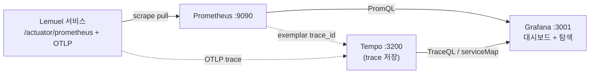

# Grafana — 소개·사용법 + Lemuel 프로젝트 적용 분석

**1부 Grafana 소개와 사용법** + **2부 이 프로젝트의 Grafana 적용 분석**으로 구성된다.

> 근거: `monitoring/grafana/provisioning/datasources/datasources.yaml`,
> `.../provisioning/dashboards/dashboards.yaml`, `.../dashboards/lemuel-business-kpi.json`,
> `monitoring/tempo.yaml`, 루트 `docker-compose.yml`, `monitoring/docker-compose.yml` 정독.
> 메트릭 정의·알림은 [프로메테우스.md](프로메테우스.md) 참조.

---

# 1부. Grafana 소개와 사용법

## 1-1. Grafana 란

**Grafana** 는 오픈소스 **관측성 시각화·대시보드 플랫폼**이다. 직접 데이터를 저장하지 않고,
여러 **데이터소스**(Prometheus, Tempo, Loki, PostgreSQL 등)에 질의해 그 결과를 패널/대시보드로
그린다. 즉 *"데이터는 남의 것, 보여주는 건 Grafana"*.

핵심 역할:
- **시각화**: 시계열·게이지·통계·테이블·노드그래프 등 다양한 패널.
- **통합 조회**: 메트릭(Prometheus) + 트레이스(Tempo) + 로그(Loki)를 한 화면에서 상관 분석.
- **알림(Alerting)**: 자체 알림 엔진도 있으나, 본 프로젝트는 Prometheus Alertmanager 를 사용.
- **데이터소스 추상화**: 같은 대시보드를 데이터소스만 바꿔 재사용.

## 1-2. Prometheus 와의 관계 (역할 분담)

| 구분 | Prometheus | Grafana |
|------|------------|---------|
| 역할 | 메트릭 **수집·저장(TSDB)·질의(PromQL)·알림 평가** | **시각화·대시보드·탐색 UI** |
| 데이터 보유 | O (시계열 저장) | X (질의해서 그림만) |
| 비유 | 창고+계산기 | 전광판 |

→ Prometheus 가 "무엇이 얼마나"를 계산하면, Grafana 는 그것을 사람이 읽는 그림으로 만든다.

## 1-3. 핵심 개념

- **Data source**: 질의 대상(여기선 Prometheus, Tempo). UID 로 식별.
- **Dashboard / Panel**: 대시보드는 패널의 모음. 패널마다 쿼리(target)와 시각화 타입.
- **Panel 타입**: `timeseries`(추이), `stat`(단일 수치+임계 색상), `row`(그룹 구분), `table`,
  `nodeGraph`(서비스 맵) 등.
- **Provisioning**: 데이터소스·대시보드를 **YAML/JSON 파일로 선언**해 컨테이너 기동 시 자동 등록
  (UI 수동 설정 불필요 → 코드로 형상관리).
- **Exemplar**: 메트릭 한 점에 붙은 trace 샘플 ID. 그래프에서 클릭하면 해당 트레이스로 점프.

## 1-4. 사용 흐름 (일반)

```
[데이터소스 등록] → [대시보드 JSON 작성/임포트] → [패널에 PromQL/TraceQL 쿼리] → [임계·색상·단위 설정]
```

운영에선 위를 **provisioning 파일로 박제**해 "기동하면 대시보드가 이미 떠 있는" 상태로 만든다.

---

# 2부. 이 프로젝트의 Grafana 적용 분석

## 2-1. 관측성 스택에서 Grafana 의 위치



- Grafana 는 **메트릭(Prometheus)** 과 **트레이스(Tempo)** 두 소스를 동시에 물고, 메트릭에서
  트레이스로 **drill-down** 할 수 있게 묶는다.
- 설정은 전부 `monitoring/grafana/` 하위에 **provisioning 으로 선언** — 코드로 관리.

## 2-2. 데이터소스 — `provisioning/datasources/datasources.yaml`

두 개의 데이터소스를 자동 등록한다.

| 데이터소스 | 타입 | URL | 핵심 설정 |
|-----------|------|-----|-----------|
| **Prometheus** (default) | prometheus | `http://prometheus:9090` | `timeInterval: 15s`, **exemplar → Tempo 연결** |
| **Tempo** | tempo (uid `tempo`) | `http://tempo:3200` | tracesToMetrics, serviceMap, nodeGraph, search |

핵심은 **두 소스의 상호 연결**이다.

- `exemplarTraceIdDestinations` (Prometheus → Tempo): 메트릭 그래프의 exemplar 점을 클릭하면
  `trace_id` 로 **Tempo 트레이스로 점프**. "이 p99 스파이크가 어느 요청이었나"를 즉시 추적.
- `tracesToMetrics` / `serviceMap` / `nodeGraph` (Tempo → Prometheus): 트레이스에서 관련 메트릭
  으로, 그리고 서비스 호출 관계를 **노드 그래프**로 시각화.
- `lokiSearch.hide: true`: **Loki(로그) 미구성**이라 로그 검색 탭은 비활성. (관측 3축 중 메트릭·
  트레이스만 갖춘 상태 — 정직히 말해 로그 축은 아직 없음.)

## 2-3. 대시보드 프로비저닝 — `provisioning/dashboards/dashboards.yaml`

```yaml
providers:
  - name: 'Lemuel dashboards'
    folder: 'Lemuel'
    type: file
    path: /var/lib/grafana/dashboards     # 이 경로의 *.json 을 자동 로드
    updateIntervalSeconds: 30             # 30초마다 파일 변경 반영
    editable: true
```

→ `monitoring/grafana/dashboards/*.json` 을 컨테이너에 마운트하면 **"Lemuel" 폴더**에 자동 등재.
대시보드를 **JSON 으로 버전 관리**(UI 클릭 설정이 휘발되지 않음).

## 2-4. 핵심 대시보드 — `lemuel-business-kpi.json`

uid `lemuel-kpi`, **10초 자동 새로고침**, 기본 시간창 `now-1h`. 패널이 **비즈니스 도메인별 row**
로 묶여 있어, 인프라 지표가 아니라 **"돈이 흐르는 경로"를 그대로 본다**. 이게 이 대시보드의 성격.

| Row | 패널 | 타입 | 쿼리(PromQL) 요지 |
|-----|------|------|-------------------|
| **결제** | PG 라우팅 분포 | stat | `sum by(provider) (rate(pg_routing_requests_total[5m]))` — PG사별 라우팅 비중 |
| 결제 | 환불 처리 시간 | timeseries | `histogram_quantile(0.50/0.95/0.99, ...refund_processing_duration...)` — p50/p95/p99 |
| **Outbox/DLQ** | Outbox PENDING | stat | `outbox_pending_count` — 임계 색상(녹100/적1000) |
| Outbox/DLQ | Outbox FAILED | stat | `outbox_failed_count` — 1건만 돼도 적색(DLQ 알람) |
| Outbox/DLQ | 발행 latency | timeseries | `histogram_quantile(0.99/0.50, ...outbox_publish_duration...)` |
| Outbox/DLQ | DLQ 발행 + Admin 액션 | timeseries | `rate(outbox_dlq_published_total / admin_retry / admin_skip [5m])` |
| **재고 동시성(SKU)** | 차감 성공/재시도/실패 | timeseries | `variant_stock_decrease_{success,retry,failure}_total` |
| 재고 동시성 | 재시도/성공 비율 | stat | retry/success ratio — **>1 이면 hot SKU 신호 → Redis 분산락 격상 검토**(패널 설명에 명시) |
| **PG 대사** | 차이 분류별 발생 | timeseries | `sum by(provider,type) (rate(pg_reconciliation_discrepancies_total[1h]))` |
| **정산** | 배치 처리 시간 | timeseries | `settlement_batch_{creation,confirmation,adjustment}_duration` p95 |

특징:
- **임계 기반 색상(stat thresholds)**: Outbox PENDING(녹→황100→적1000), FAILED(1건=적),
  retry/success(0.5황/1.0적) — 숫자를 안 읽어도 색으로 위험을 본다.
- **히스토그램 분위수**: 환불·Outbox 발행·정산 배치 모두 `histogram_quantile()` 로 p95/p99 추적
  → 평균이 아니라 **꼬리 지연(tail latency)** 을 본다. (Prometheus 측 `percentiles-histogram`
  활성이 전제 — [프로메테우스.md](프로메테우스.md) 2-2.)
- **운영 가이드 내장**: "재시도/성공 비율 >1 → hot SKU → 분산락 검토" 처럼 패널 description 에
  **대응 힌트**가 박혀 있어, 대시보드가 곧 1차 트러블슈팅 안내.

## 2-5. 트레이싱 연계 (Tempo)

- **Tempo 백엔드**(`monitoring/tempo.yaml`): 단일 노드, OTLP gRPC(4317)/HTTP(4318) 수신, 로컬
  블록 저장, `block_retention: 24h`(시연용 24시간 보관). 운영은 클러스터+S3/GCS 권장(주석 명시).
- **메트릭↔트레이스 왕복**: 2-2 의 exemplar 로 메트릭→트레이스, serviceMap/nodeGraph 로 서비스
  호출 관계 시각화. `traceparent` 가 **Outbox 이벤트에 실려 비동기 경계(Kafka)까지 전파**되므로,
  결제→정산처럼 서비스를 건너뛰는 흐름도 하나의 트레이스로 이어진다(ADR 0012, [network.md](network.md)).

## 2-6. 배포 형태 — 두 벌의 compose (주의)

Grafana 가 **두 docker-compose 에 중복 정의**돼 있어, 어느 스택을 띄우느냐에 따라 구성이 다르다.

| | 루트 `docker-compose.yml` (올인원) | `monitoring/docker-compose.yml` (모니터링 단독) |
|---|---|---|
| 이미지 | grafana 11.2.0 | grafana 11.0.0 |
| 포트 | 3001:3000 | 3001:3000 |
| 인증 | **익명 허용**(`GF_AUTH_ANONYMOUS_ENABLED=true`, org role Admin) — 시연 편의 | **admin 비밀번호**(`GF_SECURITY_ADMIN_PASSWORD`) + 가입 차단 |
| 데이터소스 | Prometheus + **Tempo**(트레이싱 포함) | Prometheus 중심(이 compose 에는 tempo 서비스 없음) |
| 부가 | `traceqlEditor` 토글, provisioning 마운트 | Alertmanager 포함, 별도 retention 15d |

→ **루트 compose** 는 앱+인프라+관측을 한 번에 띄우는 데모/로컬용(익명 접속이라 편하지만 보안상
운영 부적합). **monitoring/ compose** 는 관측 스택만 따로 운영(비밀번호 보호)하는 형태.
운영 배포 시에는 **익명 접속을 끄고 비밀번호/SSO 를 강제**해야 한다.

---

## 정리

- **역할**: Grafana 는 저장하지 않고 **Prometheus(메트릭)+Tempo(트레이스)** 를 질의해 **시각화·
  drill-down** 만 담당. 알림은 Alertmanager 가 맡음(역할 분리).
- **provisioning**: 데이터소스·대시보드를 YAML/JSON 으로 **코드 관리** — 기동 즉시 "Lemuel" 폴더에
  대시보드가 떠 있음.
- **대시보드 성격**: `lemuel-business-kpi` 는 인프라가 아닌 **결제·Outbox/DLQ·재고동시성·PG대사·
  정산** 등 도메인 KPI 중심. 임계 색상 + p95/p99 꼬리지연 + 패널 내 대응 힌트.
- **메트릭↔트레이스 연결**: exemplar(메트릭→Tempo), serviceMap/nodeGraph(Tempo→메트릭),
  `traceparent` 의 비동기 전파로 결제→정산 경계까지 한 트레이스.
- **현 한계(정직히)**: Loki(로그) 미구성으로 관측 3축 중 **로그 축 부재**, 루트 compose 는 **익명
  접속**이라 운영 부적합, 두 compose 의 Grafana 정의 중복.
- 관련 문서: [프로메테우스.md](프로메테우스.md), [network.md](network.md),
  [etc/MONITORING.md](etc/MONITORING.md), [adr/0012-distributed-tracing-across-outbox.md](adr/0012-distributed-tracing-across-outbox.md).
