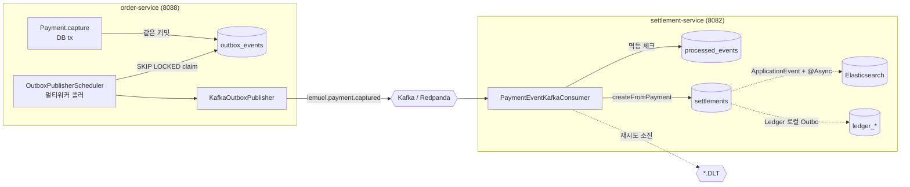
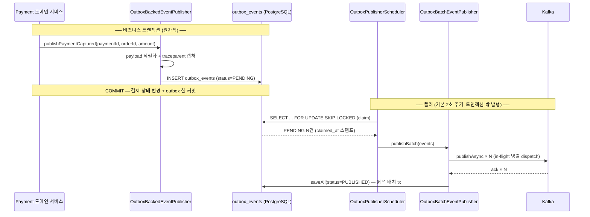
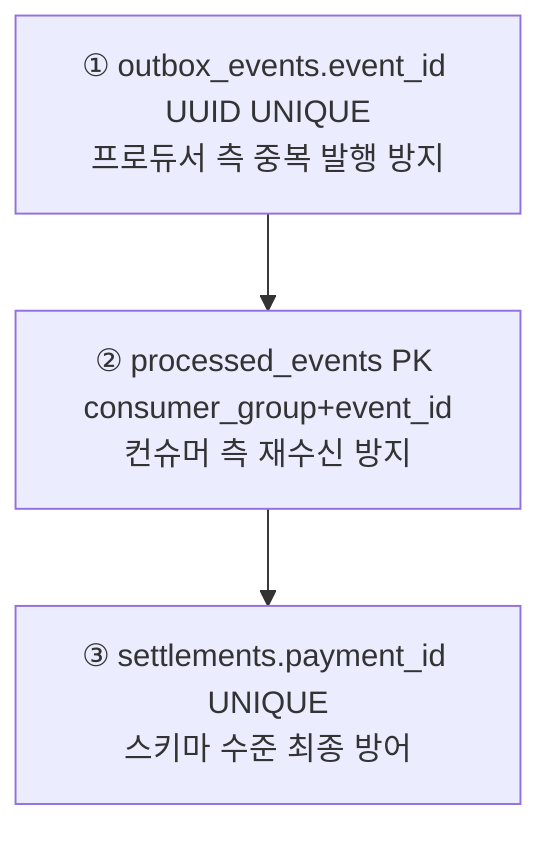

# Lemuel 비동기 연동(Asynchronous Integration) 분석

> order-service ↔ settlement-service 를 코드 의존 없이 연결하고, 무거운 후처리(ES 색인·원장 기록·알림)를 요청 경로에서 분리하기 위한 비동기 메커니즘 전체를 정리한다.
> 관련 문서: [`docs/카프카.md`](./카프카.md), [`docs/tps.md`](./tps.md), [`docs/adr/0003-transactional-outbox-pattern.md`](./adr/0003-transactional-outbox-pattern.md), [`docs/adr/0005-kafka-vs-application-events.md`](./adr/0005-kafka-vs-application-events.md), [`docs/adr/0012-distributed-tracing-across-outbox.md`](./adr/0012-distributed-tracing-across-outbox.md), [`docs/adr/0017-kafka-consumer-dlt-and-replay.md`](./adr/0017-kafka-consumer-dlt-and-replay.md)

---

## 1. 한눈에 보기 — 4가지 비동기 메커니즘

이 프로젝트의 비동기 연동은 **목적과 경계에 따라 4가지**로 나뉜다.

| # | 메커니즘 | 전달 경계 | 매체 | 주 사용처 | 신뢰성 모델 |
|---|----------|-----------|------|-----------|-------------|
| 1 | **Transactional Outbox + Kafka** | **서비스 간** (order → settlement) | Kafka(Redpanda) | 결제완료 → 정산 자동생성 | at-least-once + 멱등 |
| 2 | **Spring `ApplicationEvent` + `@Async`** | **서비스 내** (settlement 내부) | JVM 인메모리 | 정산 → Elasticsearch 색인 | best-effort + 재시도 큐 |
| 3 | **Ledger 로컬 Outbox 폴러** | **서비스 내** (settlement 내부) | DB 폴링(Kafka 미경유) | 정산/환불 → 복식부기 원장 | at-least-once + 멱등 |
| 4 | **알림 멀티채널 Fan-out** | **서비스 내** (order 내부) | 동기 호출 + 실패 격리 | 주문확정 → 메일/Slack | best-effort, 채널별 격리 |

핵심은 **(1) Transactional Outbox + Kafka** 다. 나머지는 보조 비동기 경로다. 아래에서 (1)을 가장 깊게 다룬 뒤 (2)(3)(4)를 차례로 설명한다.



---

## 2. Transactional Outbox + Kafka (서비스 간 핵심 경로)

### 2.1 왜 Outbox 인가 — Dual-Write 문제

"DB 커밋"과 "Kafka 발행"은 서로 다른 시스템이라 **한 트랜잭션으로 묶을 수 없다**. 순진하게
`save(); kafka.send();` 를 하면 — 커밋 후 발행 직전에 죽으면 이벤트 유실, 발행 후 커밋 실패면 유령 이벤트가 된다.

해결책은 **이벤트를 비즈니스 데이터와 같은 DB 트랜잭션에 `outbox_events` 행으로 기록**하고(원자성 확보), 별도 폴러가 그 행을 읽어 Kafka 로 발행하는 것이다. → "DB 커밋이 곧 이벤트 발행 보장"이 된다.

### 2.2 단계별 흐름



### 2.3 ① 이벤트 쓰기 — `OutboxBackedEventPublisher`

`order-service/.../payment/adapter/out/event/OutboxBackedEventPublisher.java`

도메인 서비스의 `@Transactional` 안에서 호출되어 **비즈니스 변경과 outbox 레코드가 같은 커밋으로 원자화**된다.

```java
// OutboxBackedEventPublisher.java:59-65, 75-96
@Override
public void publishPaymentCaptured(Long paymentId, Long orderId, BigDecimal amount) {
    writeOutbox(paymentId, "PaymentCaptured", Map.of(
            "paymentId", paymentId, "orderId", orderId, "amount", amount.toPlainString()));
}

private void writeOutbox(Long paymentId, String eventType, Map<String, Object> payload) {
    Map<String, Object> ordered = new LinkedHashMap<>(payload);   // 직렬화 순서 결정적
    String json = objectMapper.writeValueAsString(ordered);       // 실패 시 IllegalStateException → 커밋 롤백
    String traceParent = traceContextCapture.captureCurrentTraceParent(); // 도메인 tx 시점의 trace 보존
    OutboxEvent event = OutboxEvent.pending(AGGREGATE_TYPE, String.valueOf(paymentId), eventType, json, traceParent);
    saveOutboxEventPort.save(event);
}
```

발행되는 Payment 이벤트(`PublishEventPort`): `PaymentCreated`, `PaymentAuthorized`, **`PaymentCaptured`**(정산 트리거), `PaymentRefunded`.

> 설계 포인트: 직렬화 실패를 **즉시 치명적 예외**로 처리한다 — "이벤트 손실"보다 "커밋 롤백"이 안전하기 때문.

### 2.4 ② 멀티워커 폴러 — `OutboxPublisherScheduler`

`shared-common/.../outbox/application/service/OutboxPublisherScheduler.java`

```java
// OutboxPublisherScheduler.java:33-38, 72-90
private static final int BATCH_SIZE = 100;
private static final Duration CLAIM_LEASE = Duration.ofMinutes(1);    // 폴링 주기보다 충분히 길게
private final String workerId = "outbox-" + UUID.randomUUID();        // claimed_by 추적용

@Scheduled(fixedDelayString = "${app.outbox.polling-delay-ms:2000}")  // 기본 2초
public void publishPendingEvents() {
    List<OutboxEvent> claimed = claimOutboxEventPort.claimPending(BATCH_SIZE, CLAIM_LEASE, workerId);
    if (claimed.isEmpty()) return;
    batchEventPublisher.publishBatch(claimed);
}
```

**수평 확장의 핵심 — ShedLock 제거 + `FOR UPDATE SKIP LOCKED`**:

```sql
-- SpringDataOutboxEventRepository.selectClaimableIds (네이티브)
SELECT e.id FROM opslab.outbox_events e
WHERE e.status = 'PENDING'
  AND (e.claimed_at IS NULL OR e.claimed_at < now() - (:leaseSeconds * INTERVAL '1 second'))
ORDER BY e.created_at
LIMIT :limit
FOR UPDATE SKIP LOCKED          -- 다른 워커가 잠근 행은 건너뜀 → disjoint 분할
```

- **이전**: 단일 ShedLock 으로 한 인스턴스만 폴링 → 인스턴스를 늘려도 발행 처리량이 그대로.
- **현재**: 여러 인스턴스가 동시에 폴링해도 `SKIP LOCKED` 로 서로 겹치지 않는 행만 가져감 → **인스턴스 수만큼 발행량 선형 증가**.
- **리스(lease) 기반 자동 복구**: claim 시 `claimed_at` 스탬프를 찍는다(마이그레이션 `V20260611110000__outbox_claim_columns.sql`). 워커가 발행 전 죽어도 1분 후 리스 만료 → 다른 워커가 회수. **별도 reaper 불필요**.

claim 영속 어댑터 (`OutboxEventPersistenceAdapter.claimPending`, `@Transactional`):
```java
List<Long> ids = repository.selectClaimableIds(limit, lease.toSeconds());  // SKIP LOCKED 선택
repository.stampClaim(ids, worker, LocalDateTime.now());                   // claimed_at/by 스탬프
return repository.findByIdInOrderByCreatedAtAsc(ids) ...;                  // 도메인 복원
```

### 2.5 ③ 비동기 배치 발행 — `OutboxBatchEventPublisher`

`shared-common/.../outbox/application/service/OutboxBatchEventPublisher.java`

기존 "이벤트마다 동기 `send().get()` + 개별 트랜잭션" 직렬 처리의 병목을 제거한다.

```java
// OutboxBatchEventPublisher.java:80-120 (요약)
// 1) 전부 비동기 dispatch — 프로듀서가 in-flight 로 묶어 보냄
for (OutboxEvent event : events)
    inflight.put(event, publishExternalEventPort.publishAsync(event));

// 2) 결과 수거 — 모두 in-flight 라 합산 대기는 N배가 아닌 ~1배
for (entry : inflight) {
    String error = awaitError(entry.getValue());     // future.get(30s)
    if (error == null) event.markPublished();
    else { event.markFailed(error);
           if (event.isFailed()) publishToDlqQuietly(event);  // 재시도 한계 초과 → DLQ
           else retryIds.add(event); }                        // 여전히 PENDING → 리스 해제
}

// 3) 상태 일괄 영속 (JDBC 배치, 짧은 트랜잭션)
saveOutboxEventPort.saveAll(events);

// 4) 재시도 대상 리스 해제 → 다음 주기 즉시 재클레임
claimOutboxEventPort.releaseClaim(retryIds...);
```

처리량이 오르는 이유 두 가지:
1. **Kafka 라운드트립 병렬화** — N개 send 가 모두 in-flight 라서 벽시계 대기 ≈ 1배.
2. **DB 쓰기 묶음** — 상태 갱신(PUBLISHED/FAILED)을 `saveAll` 로 JDBC 배치(`order-service/application.yml` 의 `hibernate.jdbc.batch_size: 50`, `reWriteBatchedInserts=true`).
3. **DB 커넥션 점유 최소화** — Kafka 네트워크 대기는 **트랜잭션 밖**에서, 상태 반영만 짧은 배치 트랜잭션으로.

### 2.6 ④ Kafka 발행 — `KafkaOutboxPublisher`

`shared-common/.../outbox/adapter/out/event/KafkaOutboxPublisher.java` (`@ConditionalOnProperty app.kafka.enabled=true`)

- **토픽 명명 규칙**: `lemuel.<aggregate_소문자>.<event_snake>`
  예) `aggregateType=Payment`, `eventType=PaymentCaptured` → **`lemuel.payment.captured`** (접두사 중복 제거 후 camel→snake)
- **파티셔닝**: `aggregateId`(예: `payment_id`)를 **메시지 키**로 사용 → 같은 집합의 이벤트는 같은 파티션 → **순서 보장**.
- **헤더**: `event_id`(멱등 키), `event_type`, `aggregate_type`, 그리고 `traceparent`(분산 트레이싱).
- `publishAsync()` 는 `.get()` 없이 send future 를 그대로 반환(배치 폴러가 모아서 대기).

```java
// KafkaOutboxPublisher.java:79-99 — 레코드 빌드
ProducerRecord<String,String> record = new ProducerRecord<>(topic, null, event.getAggregateId(), event.getPayload());
record.headers().add(new RecordHeader("event_id", event.getEventId().toString().getBytes(UTF_8)));
// ... event_type, aggregate_type
if (event.getTraceParent() != null)
    record.headers().add(new RecordHeader("traceparent", event.getTraceParent().getBytes(UTF_8)));
```

---

## 3. Kafka 컨슈머 (settlement-service)

### 3.1 결제완료 → 정산 자동생성 — `PaymentEventKafkaConsumer`

`settlement-service/.../settlement/adapter/in/kafka/PaymentEventKafkaConsumer.java`

이 컨슈머가 **"배치 중심 정산"을 "이벤트 기반 정산"으로 전환**한다.

```java
// PaymentEventKafkaConsumer.java:58-115 (요약)
@KafkaListener(topics = "${app.kafka.topic.payment-captured}", groupId = "lemuel-settlement",
               containerFactory = "kafkaListenerContainerFactory")
@Transactional
public void onPaymentCaptured(ConsumerRecord<String,String> record, Acknowledgment ack) {
    UUID eventId = extractEventId(record);                    // event_id 헤더
    if (eventId == null) { ack.acknowledge(); return; }       // 키 없는 레코드는 skip

    // ① 컨슈머 멱등: (group, event_id) 이미 처리 → skip
    if (processedEventRepository.existsById(new ProcessedEventId(CONSUMER_GROUP, eventId))) {
        ack.acknowledge(); return;
    }
    // ② 파싱 — JsonProcessingException → IllegalArgumentException (즉시 DLT)
    JsonNode node = objectMapper.readTree(record.value());
    Long paymentId = node.get("paymentId").asLong();
    Long orderId   = node.get("orderId").asLong();
    BigDecimal amount = node.has("amount") ? new BigDecimal(node.get("amount").asText()) : BigDecimal.ZERO;

    // ③ 정산 생성 (내부 payment_id UNIQUE 로 추가 방어)
    createSettlementFromPaymentUseCase.createSettlementFromPayment(paymentId, orderId, amount);

    // ④ 처리 기록 → 재처리 시 멱등 보장
    processedEventRepository.save(new ProcessedEventJpaEntity(CONSUMER_GROUP, eventId, "PaymentCaptured"));
    ack.acknowledge();
}
```

> **Read-only Projection 과의 연결**: 컨슈머는 `order-service` 를 import 하지 않는다. 이벤트로 트리거만 받고, 추가 데이터는 settlement-service 자체의 read-model(`SettlementPaymentReadModel` 등)로 같은 테이블을 읽는다 → **MSA 코드 의존 0**.

### 3.2 컨슈머 병렬화 — `KafkaErrorHandlerConfig`

`settlement-service/.../settlement/adapter/in/kafka/KafkaErrorHandlerConfig.java`

```java
// KafkaErrorHandlerConfig.java:194-206
factory.setConcurrency(concurrency);   // app.kafka.consumer.concurrency (기본 3)
factory.getContainerProperties().setAckMode(AckMode.MANUAL_IMMEDIATE);
```

- `concurrency` 개의 컨슈머 스레드가 **토픽 파티션의 disjoint 부분집합**을 맡아 정산 생성을 병렬 처리.
- **유효 상한 = 파티션 수**(`app.kafka.topic.partitions`, 기본 3). 초과분은 idle 이라, 파티션과 함께 올려야 처리량이 는다.
- 파티션 간 병렬 처리는 멱등 3단 방어(§4)로 안전.

### 3.3 에러 핸들링 & DLT (Dead Letter Topic)

Spring Kafka 기본값 `FixedBackOff(0, 9)` 는 9회 즉시 재시도 후 **조용히 skip** → 메시지 사실상 유실. 이를 막기 위해 `DefaultErrorHandler` 를 명시적으로 구성한다.

```java
// KafkaErrorHandlerConfig.java:60-62, 164-186
private static final long RETRY_INTERVAL_MS = 2_000L;   // 2초
private static final long MAX_RETRIES = 3L;             // 합계 6초

DefaultErrorHandler handler = new DefaultErrorHandler(recoverer, new FixedBackOff(2_000, 3));
handler.addNotRetryableExceptions(            // 재시도 무의미 → 즉시 DLT
        JsonProcessingException.class,        //   - 페이로드 파싱 불가
        IllegalArgumentException.class,       //   - 도메인 인풋 검증 실패(음수 금액 등)
        IllegalStateException.class);         //   - 상태 머신 위반(종료된 정산 재처리 등)
```

| 예외 유형 | 처리 |
|-----------|------|
| 일시적(DB lock, IO) | `FixedBackOff` 2초 × 3회 재시도 → 소진 시 DLT |
| 독성 메시지(파싱/검증/상태) | **재시도 없이 즉시 DLT** — 같은 파티션 후속 메시지 stall 방지 |

`DeadLetterPublishingRecoverer` 가 재시도 소진 레코드를 **`<원본토픽>.DLT`** 로 복사하며, 원본 헤더(`event_id`, `traceparent`)를 패스스루하고 `kafka_dlt-*` 진단 헤더(원본 토픽/오프셋/예외 FQCN/스택트레이스)를 자동 부여 → 사후 추적·replay 용이.

DLT 전용 프로듀서는 `acks=all` + `enable.idempotence=true` 로 **DLT 손실까지 방지**.

### 3.4 DLT 검사·재처리 — `DlqReplayService`

`settlement-service/.../settlement/adapter/in/kafka/DlqReplayService.java`

- **`inspect(dltTopic, max)`**: 일회용 컨슈머 그룹으로 read→seek→close (commit 안 함 → lag 누적 X). 페이로드 미리보기 + 원본 메타 + 예외 cause 노출.
- **`replay(dltTopic, max)`**: DLT 메시지를 **원본 토픽으로 republish**. `kafka_dlt-*` 표식 헤더는 제거하고 `event_id`/`traceparent` 는 보존 → 컨슈머의 `processed_events` 멱등으로 **재처리 무해**.
- **무한 루프 방지**: `x-replay-count` 헤더로 카운트, **5회 도달 시 skip**.

---

## 4. 멱등성 3단 방어

at-least-once 전달(리밸런싱·재처리는 Kafka 의 본질)에서 **정산 중복 생성·환불 이중 반영**을 막는 다층 방어.



| 단계 | 위치 | 근거 |
|------|------|------|
| ① `event_id` UNIQUE | `V28__create_outbox_events.sql` `uq_outbox_event_id` | 프로듀서 측 중복 발행 차단 |
| ② `(consumer_group, event_id)` PK | `V29__create_processed_events.sql`, `ProcessedEventJpaEntity` (`@EmbeddedId`) | 컨슈머 측 재수신 차단 |
| ③ `payment_id` UNIQUE | `settlements` 테이블 | 위 두 단계가 모두 뚫려도 DB 가 최종 거부 |

추가로 프로듀서 `enable.idempotence=true`(application.yml) 가 브로커 레벨 중복까지 막는다.

---

## 5. 분산 트레이싱 — 비동기 경계를 잇는 W3C Trace Context

비동기 발행은 요청 스레드와 폴러 스레드가 달라 trace 가 끊긴다. 이를 잇기 위해 **도메인 트랜잭션 시점의 trace 를 outbox 에 영속**한다.

- `OutboxEvent.traceParent` 필드 (W3C `traceparent`, 예: `00-{traceId}-{spanId}-01`).
- `OutboxBackedEventPublisher` 가 쓰기 시점에 `TraceContextCapture.captureCurrentTraceParent()` 로 캡처(폴러 시점이 아닌 **비즈니스 변경 시점**의 trace).
- `KafkaOutboxPublisher` 가 발행 시 `traceparent` 헤더로 복원 → 컨슈머가 같은 trace 에 합류.
- 마이그레이션: `V40__outbox_traceparent.sql`. 상세: [ADR-0012](./adr/0012-distributed-tracing-across-outbox.md).

결과: **결제 → outbox → Kafka → 정산 생성** 전 구간이 단일 trace 로 Tempo/Jaeger 에 연결된다(트레이싱 비활성 환경에선 `null` 로 무해).

---

## 6. 서비스 내 비동기 ① — `ApplicationEvent` + `@Async` (ES 색인)

정산 생성/확정 후 **Elasticsearch 색인**은 요청 경로에서 분리한다. 서비스 **내부** 이벤트라 Kafka 가 아닌 Spring `ApplicationEventPublisher` 를 쓴다([ADR-0005](./adr/0005-kafka-vs-application-events.md) 의 경계 결정).

**발행** — `SettlementEventPublisherAdapter` (`PublishSettlementEventPort` 구현):
```java
eventPublisher.publishEvent(new SettlementIndexEvent(settlementIds, IndexEventType.BATCH_CREATED));
```

**구독** — `SettlementIndexEventListener` (`@ConditionalOnProperty app.search.enabled=true`):
```java
// SettlementIndexEventListener.java:28-60
@Async
@EventListener
public void handleSettlementIndexEvent(SettlementIndexEvent event) {
    switch (event.getEventType()) {
        case BATCH_CREATED, BATCH_CONFIRMED, REFUND_PROCESSED -> indexSettlementUseCase.bulkIndexSettlements(ids);
        case SINGLE_UPDATED, APPROVED, REJECTED -> ids.forEach(indexSettlementUseCase::indexSettlement);
    }
    // 실패해도 UseCase 내부에서 재시도 큐에 추가되므로 추가 처리 불필요
}
```

- `@Async` 스레드풀은 `shared-common/.../config/elasticsearch/AsyncConfig.java` 에서 정의.
- ES 색인 실패가 **정산 트랜잭션을 롤백시키지 않는다**(best-effort + 재시도 큐).

---

## 7. 서비스 내 비동기 ② — Ledger 로컬 Outbox (Kafka 미경유)

복식부기 원장 기록은 정산/환불과 **같은 커밋**으로 `ledger_outbox` 에 작업을 적재하고, 로컬 폴러가 처리한다. **Kafka 를 거치지 않는** 트랜잭셔널 아웃박스다(서비스 내부 + 강한 정합성 요구).

`settlement-service/.../ledger/adapter/in/batch/LedgerOutboxPoller.java`:
```java
// LedgerOutboxPoller.java:29-58 (요약)
@Scheduled(fixedDelayString = "${app.ledger-outbox.poll-delay-ms:5000}")   // 기본 5초
@SchedulerLock(name = "ledger-outbox-poller", lockAtMostFor = "PT5M")       // ShedLock 직렬화
public void poll() {
    List<LedgerOutboxTask> batch = processPort.fetchPending(100);
    for (LedgerOutboxTask task : batch) {
        try { processPort.execute(task); processPort.markDone(task.id()); }   // 처리 + 마킹 분리
        catch (RuntimeException e) { processPort.markFailed(task.id(), e.getMessage()); } // 한 건 실패가 배치 차단 X
    }
}
```

- 정산/환불 트랜잭션과 같은 커밋으로 적재 → **크래시 후에도 작업이 살아남아 결국 처리**(at-least-once + 멱등).
- `app.kafka.enabled` 와 무관하게 동작. 마이그레이션 `V49__create_ledger_outbox.sql`.
- **§2 Outbox 폴러와의 차이**: 이쪽은 ES 색인 폴러처럼 단일 인스턴스 `@SchedulerLock` 직렬화(원장 순서 정합 우선). §2 의 결제 outbox 는 `SKIP LOCKED` 멀티워커(처리량 우선).

---

## 8. 서비스 내 비동기 ③ — 주문 알림 멀티채널 Fan-out

`order-service/.../order/adapter/out/notification/CompositeOrderNotificationAdapter.java`

**Composite + Strategy** 로 활성화된 모든 `OrderNotificationChannel`(메일·Slack)에 팬아웃한다.

```java
// CompositeOrderNotificationAdapter.java:31-44
for (OrderNotificationChannel channel : channels) {
    if (!channel.isEnabled()) continue;
    try { channel.sendOrderConfirmation(email, order); }
    catch (Exception e) {
        // 채널 실패 격리 — 다른 채널·주문 생성에 영향 없음
        log.error("알림 채널 '{}' 전송 실패: orderId={} ...", channel.channelName(), order.getId());
    }
}
```

- 채널: `MailOrderNotificationChannel`(항상 활성), `SlackOrderNotificationChannel`(`app.notification.slack.enabled` opt-in).
- **채널 간 실패 격리** + **알림 실패가 주문 생성 트랜잭션을 롤백하지 않음**(예외 삼키고 로그).
- 새 채널은 `OrderNotificationChannel` 구현만 추가하면 Composite 수정 없이 자동 합류(Open/Closed).

> 엄밀히는 동기 호출이지만, "주문 생성의 핵심 경로에서 알림 결과를 분리"한다는 점에서 비동기적 신뢰성 특성(best-effort)을 띤다.

---

## 9. Kafka 설정 요약

`app.kafka.enabled` 로 전체 Kafka 경로를 토글한다(로컬 기본 **OFF**, 프로덕션 compose/K8s 에서 **ON**).

| 항목 | order-service (producer) | settlement-service (consumer) |
|------|--------------------------|-------------------------------|
| `acks` | `all` (모든 ISR 확인) | (DLT/replay 프로듀서) `all` |
| `enable.idempotence` | `true` | `true` |
| `retries` | `5` | `5` |
| `max.in.flight....` | `5` | `5` |
| `compression.type` | `lz4` | — |
| `group-id` | — | `lemuel-settlement` |
| `enable-auto-commit` | — | `false` (수동 ack) |
| `auto-offset-reset` | — | `earliest` |
| `isolation.level` | — | `read_committed` |
| `ack-mode` | — | `manual_immediate` |
| `concurrency` | — | `app.kafka.consumer.concurrency` (기본 3) |
| `partitions` | `app.kafka.topic.partitions` (기본 3) | 동일 |
| 폴링 주기 | `app.outbox.polling-delay-ms` (기본 2000) | — |

**토픽 목록**:

| 토픽 | 발행 | 소비 | 용도 |
|------|------|------|------|
| `lemuel.payment.captured` | order (`publishPaymentCaptured`) | settlement (`PaymentEventKafkaConsumer`) | 결제완료 → 정산 자동생성 |
| `lemuel.payment.refunded` | order (`publishPaymentRefunded`) | — (설정/토픽만 존재, 컨슈머 미구현) | 환불 → 역정산 (예약된 확장점) |
| `lemuel.payment.captured.DLT` | (에러핸들러) | (운영 inspect/replay) | 재시도 소진 메시지 |

> `lemuel.payment.refunded` 는 발행 측(`OutboxBackedEventPublisher.publishPaymentRefunded`)과 토픽 설정(`app.kafka.topic.payment-refunded`)은 갖췄으나, settlement-service 에 `@KafkaListener` 가 아직 없다. 현재 역정산은 settlement 내부 경로(adjustment)로 처리되며 이 토픽은 향후 확장점이다.

---

## 10. 신뢰성 — 장애 시나리오 매트릭스

| 장애 지점 | 결과 | 복구 메커니즘 |
|-----------|------|---------------|
| 비즈니스 커밋 후 발행 전 워커 crash | outbox 행은 PENDING 으로 남음 | 다른 워커가 리스 만료 후 재claim → 발행 |
| Kafka 일시 장애 | `markFailed`, retryCount++ | 리스 해제 → 다음 주기 재발행, 10회 초과 시 outbox FAILED + DLQ |
| 컨슈머가 같은 event_id 재수신 | 중복 처리 안 됨 | `processed_events` PK 멱등 |
| 독성 메시지 | 파티션 stall 없음 | 즉시 DLT 라우팅 → `inspect`/`replay` |
| 컨슈머 처리 중 DB 실패 | ack 안 함 → 재전달 | 2초 × 3회 재시도 → 소진 시 DLT |
| ES 색인 실패 | 정산 트랜잭션 영향 없음 | UseCase 내부 재시도 큐 |
| 원장 기록 워커 crash | ledger_outbox PENDING 잔존 | 폴러 재기동 시 재처리(멱등) |
| 알림 채널 실패 | 주문 생성 영향 없음 | 채널 격리, 로그만 |

---

## 11. 관측(Observability) 메트릭

| 메트릭 | 출처 | 의미 |
|--------|------|------|
| `outbox.pending.count` | `OutboxPublisherScheduler` (Gauge) | PENDING 적체 — 폴러 백로그 감시 |
| `outbox.failed.count` | `OutboxPublisherScheduler` (Gauge) | FAILED 건수 — DLQ 알람 대상 |
| `outbox.publish.batch.duration` | `OutboxBatchEventPublisher` (Timer p50/95/99) | 배치 발행 처리시간 |
| `outbox.dlq.published` | `OutboxBatchEventPublisher` (Counter) | 재시도 한계 초과 DLQ 발행 |
| `settlement.kafka.dlt.published` | `KafkaErrorHandlerConfig` (Counter) | 컨슈머 DLT 발행 — 알람 임계(예: 10/min) |
| `settlement.kafka.retry` | `KafkaErrorHandlerConfig` (Counter) | 컨슈머 재시도 횟수 |
| `settlement.kafka.dlt.replayed` | `DlqReplayService` (Counter) | DLT → 원본 replay 건수 |

운영 런북: [`docs/runbook/outbox-backlog.md`](./runbook/outbox-backlog.md).

---

## 12. 핵심 파일 색인

| 역할 | 경로 |
|------|------|
| Outbox 도메인 | `shared-common/.../outbox/domain/OutboxEvent.java` |
| Outbox 쓰기(payment) | `order-service/.../payment/adapter/out/event/OutboxBackedEventPublisher.java` |
| 멀티워커 폴러 | `shared-common/.../outbox/application/service/OutboxPublisherScheduler.java` |
| 배치 발행 | `shared-common/.../outbox/application/service/OutboxBatchEventPublisher.java` |
| Kafka 발행 | `shared-common/.../outbox/adapter/out/event/KafkaOutboxPublisher.java` |
| claim SQL | `shared-common/.../outbox/adapter/out/persistence/SpringDataOutboxEventRepository.java` |
| 결제 컨슈머 | `settlement-service/.../settlement/adapter/in/kafka/PaymentEventKafkaConsumer.java` |
| 에러핸들러/DLT | `settlement-service/.../settlement/adapter/in/kafka/KafkaErrorHandlerConfig.java` |
| DLQ replay | `settlement-service/.../settlement/adapter/in/kafka/DlqReplayService.java` |
| 멱등 추적 | `shared-common/.../outbox/adapter/in/kafka/ProcessedEventJpaEntity.java` |
| ES 색인 리스너 | `settlement-service/.../settlement/adapter/in/event/SettlementIndexEventListener.java` |
| 원장 폴러 | `settlement-service/.../ledger/adapter/in/batch/LedgerOutboxPoller.java` |
| 알림 Composite | `order-service/.../order/adapter/out/notification/CompositeOrderNotificationAdapter.java` |
| 마이그레이션 | `V28`(outbox), `V29`(processed_events), `V40`(traceparent), `V49`(ledger_outbox), `V20260611110000`(claim 컬럼) |
