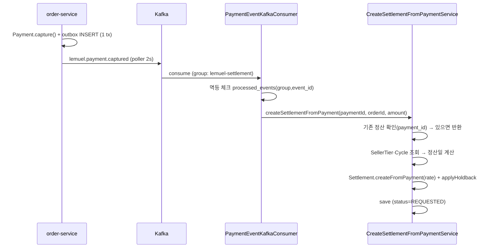

# 정산(Settlement) 도메인 분석

이 프로젝트의 핵심 도메인인 **정산**을 분석한 문서. 정산이란 무엇인지부터, 이 프로젝트가 정산을 어떻게 모델링·계산·확정·역정산하는지 코드 근거와 함께 정리한다.

> 근거: `Settlement`, `SellerTier`, `SettlementCycle`, `HoldbackPolicy`, `SettlementAdjustment` 도메인 + `CreateSettlementFromPaymentService`, `ConfirmDailySettlementsService`, `AdjustSettlementForRefundService`, `PaymentEventKafkaConsumer` 정독.

---

## 1) 정산이란

**정산(Settlement)** 은 "구매자가 결제한 돈에서 플랫폼 수수료를 떼고, 남은 금액을 판매자(셀러)에게 지급할 금액으로 확정하는 회계 과정"이다.

```
구매자 결제액(paymentAmount)
   − 플랫폼 수수료(commission)
   − 보류금(holdback, 일정 기간 후 해제)
   = 셀러 실 지급액(netAmount / immediatePayout)
```

이커머스 플랫폼에서 정산은 **실제 돈의 흐름**이라 정확성·정합성·멱등성·감사추적이 일반 CRUD 보다 훨씬 엄격하게 요구된다.

---

## 2) 정산 도메인의 구성 (Bounded Context)

`settlement-service` 는 정산을 6개 하위 도메인으로 나눈다.

| 하위 도메인 | 책임 |
|-------------|------|
| **settlement** | 정산 생성/확정/역정산 (핵심) |
| **payout** | 셀러 실지급 (펌뱅킹 송금) |
| **ledger** | 복식부기 원장 (회계 정합성) |
| **chargeback** | 카드사 분쟁/지급거절 처리 |
| **pgreconciliation** | PG 정산파일 vs 내부원장 대사 |
| **report** | 캐시플로우 리포트·PDF |

> 핵심 분리 원칙: settlement-service 는 order-service 코드를 import 하지 않는다. 결제/주문 데이터는 `@Immutable` Read-Model 로 조회하고, 상태 전파는 Kafka 이벤트로 받는다.

---

## 3) 정산 금액 계산 규칙

### 3-1. 수수료 (Commission)
```
commission = paymentAmount × commissionRate   (BigDecimal, HALF_UP, scale 2)
netAmount  = paymentAmount − commission
```
- **레거시 기본율 3%** (`Settlement.COMMISSION_RATE = 0.03`) — 차등 전환 전 정산.
- **셀러 등급별 차등율**(V32, 정산마다 `commission_rate` 스냅샷 저장):

| 등급(SellerTier) | 수수료율 | 기본 정산주기 |
|------------------|----------|---------------|
| NORMAL | 3.5% | T+7 영업일 |
| VIP | 2.5% | T+3 영업일 |
| STRATEGIC | 2.0% | T+1 영업일 |

### 3-2. 정산 주기 (SettlementCycle)
결제일(`paymentDate`)로부터 **정산일**을 계산하는 규칙:

| 주기 | 정산일 계산 |
|------|-------------|
| DAILY | paymentDate + 1일 |
| WEEKLY_MON | 결제 이후 첫 월요일 |
| MONTHLY_LAST | 결제 월 말일 |
| T_PLUS_1 / 3 / 7 | **영업일** N일 후(`BusinessDayCalculator`, 주말/공휴일 skip) |

- 셀러가 명시한 cycle(`users.settlement_cycle`)이 우선, 없으면 등급별 default.

### 3-3. 홀드백 (Holdback) — 안전장치
정산금 일부를 일정 기간 **보류**했다가 환불·분쟁이 없으면 해제·지급. 신뢰도 낮은 셀러의 환불 다발/사기 위험을 정산 사이클 안에서 흡수.

| 등급 | 보류율 | 보류 기간 |
|------|--------|-----------|
| NORMAL | 30% | 30일 |
| VIP | 10% | 14일 |
| STRATEGIC | 0% (즉시 전액) | — |

```
holdbackAmount     = netAmount × holdbackRate
immediatePayout    = netAmount − holdbackAmount   (즉시 지급)
→ holdbackReleaseDate 도달 후 배치가 자동 release
```

---

## 4) 정산 상태 머신 (Lifecycle)

```
REQUESTED ──startProcessing()──▶ PROCESSING ──complete()──▶ DONE
    ▲                                  │
    └────────retry()───── FAILED ◀──fail()
                                       
   (REQUESTED/PROCESSING) ──cancel()──▶ CANCELED
```

- **DONE 은 불변(immutable)**: 이미 셀러 지급이 확정된 정산은 금액 직접 변경 금지(V30 DB 트리거로도 강제). 환불은 별도 `SettlementAdjustment` 레코드로만 상쇄 → 원장 정합성 보존.
- net ≤ 0 이 되면(전액 환불 등) 자동 `CANCELED`.

---

## 5) 정산 생성 흐름 (이벤트 기반)



**3단 멱등 방어** (실제 돈이라 중복 정산 절대 금지):
1. `outbox_events.event_id` UUID UNIQUE — 프로듀서 중복 발행 방지
2. `processed_events (consumer_group, event_id)` PK — 컨슈머 재수신 방지
3. `settlements.payment_id` UNIQUE — 스키마 최종 방어
4. (애플리케이션) 생성 전 `findByPaymentId` 존재 확인

---

## 6) 정산 확정 흐름 (배치)

`ConfirmDailySettlementsService` — Spring Batch 비의존 순수 로직, 스케줄러가 호출.

```
1. findConfirmableForUpdate(targetDate)  ← 비관적 락(REQUESTED 잠금)
2. 각 정산 confirm() : REQUESTED → PROCESSING → DONE
3. enqueueLedgerTaskPort.enqueueCreate(ids)   ← 같은 tx 아웃박스 적재
   publishSettlementConfirmedEvent(ids)       ← ES 색인 이벤트
```

- **비관적 락**으로 확정 배치/수동 트리거가 같은 일자를 동시 처리해도 직렬화 → **이중 확정 방지**.
- 원장 분개·ES 색인은 **같은 트랜잭션 아웃박스**에 적재 후 커밋 → 크래시가 나도 폴러가 멱등 처리(crash-tolerant).
- `@Auditable` 로 확정 건수·대상일 감사 로그 자동 기록.

---

## 7) 역정산 흐름 (환불 / 차지백)

### 7-1. 환불 역정산 — `AdjustSettlementForRefundService`
```
1. findByPaymentIdForUpdate(paymentId)  ← 비관적 락 (동시 환불 lost-update 방지)
2. consumeHoldbackForRefund(refundAmount)  ← ★ 보류금에서 우선 차감 (셀러 추가 부담 최소화)
3. settlement.adjustForRefund(refundAmount) ← netAmount 재계산(running total)
4. SettlementAdjustment.ofRefund(...) 저장   ← 음수 금액 역정산 이력 (refundId 1:1 매핑)
5. enqueueReverse(...)  ← 원장 역분개 작업 아웃박스 적재
```

- **홀드백 우선 차감 정책**이 핵심: 보류금이 충분하면 셀러 net 에 영향 없이 환불 흡수.
- DONE 정산은 직접 변경 불가 → `SettlementAdjustment`(별도 레코드)로만 상쇄.
- 역정산도 **복식부기 역분개**(`PENDING→POSTED→REVERSED`)로 회계 정합성 유지.

### 7-2. 차지백 (Chargeback)
카드사 분쟁/지급거절. `chargebacks`(OPEN→ACCEPTED/REJECTED). ACCEPTED 시 `settlement_adjustments.chargeback_id` 로 연결돼 환불과 동일하게 역정산 반영(`refund_id` 와 양립, 둘 중 하나만).

---

## 8) 후속 처리

| 처리 | 도메인 | 설명 |
|------|--------|------|
| **셀러 지급** | payout | 확정 정산을 펌뱅킹으로 송금. `REQUESTED→SENDING→COMPLETED/FAILED`, 낙관적 락(`@Version`) + 실패 시 재시도 |
| **홀드백 해제** | settlement | `HoldbackReleaseScheduler` 가 release_date 도달분 자동 해제 |
| **복식부기 원장** | ledger | 정산/환불을 차변/대변으로 기록, `ledger_outbox` 비동기 발행 |
| **PG 대사** | pgreconciliation | PG 정산파일 vs 내부원장 매칭(불일치 5종 분류) |
| **ES 색인** | settlement | `settlement_index_queue` → Elasticsearch 검색 색인 |
| **리포트/PDF** | report | 캐시플로우 리포트, iText 정산서 PDF |

---

## 9) 정산 관련 배치/스케줄러

| 스케줄러 | 역할 |
|----------|------|
| `SettlementScheduler` | 일일 정산 생성/확정 트리거 |
| `HoldbackReleaseScheduler` | 보류금 해제일 도달분 release |
| `PayoutScheduler` | 확정 정산 셀러 지급 실행 |
| `LedgerOutboxPoller` | 원장 분개 작업 폴링 처리 |
| `OutboxPublisherScheduler` | Outbox→Kafka 발행(2초 주기, 멀티워커 claim) |

- 모든 스케줄러는 **ShedLock**(`SchedulingLockConfig`)으로 다중 인스턴스 중 한 노드에서만 실행 → 중복 정산 방지.

---

## 10) 정산 도메인의 정합성·안정성 장치 (요약)

| 위험 | 방어 장치 |
|------|-----------|
| 중복 정산 | 3단 멱등(outbox UUID / processed_events PK / payment_id UNIQUE) |
| 이중 확정 | 비관적 락(`findConfirmableForUpdate`) + 상태 머신 |
| 동시 환불 lost-update | 비관적 락(`findByPaymentIdForUpdate`) |
| 동시 지급/확정 충돌 | 낙관적 락(`@Version` on settlements/payouts) |
| 확정 정산 변조 | DONE 불변 + V30 DB 트리거 + SettlementAdjustment 상쇄 |
| 금액 오차 | `BigDecimal` HALF_UP scale 2 (부동소수점 미사용) |
| 회계 불일치 | 복식부기 원장 + 일별 합계 대사(`ReconcileDailyTotals`) + PG 대사 |
| 부분 실패 | 같은 tx 아웃박스 적재 → 커밋 후 폴러 멱등 처리 |
| 환불 다발 셀러 | 홀드백 정책(보류금 우선 차감) |
| 다중 노드 중복 실행 | ShedLock |

---

## 정리

- 정산 = **결제액 − 수수료 − 홀드백 = 셀러 지급액**. `BigDecimal` 정확 연산이 기본.
- **차등 정책**: SellerTier(수수료율) × SettlementCycle(정산일) × HoldbackPolicy(보류) 조합으로 셀러 등급별 차등.
- **흐름**: 결제완료 이벤트(Kafka) → 정산 생성(REQUESTED) → 일배치 확정(DONE) → 원장/색인/지급. 환불/차지백은 `SettlementAdjustment` 역정산.
- **이벤트 기반 + 배치 혼합**: 생성은 실시간 이벤트, 확정·지급·해제는 배치.
- **정합성이 최우선**: 3단 멱등 + 비관/낙관 락 + DONE 불변 + 복식부기 + ShedLock + 트랜잭셔널 아웃박스.
- 관련 문서: `docs/diagrams/sequence-payment-to-settlement.md`, `docs/adr/0002-settlement-state-machine.md`, `docs/adr/0004-reverse-settlement-via-adjustment.md`, `docs/adr/0014-tier-based-settlement-cycle.md`, `docs/adr/0015-settlement-holdback-policy.md`.
