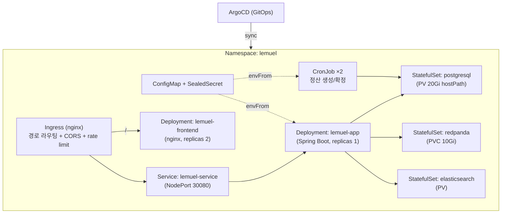

# Kubernetes — 소개·사용법 + Lemuel 프로젝트 적용 분석

**1부 Kubernetes 소개와 사용법** + **2부 이 프로젝트의 Kubernetes 적용 분석**으로 구성된다.

> 근거: `k8s/` 디렉터리 전수 정독 — `base/{namespace,configmap,deployment,service,frontend-deployment,kafka,batch-cronjob}.yaml`,
> `ingress/ingress.yaml`, `security/sealed-secret.yaml`, `stroage/{postgresql,elasticsearch}-pv.yaml`,
> `argocd/argocd-app.yaml`. 배포 전반은 [etc/DEPLOYMENT.md](etc/DEPLOYMENT.md)·[etc/INFRASTRUCTURE.md](etc/INFRASTRUCTURE.md) 참조.

---

# 1부. Kubernetes 소개와 사용법

## 1-1. Kubernetes 란

**Kubernetes(K8s)** 는 컨테이너화된 애플리케이션의 **배포·확장·운영을 자동화**하는 오픈소스
오케스트레이터다. "원하는 상태(desired state)"를 YAML 로 선언하면, K8s 가 현재 상태를 거기에
**계속 수렴(reconcile)** 시킨다. Pod 가 죽으면 다시 띄우고, 부하가 늘면 늘리고, 새 버전은 무중단
교체한다.

핵심 사고방식:
- **선언형(Declarative)**: "이렇게 해라(명령)"가 아니라 "이 상태를 유지해라(선언)".
- **자가 치유(Self-healing)**: 죽은 컨테이너 재시작, 실패 노드의 Pod 재배치.
- **컨트롤 루프**: 컨트롤러가 *현재 vs 원하는 상태* 차이를 끊임없이 좁힌다.

## 1-2. 핵심 오브젝트 (이 프로젝트에서 쓰는 것 위주)

| 오브젝트 | 역할 | 비유 |
|----------|------|------|
| **Namespace** | 리소스 격리 공간 | 프로젝트 전용 폴더 |
| **Pod** | 컨테이너 실행 최소 단위 | 컨테이너 한 묶음 |
| **Deployment** | 무상태 Pod 를 N개 유지 + 롤링 업데이트 | "이 앱 항상 N개 켜둬" |
| **StatefulSet** | 상태(데이터) 가진 Pod — 고정 이름·순서 | DB·브로커용 |
| **Service** | Pod 묶음에 고정 주소(LB) 부여 | 내부 로드밸런서 |
| **Ingress** | 외부 HTTP 경로 라우팅 규칙 | 정문 + 경로 안내판 |
| **ConfigMap / Secret** | 설정값 / 민감값 주입 | 환경변수 저장소 |
| **PV / PVC** | 영구 저장소 / 그 사용 신청서 | 디스크 + 임대 계약 |
| **CronJob / Job** | 주기적/일회성 작업 | 예약 배치 |

## 1-3. 무상태 vs 상태 (Deployment vs StatefulSet)

- **무상태(앱 서버)**: 아무 Pod 나 죽어도 새로 띄우면 됨 → **Deployment**. 수평 확장 쉬움.
- **상태(DB·브로커)**: 데이터·정체성이 중요 → **StatefulSet** + **PV**. 이름 고정(`postgresql-0`),
  순서 보장.

## 1-4. 헬스 프로브 3종 (무중단의 핵심)

| 프로브 | 질문 | 실패 시 |
|--------|------|---------|
| **startup** | "기동 다 됐나?" | 아직 기동 중 → liveness/readiness 보류 |
| **liveness** | "살아 있나?" | Pod **재시작** |
| **readiness** | "트래픽 받을 준비 됐나?" | **Service 에서 제외**(트래픽 차단) |

→ Spring Boot 는 `/actuator/health/liveness`·`/readiness` 로 이 3종을 정확히 지원한다.

## 1-5. 사용 흐름 (일반)

```
[YAML 작성] → kubectl apply -f → [API Server 저장] → [컨트롤러가 원하는 상태로 수렴] → [kubectl get/logs 로 확인]
```

GitOps(ArgoCD)를 쓰면 `kubectl apply` 를 사람이 안 친다 — **Git 이 곧 원하는 상태**이고 ArgoCD 가
자동 동기화한다.

---

# 2부. 이 프로젝트의 Kubernetes 적용 분석

## 2-1. 전체 구성 한눈에



설정은 전부 `k8s/` 에 **선언형 매니페스트**로 있고, **ArgoCD** 가 이를 클러스터에 동기화한다.

## 2-2. ★ 가장 중요한 관찰 — 배포 단위는 "단일 백엔드"다

매니페스트는 order/settlement/gateway **3개 서비스를 따로 배포하지 않는다.** Deployment 는
**하나(`lemuel-app`)** 이고 이미지도 하나(`ghcr.io/myoungsoo7/settlement:latest`)다. Ingress 도
`/api,/orders,/payments,/refunds,...` 를 전부 **단일 `lemuel-service`** 로 보낸다.

→ 이는 [msa.md](msa.md) 의 결론 *"런타임은 settlement 가 order 에 번들된 모듈러 모놀리스"* 와
**정확히 일치**한다. 즉 K8s 레이어도 **"논리적 MSA / 물리적 단일 배포"** 를 그대로 반영한다.
(gateway-service 도 별도 Deployment 없음 — 외부 라우팅은 nginx Ingress 가 대신한다.)

## 2-3. 애플리케이션 워크로드

### (1) 백엔드 — `base/deployment.yaml`

| 항목 | 설정 | 의미 |
|------|------|------|
| replicas | **1** | 단일 노드 전제(주석: 멀티노드 시 3) |
| strategy | RollingUpdate, maxSurge 1 / **maxUnavailable 0** | 신규 Pod 먼저 뜨고 구 Pod 종료 → 무중단 |
| podAntiAffinity | preferred, hostname | 가능하면 노드 분산(단일노드선 무시) |
| terminationGracePeriod | **60s** | SIGTERM 후 진행 요청 마무리(graceful) |
| resources | req 512Mi/250m, lim 2Gi/1core | 스케줄링·상한 |
| probes | startup(최대 300s) → liveness → readiness | `/actuator/health/*` |
| envFrom | ConfigMap + Secret | 설정·비밀 주입 |
| imagePullSecrets | `ghcr-secret` | GHCR private pull |

→ **무중단 배포 + 헬스 프로브 3종 분리**가 교과서적으로 잘 잡혀 있다. `maxUnavailable: 0` +
startup probe 300s 여유 + graceful 60s 가 결합돼 "새 Pod 준비 완료 후 전환".

### (2) 프론트엔드 — `base/frontend-deployment.yaml`

React 빌드물을 nginx 로 서빙. **replicas 2**(무상태라 다중), `/health` 프로브, ClusterIP Service.
Ingress 의 `/` 경로가 여기로 라우팅.

### (3) 진입점 — `service.yaml` + `ingress.yaml`

- **Service**: `NodePort 30080` + `sessionAffinity: ClientIP`(3시간) — 단일 노드 외부 직접 접근.
- **Ingress**(nginx): 경로 라우팅(`/api`·`/auth`·`/orders`·`/payments`·`/refunds`·`/actuator`·
  `/swagger-ui`·`/v3/api-docs` → 백엔드, `/` → 프론트). 부가로 **CORS, `limit-rps: 100`(rate
  limit), 타임아웃 60s, body-size 10m**. TLS 는 주석 처리(cert-manager + Let's Encrypt 예고).

## 2-4. 상태 저장소 — StatefulSet + PV (클러스터 내장)

DB·브로커·검색엔진을 **클러스터 안에서** 직접 돌린다.

| 컴포넌트 | 매니페스트 | 구성 |
|----------|-----------|------|
| PostgreSQL | `stroage/postgresql-pv.yaml` | StatefulSet(postgres:16-alpine) + **hostPath PV 20Gi(Retain)** + PVC + Headless Service, `pg_isready` 프로브 |
| Redpanda(Kafka) | `base/kafka.yaml` | StatefulSet 단일 브로커 + volumeClaimTemplates 10Gi, `rpk cluster health` 프로브 |
| Elasticsearch | `stroage/elasticsearch-pv.yaml` | StatefulSet + PV |

특징과 한계(주석에 정직히 명시됨):
- **hostPath PV**: 우분투 서버 `/data/k8s/postgresql` 에 직접 바인딩 → **단일 노드 전용**.
  멀티 노드면 Pod 가 다른 노드로 가면 데이터에 못 닿는다(운영은 네트워크 스토리지/CSI 필요).
- **단일 replica**: PG/Redpanda/ES 모두 1개 → **고가용성 없음**. 주석이 *"운영은 Strimzi/Redpanda
  Operator 로 3 브로커 + 3 복제"*, *"PG 16-alpine 단일"* 임을 인정.
- `Retain` 정책으로 PVC 삭제해도 데이터 보존(실수 방지)은 양호.

## 2-5. 정산 배치 — `base/batch-cronjob.yaml`

CronJob 2개로 정산을 돌린다.

| Job | 스케줄 | 실행 |
|-----|--------|------|
| settlement-batch-creation | `0 1 * * *` (01:00) | `--spring.batch.job.names=createSettlementJob` |
| settlement-batch-confirmation | `0 2 * * *` (02:00) | `--spring.batch.job.names=confirmSettlementJob` |

- `concurrencyPolicy: Forbid`(이전 실행 안 끝나면 스킵), `backoffLimit: 2`(2회 재시도),
  `restartPolicy: Never`, history 3개 보관 — 배치 안정성 패턴이 잘 갖춰짐.
- 백엔드와 **동일 이미지**를 배치 프로파일로 기동(별도 배치 이미지 불필요).

> ⚠️ **정합성 주의(정직히)**: 앱 내부에는 `@Scheduled` 스케줄러(`SettlementScheduler`, **02:00 생성
> / 03:00 확정**, ShedLock)도 있다(코드 근거). K8s CronJob(01:00/02:00, Spring Batch Job)과
> **스케줄링 방식·시각이 이원화**돼 있어, 실제 운영 시 **둘 중 하나로 일원화**(중복 실행/혼선
> 방지)가 필요하다. 어느 쪽이 권위인지는 배포 프로파일 설정에 달림.

## 2-6. 설정·비밀 관리

- **ConfigMap(`lemuel-config`)**: 비밀 아닌 값 — `SPRING_PROFILES_ACTIVE: production`,
  `POSTGRES_HOST: postgresql-service`, `POSTGRES_DB: opslab`, ES 호스트, JWT 발급자/TTL,
  `LEMUEL_DEMO_ENABLED: "true"`.
- **SealedSecret(`security/sealed-secret.yaml`)**: bitnami SealedSecret 으로 민감값
  (POSTGRES/ES 자격, JWT_SECRET, Slack webhook)을 **클러스터 공개키로 암호화 → Git 커밋 가능**.
  적용 시 컨트롤러가 복호화해 실제 `lemuel-secret` 생성. **"비밀을 Git 에 안전하게"** 라는 GitOps
  핵심 난제를 정석으로 해결.

## 2-7. GitOps 배포 — `argocd/argocd-app.yaml`

```
개발자 push(main) → GitHub Actions 이미지 빌드 → GHCR push
                  → k8s/*.yaml 변경을 ArgoCD 가 감지 → 자동 동기화(kubectl apply)
```

- **source**: repo `MyoungSoo7/settlement`, `main` 브랜치, `path: k8s`.
- **syncPolicy.automated**: `prune: true`(Git 에서 지운 리소스는 클러스터에서도 제거),
  `selfHeal: true`(누가 `kubectl` 로 손대도 Git 상태로 되돌림) → **Git 이 단일 진실 원천**.
- `syncOptions`: `CreateNamespace`, `ServerSideApply`(SealedSecret CRD 대응), `PruneLast`.
- `ignoreDifferences` 로 **Deployment `/spec/replicas` 차이를 무시** → HPA 가 replicas 를 바꿔도
  ArgoCD 가 되돌리지 않게 설계(**HPA 도입 대비**). 단 **HPA 매니페스트 자체는 아직 없음**.

## 2-8. K8s 성숙도 평가

| 평가 축 | 상태 | 근거 |
|---------|------|------|
| 선언형 매니페스트 | ✅ 우수 | 전 리소스 YAML, 주석 친절 |
| 무중단 배포 | ✅ 우수 | RollingUpdate maxUnavailable 0 + 프로브 3종 + graceful 60s |
| GitOps 자동화 | ✅ 우수 | ArgoCD prune+selfHeal, Git=진실원천 |
| 비밀 관리 | ✅ 우수 | SealedSecret(암호화 커밋) |
| 헬스/프로브 | ✅ 우수 | startup/liveness/readiness 분리 |
| 고가용성(HA) | ❌ 미달 | 백엔드·DB·브로커·ES 모두 replicas 1 |
| 자동 확장(HPA) | 🟡 준비만 | argocd ignoreDifferences 만 있고 HPA 리소스 없음 |
| 스토리지 견고성 | ❌ 단일노드 | hostPath PV → 멀티노드 비호환 |
| 상태 저장소 운영등급 | ❌ 미달 | DB/Kafka/ES 단일 인스턴스(operator 미사용) |
| 설정 정합성 | 🟡 주의 | compose 와 DB명(opslab vs inter)·PG버전(16 vs 17)·배치 스케줄 불일치 |

→ **배포 자동화·무중단·비밀관리·관측 연계는 운영 수준**으로 잘 잡혔으나, **고가용성/자동확장/
스토리지 견고성은 단일 노드 데모 수준**이다. 매니페스트 주석들이 이 한계를 스스로 인정하며
운영 전환 방향(operator, 멀티 replica, CSI 스토리지, cert-manager TLS)을 예고한다.

## 2-9. 운영 전환 로드맵 (매니페스트가 예고한 것)

1. **HA**: 백엔드 `replicas≥2`(이미 anti-affinity 준비됨) + **HPA 매니페스트 추가**(ignoreDifferences 는 준비됨).
2. **상태 저장소 분리**: DB/Kafka/ES 를 클러스터 내장 단일 인스턴스 → **Operator(Strimzi 등) 또는
   매니지드 서비스**로. hostPath → CSI 네트워크 스토리지.
3. **TLS**: Ingress 의 주석 처리된 `tls` 활성 + **cert-manager + Let's Encrypt**.
4. **설정 일원화**: compose ↔ k8s 의 DB명/버전/배치 스케줄 불일치 정리, `@Scheduled` vs CronJob
   배치 이원화 해소.
5. **보안**: 운영 ConfigMap 의 `LEMUEL_DEMO_ENABLED: "true"`(데모 자동로그인)는 운영 비활성 검토.

---

## 정리

- **구성**: `lemuel` 네임스페이스에 백엔드 Deployment + 프론트 Deployment + (PG/Redpanda/ES)
  StatefulSet + CronJob(정산) + Ingress + ConfigMap/SealedSecret, ArgoCD 로 GitOps 동기화.
- **핵심 관찰**: 배포 단위는 3-서비스 분리가 아닌 **단일 백엔드(`lemuel-app`)** — [msa.md](msa.md)
  의 "모듈러 모놀리스 런타임" 결론과 K8s 레벨에서 일치.
- **잘된 점**: 무중단 RollingUpdate(maxUnavailable 0) + 프로브 3종 + graceful 종료, ArgoCD
  prune/selfHeal GitOps, SealedSecret 비밀관리.
- **현 한계(정직히)**: 전 컴포넌트 단일 replica(HA 없음), HPA 미정의(준비만), hostPath PV(단일노드
  종속), 상태 저장소 operator 미사용, compose 와 설정 불일치, 데모 로그인 운영 노출.
- 관련 문서: [msa.md](msa.md), [그라파나.md](그라파나.md), [프로메테우스.md](프로메테우스.md),
  [etc/DEPLOYMENT.md](etc/DEPLOYMENT.md), [etc/INFRASTRUCTURE.md](etc/INFRASTRUCTURE.md), [etc/kube.md](etc/kube.md).
