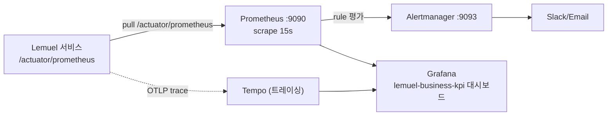

# Prometheus — 소개·사용법 + Lemuel 프로젝트 적용 분석

**1부 Prometheus 소개와 사용법** + **2부 이 프로젝트의 Prometheus 적용 분석**으로 구성된다.

> 근거: `monitoring/prometheus.yml`, `monitoring/alert-rules.yml`, `application.yml`(actuator/metrics), `RefundMetrics`, `SettlementBatchHealthIndicator`, `PgRouter`·`MethodTraceAspect` 등 정독.

---

# 1부. Prometheus 소개와 사용법

## 1-1. Prometheus 란

**Prometheus** 는 CNCF 의 오픈소스 **메트릭 기반 모니터링·알림 시스템**. 시계열(time-series) DB 에 수치 지표를 저장하고, PromQL 로 질의하며, 임계 조건에 알림을 발생시킨다.

핵심 특징:
- **Pull 방식**: Prometheus 가 대상(타깃)의 `/metrics` 엔드포인트를 주기적으로 **스크레이프(scrape)** 한다. (push 가 아닌 pull — 대상이 살아있는지 자체가 신호 `up`)
- **시계열 데이터 모델**: `metric_name{label=value, ...} → 값@타임스탬프`. 라벨로 다차원 슬라이싱.
- **PromQL**: 강력한 질의 언어(rate, histogram_quantile, aggregation).
- **알림**: rule 로 조건 평가 → **Alertmanager** 로 라우팅(Slack/Email 등).
- **Grafana** 와 결합해 시각화.

## 1-2. 메트릭 4가지 타입

| 타입 | 의미 | 예 |
|------|------|----|
| **Counter** | 단조 증가(누적) | 요청 수, 실패 수 (`refund_requests_total`) |
| **Gauge** | 오르내리는 현재값 | 메모리 사용량, PENDING 건수 (`outbox_pending_count`) |
| **Histogram** | 값 분포를 버킷에 누적 → 분위수 계산 | 처리 시간 (`..._duration_seconds_bucket`) |
| **Summary** | 클라이언트 측 분위수 계산 | 금액 분포 등 |

> Counter 이름은 관례상 `_total` 접미사. Histogram 은 `_bucket`/`_sum`/`_count` 세트로 노출되고 `histogram_quantile()` 로 p95 등을 구한다.

## 1-3. 동작 구조

```
[App /metrics] ──scrape(pull)──▶ [Prometheus TSDB] ──query──▶ [Grafana]
                                        │
                                        └─rule 평가─▶ [Alertmanager] ─▶ Slack/Email
```

## 1-4. PromQL 기본

```promql
# 초당 요청률 (counter → rate)
rate(refund_requests_total[5m])

# 실패율
rate(refund_failed_total[5m]) / rate(refund_requests_total[5m])

# p95 지연 (histogram)
histogram_quantile(0.95, rate(refund_processing_duration_seconds_bucket[5m]))

# 대상 생존 여부
up{job="lemuel"} == 0
```

## 1-5. Spring Boot 에서 쓰는 법 (일반)

1. `micrometer-registry-prometheus` 의존성 추가 → Micrometer 가 Prometheus 포맷으로 메트릭 변환.
2. Actuator `/actuator/prometheus` 엔드포인트 노출.
3. 커스텀 메트릭은 `MeterRegistry` 주입 후 `Counter/Timer/Gauge.builder(...).register(registry)`.
4. `prometheus.yml` 의 `scrape_configs` 에 앱 타깃 등록.

---

# 2부. 이 프로젝트의 Prometheus 적용 분석

## 2-1. 관측성 스택 구성



- 설정 위치: `monitoring/` (prometheus.yml, alert-rules.yml, alertmanager.yml, tempo.yaml, grafana/).
- **메트릭(Prometheus)** + **트레이싱(Tempo/OTLP)** 을 분리 수집, Grafana 에서 통합 조회.

## 2-2. 노출(Exposure) 설정 — `application.yml`

```yaml
management:
  endpoints.web.exposure.include: health,info,metrics,prometheus
  endpoint.prometheus.enabled: true
  metrics.distribution.percentiles-histogram:
    refund.processing.duration: true       # 히스토그램 버킷 활성 → p95 계산 가능
  server.port: 8089                          # 로컬: 관리 포트 분리 / Docker: 8080 통합
  tracing.sampling.probability: 1.0          # 트레이싱 샘플링
  otlp.tracing.endpoint: ${...}              # Tempo OTLP
  health: db/redis/elasticsearch/liveness/readiness 개별 토글
```

- `health,info,metrics,prometheus` 만 노출(최소 노출 — 보안). Actuator 는 인증 필요.
- `percentiles-histogram` 을 켜야 `histogram_quantile()` 용 `_bucket` 시계열이 노출됨.

## 2-3. 스크레이프 설정 — `monitoring/prometheus.yml`

```yaml
global: { scrape_interval: 15s, evaluation_interval: 15s }
alerting.alertmanagers: [ alertmanager:9093 ]
rule_files: [ alert-rules.yml ]
scrape_configs:
  - job_name: 'lemuel'
    metrics_path: '/actuator/prometheus'
    static_configs: [ { targets: ['app:8080'], labels: { application: lemuel, environment: production } } ]
```

- **15초 주기 pull**, 정적 타깃(서비스 디스커버리 미사용). 알림 규칙은 `alert-rules.yml` 로딩.

## 2-4. 커스텀 메트릭 (Micrometer)

도메인에 특화된 비즈니스 메트릭을 직접 정의한다. 모두 `MeterRegistry` 기반.

| 메트릭 | 타입 | 정의 위치 | 의미 |
|--------|------|-----------|------|
| `refund.requests` / `refund.completed` / `refund.failed{reason}` | Counter | `RefundMetrics` | 환불 요청·완료·실패 |
| `refund.idempotency_key_reuse` | Counter | `RefundMetrics` | 멱등키 재사용(중복 요청) |
| `refund.amount` (KRW) | DistributionSummary | `RefundMetrics` | 환불 금액 분포 |
| `refund.processing.duration` | Timer(+histogram) | `RefundMetrics` | 환불 처리 시간 p95 |
| `pg.routing.requests{provider,reason,method}` | Counter | `PgRouter` | PG 라우팅 결정 |
| `lemuel.method.execution{layer,class,method,outcome}` | Timer | `MethodTraceAspect`(AOP) | 메서드 실행 시간 자동 측정 |
| `outbox_pending_count` | Gauge | Outbox | 미발행 이벤트 적체 |
| `outbox_publish_duration` | Histogram | Outbox | 발행 지연 |
| `settlement_creation/confirmation_duration` | Histogram | 정산 배치 | 배치 처리 시간 |
| `settlement_batch_last_run_timestamp_seconds` | Gauge | 정산 배치 | 마지막 실행 시각 |
| `batch_failures_total{batch_type}` | Counter | 배치 | 배치 실패 |
| `settlement_kafka_dlt_published/retry/replayed_total` | Counter | `KafkaErrorHandlerConfig`/`DlqReplayService` | DLT 라우팅·재시도·재처리 |
| `cashflow_reconciliation_mismatch_total{check}` | Counter | 캐시플로우 | 원장 대사 불일치 |
| `settlement_adjustment_status{status}` | Gauge | 정산 조정 | PENDING 누적 |

- **AOP 자동 계측**: `MethodTraceAspect` 가 `adapter.in.web`·`application.service`·`adapter.in.kafka` 레이어 메서드를 자동으로 Timer 측정(layer/outcome 태그) → 코드 산재 없이 전 계층 관측.
- **헥사고날 정합**: `RefundMetrics`/`SettlementBatchHealthIndicator` 주석처럼 메트릭/헬스는 **모니터링 어댑터**(in/out)로 취급, 도메인은 직접 의존하지 않음.

## 2-5. 커스텀 HealthIndicator

**위치**: `SettlementBatchHealthIndicator` (`/actuator/health`)

- 어제 기준 정산 배치 스냅샷 조회 → PENDING 과다면 `DOWN`, 조정 PENDING 과다면 `WARNING`, 정상이면 `UP`.
- 이 상태가 `health_status{component="settlementBatch"}` 메트릭으로 노출돼 알림(`SettlementBatchHealthWarning`)에 활용.

## 2-6. 알림 규칙 — `monitoring/alert-rules.yml`

8개 알림 그룹으로 도메인·인프라를 망라한다.

| 그룹 | 대표 알림 (조건) |
|------|------------------|
| **batch** | `SettlementBatchFailure`(배치 실패>0), `SettlementBatchSlowProcessing`(p95>60s), `SettlementBatchNotRunning`(24h 미실행) |
| **refund** | `HighRefundFailureRate`(실패율>10%), `RefundRequestSpike`(평소 5배), `RefundProcessingSlow`(p95>5s), `HighIdempotencyKeyReuse` |
| **settlement_adjustment** | `PendingSettlementAdjustmentBacklog`(>100), `AdjustmentConfirmationFailure` |
| **health** | `ApplicationHealthDown`(`up==0`), `SettlementBatchHealthWarning` |
| **performance** | `HighJVMMemoryUsage`(heap>85%), `DatabaseConnectionPoolNearExhaustion`(Hikari active/max>80%) |
| **outbox** | `OutboxPendingBacklog`(>1000), `OutboxPendingCritical`(>10000), `OutboxPublishSlow`(p95>2s) |
| **cashflow_report** | `CashflowReconciliationMismatch`(원장 정합성 위반 — critical), `CashflowReportGenerationSlow` |
| **kafka_dlt** | `SettlementKafkaDltPublishedSpike`, `SettlementKafkaRetrySpike`, `SettlementKafkaDltReplaySurge` |

특징:
- **금융 정합성 직결 알림**: `CashflowReconciliationMismatch` 는 결제−환불=정산 불변식 위반(금액 유실 가능성)을 critical 로 즉시 포착, runbook·대응 절차를 annotation 에 명시.
- **runbook 연계**: 다수 알림이 `runbook_url` 과 구체적 대응 단계(예: `/admin/dlq/inspect` → `replay`)를 description 에 포함 → 알림이 곧 대응 가이드.
- **표준 메트릭 활용**: `jvm_memory_used_bytes`, `hikaricp_connections_active/max`, `up` 등 Micrometer/Actuator 기본 메트릭으로 인프라 알림 구성.

## 2-7. 시각화 / 트레이싱 연계

- **Grafana 대시보드**: `monitoring/grafana/dashboards/lemuel-business-kpi.json` — 비즈니스 KPI(정산·환불·outbox 등) 대시보드. 데이터소스/대시보드 프로비저닝 자동화(`provisioning/`).
- **Tempo 트레이싱**: 메트릭(Prometheus)이 "무엇이 얼마나"라면, Tempo 트레이스는 "어디서 느린가"를 보완. `traceparent` 가 Outbox 이벤트로 전파돼 비동기 경계까지 추적(상세 [network.md](network.md), ADR 0012).

---

## 정리

- **수집**: Micrometer → `/actuator/prometheus` → Prometheus 15초 pull.
- **커스텀 메트릭**: 환불·PG 라우팅·Outbox·정산 배치·Kafka DLT·캐시플로우 대사 등 **도메인 특화 지표**를 Counter/Gauge/Histogram 으로 정의. AOP(`MethodTraceAspect`)로 전 계층 자동 계측.
- **헬스**: `SettlementBatchHealthIndicator` 커스텀 + DB/liveness/readiness.
- **알림**: 8개 그룹(batch/refund/adjustment/health/performance/outbox/cashflow/kafka-dlt), 금융 정합성 위반은 critical + runbook 연계.
- **설계 정합성**: 메트릭/헬스를 모니터링 **어댑터**로 분리(헥사고날), 도메인 오염 없음.
- 관련 문서: [network.md](network.md), [memory.md](memory.md), [etc/MONITORING.md](etc/MONITORING.md), [runbook/](runbook/README.md), [adr/0012-distributed-tracing-across-outbox.md](adr/0012-distributed-tracing-across-outbox.md), [adr/0017-kafka-consumer-dlt-and-replay.md](adr/0017-kafka-consumer-dlt-and-replay.md).
